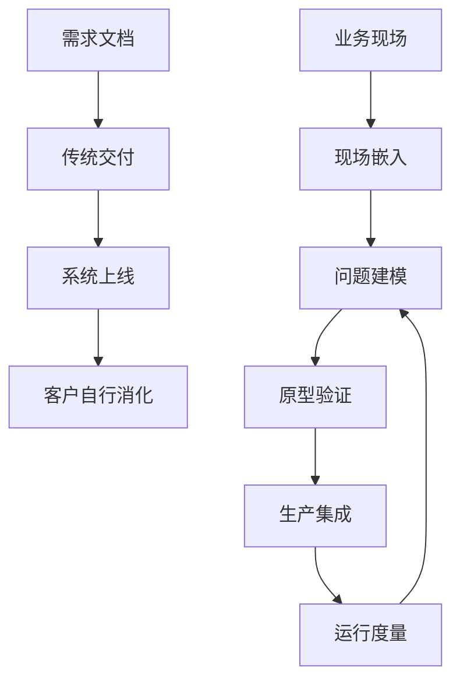

## 1.2 从软件交付到现场嵌入

### 1.2.1 交付对象从系统变成工作流

软件交付曾经主要围绕“系统上线”组织：需求确认、方案设计、开发测试、部署培训、验收移交。这个模式适合边界清晰、流程稳定、变化较慢的项目。但 FDE 面对的往往是开放问题：为什么产线停机没有被提前发现？为什么客户流失信号分散在多个系统？为什么 AI 助手在演示中可用，进入真实审批流后却无法通过权限、审计和责任边界？此时，交付对象不再只是一个应用，而是端到端工作流。

现场嵌入意味着工程师必须进入流程发生的位置。Palantir 将 FDE [描述为围绕客户现场持续开发平台能力的产品开发范式](https://www.palantir.com/docs/foundry/architecture-center/platforms/)。OpenAI 设有专门的 Forward Deployed Engineering 团队，其[岗位说明](https://openai.com/careers/forward-deployed-engineer-%28fde%29-sf-san-francisco/)同样强调 FDE 负责从原型走向稳定生产，并把现场反馈传回产品和研究团队（单条招聘 req 会随招聘周期下线，届时从 [OpenAI 招聘搜索](https://openai.com/careers/search/)按团队名检索即可）。这些描述共同指向同一件事：FDE 不只是把软件“送达客户”，而是在客户运行环境中发现问题、改造流程、交付系统，并让组织能够持续使用。

#### 综合示例：制造企业如何降低非计划停机

以下示例说明 FDE 如何把“预测停机”这类模糊目标，拆成可验证的现场闭环。项目动作和指标口径为教学设定；涉及制造维护能力的外部事实，仅引用 NIST 公开资料。

**背景**：某制造企业希望降低关键设备的非计划停机。历史维护方式主要依赖固定周期点检、班组经验和事后维修，传感器数据、MES 工单、备件记录和人工点检表分散在不同系统中。NIST 也把[监测、诊断和预测](https://www.nist.gov/el/enhancing-maintenance-strategies-manufacturing-operations)列为减少非计划停机、优化计划停机的重要能力。

**现场约束**：产线不能为了试点频繁停机；部分老设备只有低频采样或人工录入数据；维修班组更信任可解释的异常原因，而不是单一风险分数；模型告警如果过多，会挤占排班和备件资源；任何自动建议都必须保留人工确认和审计记录。

**FDE 动作**：FDE 先选一类瓶颈设备做最小闭环，而不是直接建设全厂预测平台。第一步把停机事件、维修工单、传感器窗口和班组备注对齐成统一事件时间线；第二步与维修主管共同定义“可采取行动的告警”，例如连续多个采样窗口超过示例阈值才触发检查；第三步上线只读看板和工单建议，不直接自动停线；第四步把误报、漏报、人工处理结果回写为评测样本，并把通用的数据对齐、告警解释和工单回写能力沉淀为模板。

**取舍**：团队牺牲了短期模型覆盖率，换取告警可信度和班组采用率；暂缓复杂端到端自动化，先保证数据血缘、权限、审计和人工复核闭环；没有把每台设备的特殊规则都写成定制代码，而是把设备差异限制在特征配置和阈值配置中。

**指标结果**：可用示例指标包括：目标设备告警精确率达到试点阈值后再扩大范围；误报率低于班组可承受阈值；从异常出现到维修确认的时间缩短；关键工单中包含模型解释和人工处置结果的比例提升；可复用模板覆盖下一类设备时所需改动减少。这里的数值应由项目基线和客户风险偏好定义，不能用外部案例数字替代现场验证。

### 1.2.2 嵌入不是无边界驻场

现场嵌入不等于长期驻场外包，也不等于客户提出什么就做什么。FDE 的专业边界在于把现场知识转化为工程判断：哪些是必须适配的领域约束，哪些是历史包袱；哪些定制会创造长期价值，哪些只会制造维护债；哪些问题应由产品平台承接，哪些应由客户流程调整解决。这个判断必须建立在事实之上，包括数据样本、用户路径、权限模型、故障记录、成本结构和上线风险。

从工程方式看，现场嵌入要求 FDE 同时维护两个节奏。第一是现场节奏：快速理解语境，尽早做出可运行切片，降低客户对“黑箱交付”的不确定感。第二是产品节奏：把局部需求抽象成平台能力、模板、组件、接口或文档，避免每个客户都形成孤岛。DORA 指标强调软件交付应当[安全、快速、有效](https://dora.dev/guides/dora-metrics/)；FDE 需要在此基础上再补一层现场结果指标，例如流程耗时、人工干预率、采用率、业务异常恢复时间和可复用资产数量。只有当现场交付与平台沉淀同时发生，FDE 才区别于传统实施。
