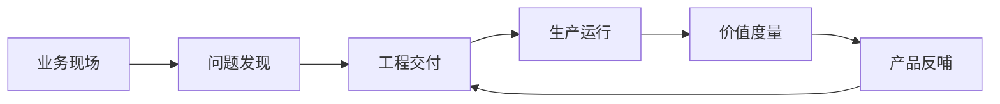

# 第一章：FDE 的角色边界

FDE，Forward Deployed Engineering，本书译作“前线部署工程”。理解 FDE，不能只从岗位名称入手，也不能把它简单归入售前、咨询、实施或客户成功。FDE 的关键在于“前线”和“工程”同时成立：工程师进入真实业务现场，面对不完整信息、遗留系统、权限约束、组织流程和生产风险，把一个模糊但高价值的问题推进为可运行、可观测、可治理、可复用的系统。

Palantir 的实践将这一角色广泛带入行业视野，并把 FDE [描述为一种产品开发范式](https://www.palantir.com/docs/foundry/architecture-center/overview)：工程师嵌入客户环境，与核心工程团队协同，把现场反馈持续转化为平台能力。近年来，FDE 已不再只是某家公司的组织语言。OpenAI 将 FDE [定义为嵌入复杂组织的前沿 AI 部署能力](https://openai.com/index/openai-launches-the-deployment-company/)，用于识别高影响场景、重构工作流并形成可持续系统；Anthropic 的招聘材料也要求这类角色[嵌入战略客户、交付 AI 应用，并反馈可重复部署模式](https://job-boards.greenhouse.io/anthropic)——注意岗位名称本身就在漂移：Anthropic 公开招聘板上，Forward Deployed 命名的岗位与 Applied AI Architect 系列并存，且命名岗位曾一度归零、其后又重新挂出，读者应按职责而非名称对照，核验日期见[快变事实核验表](../appendix/volatile_facts.md)。

本章回答五个问题：FDE 为什么出现；它如何改变传统软件交付的边界；它与解决方案架构师、售前工程师、SRE、平台工程师、专业服务、客户成功等相邻角色如何分工；如何用价值闭环和成功指标判断 FDE 是否真正有效；以及哪些常见反模式会让“看起来像 FDE”的工作实际偏离 FDE 的核心责任。

读完本章，读者应能用清晰边界描述 FDE：它不是“万能救火队”，而是把客户现场、工程系统、产品路线和业务结果连接起来的一种高密度工程角色。
