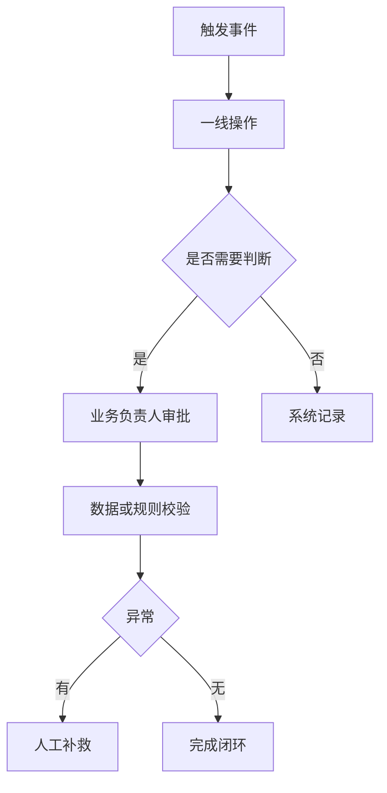

## 2.1 业务场景进入

### 2.1.1 从请求进入，而不是从方案进入

FDE 进入现场时，常见入口是一句看似明确的请求：做一个 AI 助手、替换一套报表、把审批自动化、把分散数据接到一个平台。成熟的进入方式不是立即接受请求，而是把请求还原成业务场景：谁在什么时刻遇到什么阻塞，阻塞造成什么损失，当前为什么无法靠流程、培训或已有系统解决。这样做不是拖慢进度，而是避免把工程能力用在错误层级的问题上。

业务场景进入应先确认三类事实。第一是触发事件，例如监管要求、交付瓶颈、成本上升、客户流失或一线人员无法及时决策。第二是受影响角色，包括直接操作者、审批者、数据维护者、系统管理员和最终负责业务结果的人。第三是可观察信号，例如处理时长、返工率、人工核对量、缺陷率、等待队列、异常升级次数。DORA 在 [DevOps capabilities](https://dora.dev/capabilities/) 中强调能力改进需要围绕交付和组织表现展开；FDE 的现场进入也应从系统级结果出发，而不是从单点功能出发。

贯穿案例可以从“异常订单归因”开始。以下为合成、脱敏的教学样例，数字只用于说明方法，不代表真实客户数据，也不代表可外推的行业基准。原始请求是：“给运营做一个智能工具，自动解释为什么订单失败。”FDE 不应马上设计聊天界面，而要把请求拆成现场入口：

| 入口项 | 现场记录 |
| --- | --- |
| 原始请求 | 运营希望在订单异常后自动看到失败原因和下一步动作 |
| 受影响角色 | 客服需要回复客户，运营主管需要分派处理，仓配团队需要确认库存和履约状态，财务需要确认退款责任，数据团队需要维护异常口径 |
| 基线指标 | 每周约 1,200 笔异常订单；人工归因中位时长 18 分钟；约 23% 需要跨部门二次确认；客户首次回复时限为 30 分钟 |
| 现场证据 | 经授权后的最小样本：异常工单样本、订单请求状态、支付交易事件、履约与库存日志、退款审批记录、运营日报；客服聊天记录只抽取与异常原因相关的脱敏片段 |
| 证据边界 | 不导出全量原始数据；样本范围、敏感字段、脱敏方式、访问人、保留期限和删除方式由业务、数据、安全/合规负责人确认 |
| 确认人 | 运营主管确认业务损失和验收口径，数据负责人确认证据来源，安全/合规负责人确认访问和脱敏边界，FDE 负责把这些输入转成可验证工程问题 |
| 第一轮问题陈述 | 运营团队无法在服务时限内稳定判断异常订单的主要原因，导致客服回复延迟和跨部门返工；下一轮要验证订单请求状态、支付交易事件、履约单状态、退款案件状态、失败原因和补救动作是否有可复查的数据证据 |

这份记录的作用，是把“做智能工具”改写成可执行的现场流程：先抽取异常订单样本，再追踪每个样本从创建、支付、库存、履约、退款到客服回复的证据链，最后判断哪些原因可以由系统自动归因，哪些仍需要人工确认。

### 2.1.2 建立最小现场地图

最小现场地图不追求完整企业架构，而是画出“工作如何发生”。它是粗粒度定位图，不替代后续的领域状态机或接口设计。它至少包含业务目标、触发条件、参与角色、关键系统、数据流向、决策点和失败后的补救路径。FDE 在第一次现场访谈后，就应能回答：如果今天什么都不改，问题会继续在哪里累积；如果只改一个环节，收益是否会被下游瓶颈抵消。

| 进入问题 | 需要的证据 | 错误信号 |
| --- | --- | --- |
| 为什么现在要做 | 业务事件、指标变化、外部压力 | 只有高层口号 |
| 谁真正受影响 | 角色清单、操作记录、审批链 | 只听单一赞助人 |
| 当前怎么完成 | 系统截图、工单、日志、表格 | 只看流程图不看现场 |
| 成功如何判断 | 基线指标、验收阈值 | 只有“体验更好” |

现场地图可以用一张轻量表收敛，不必一开始画完整架构图：

| 地图字段 | 最低记录内容 |
| --- | --- |
| 业务目标 | 要改善的业务结果、当前基线、受影响时间窗 |
| 触发条件 | 谁在什么事件后开始处理，事件来自哪个系统或人工动作 |
| 角色与责任 | 操作者、审批者、数据 owner、系统 owner、安全/合规确认人、最终业务 owner |
| 系统与数据 | 读哪些系统、写哪些系统、哪些字段敏感、哪些数据只能看不能导出 |
| 决策点 | 哪些判断由规则、模型、人工经验或制度决定 |
| 异常与补救 | 出错后谁发现、谁接手、是否有 SLA、是否有审计记录 |
| 未知项 | 还缺什么证据、谁负责补齐、下一轮何时验证 |

进入阶段的结论应保持克制：不是“我们要做某系统”，而是“我们已确认某类角色在某流程中存在可观察损失，下一步要收集事实并识别约束”。这句话越具体，后续架构和交付越不容易漂移。

还要明确进入阶段的边界。FDE 可以帮助客户澄清问题、验证风险和设计交付路径，但不能替客户跳过责任确认。若业务负责人无法说明指标基线，系统负责人无法说明数据来源，安全团队无法说明权限要求，工程团队就不应把这些空白默认为“以后再补”。进入现场的第一项产物，往往不是原型，而是一份简短的问题陈述和证据清单：什么已经确认，什么只是判断，什么必须在下一轮调研中被验证。
