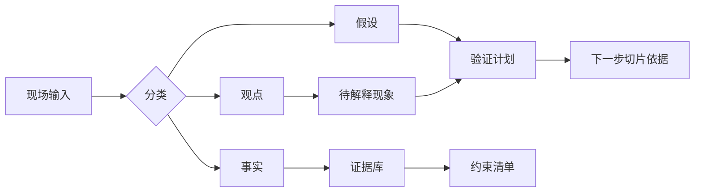

## 2.2 事实收集与约束识别

### 2.2.1 把观点、事实和假设分开

现场访谈中最危险的混合物，是把“大家都这么说”当成事实。FDE 需要把输入拆成三层：事实是可复查的证据，例如日志、单据、权限配置、接口文档、SLA、审计记录、历史事故；观点是人的判断，例如“系统很慢”“流程很乱”；假设是尚未验证的因果关系，例如“慢是因为数据库性能不足”。三者都重要，但不能混放在同一列里。

事实收集应覆盖业务、数据、系统和组织四个方向。业务事实说明工作量、周期、价值和异常类型；数据事实说明字段含义、来源、更新频率、质量问题和保留策略；系统事实说明接口、权限、部署、容量、依赖和可观测性；组织事实说明决策权、变更窗口、合规要求和运维边界。事实收集本身不是目的，它要服务于后续的范围、风险和验证决策，而不是堆积材料；无法被引用进决策的事实，应在下一轮调研中精简或验证。

可执行的事实表应记录字段，而不只是写结论。最低字段包括：结论、性质、主题、来源、时间、负责人、数据边界、可信度、是否可复查、下一步验证动作。性质用于区分事实、观点和假设；主题用于标注业务、数据、系统、组织、合规或口径冲突。可信度可以用“高、中、低”表达：高表示证据来自系统记录或可重复查询；中表示来自授权样本、截图或多人一致陈述；低表示来自单人判断或无法复查的会议记忆。下表仍为教学样例记录，日期和指标用于展示写法。

| 结论 | 性质 | 主题 | 来源 | 时间 | 负责人 | 数据边界 | 可信度 | 是否可复查 | 下一步验证动作 |
| --- | --- | --- | --- | --- | --- | --- | --- | --- | --- |
| 异常订单人工归因中位时长约 18 分钟 | 事实 | 业务 | 最近两周工单导出和处理时间戳 | 2025-12-01 | 运营分析师 | 脱敏工单 ID 和时间戳 | 中 | 是 | 抽样 50 单核对工单时间和客服回复时间 |
| “库存不足”是主要失败原因 | 假设 | 数据 | 运营主管访谈 | 2025-12-01 | FDE | 不含客户身份信息 | 低 | 否 | 对照库存系统日志和订单失败码 |
| 失败订单必须先由客服联系客户 | 事实 | 组织约束 | 客服操作规范和主管确认 | 2025-12-02 | 客服主管 | 仅引用制度条款 | 中 | 是 | 检查操作规范是否覆盖退款和补发两种路径 |
| 支付失败和履约失败都被报表记为失败 | 事实 | 口径冲突 | 运营日报、财务退款表 | 2025-12-02 | 数据负责人 | 聚合报表，不导出客户明细 | 高 | 是 | 建立状态映射表并让运营、财务共同确认 |

### 2.2.2 约束不是阻碍，而是设计输入

约束可分为硬约束和软约束。硬约束包括法律合规、数据驻留、身份权限、预算上限、上线窗口、外部系统 API 限制和已有平台标准。软约束包括团队技能、组织偏好、历史债务、供应商关系、审批习惯和变更接受度。硬约束决定边界，软约束影响路径。忽略硬约束会导致方案不可上线，忽略软约束会导致方案无人采用。

| 类型 | 示例 | 核查方式 | 对设计的影响 |
| --- | --- | --- | --- |
| 业务事实 | 月处理量、峰值时段、返工率 | 报表、工单、抽样记录 | 决定收益基线 |
| 数据事实 | 字段来源、缺失率、口径冲突 | 数据字典、查询、血缘 | 决定建模可信度 |
| 系统约束 | 认证方式、接口限流、部署环境、版本兼容、超时和错误码 | 文档、配置、日志、沙箱调用 | 决定集成方案 |
| 组织约束 | 审批链、值班能力、变更窗口 | 访谈、制度、历史发布记录 | 决定交付节奏 |
| 隐私与合规约束 | 敏感字段、访问授权、保留期限、审计要求 | 数据分级、授权记录、合规评审 | 决定样本边界和脱敏方式 |

证据采集本身也要受控。FDE 不应因为“调研需要”而默认获取全量导出、客户聊天原文或生产截图；更稳妥的做法是先定义样本目的、最小字段、访问角色、脱敏规则和删除时间，再采集可复查证据。若某条证据必须依赖临时权限，应记录授权人、到期时间和审计位置，避免发现阶段留下新的影子数据资产。

观点、事实和假设冲突时，不要在会上用职位或声音大小裁决。处理顺序应固定：先保留原话并标注类型，再寻找可复查证据；如果事实之间冲突，优先比较来源系统、时间范围、抽样口径和字段定义；如果观点与事实冲突，把观点改写成待解释现象，例如“运营感觉失败率上升”，再用同一时间窗的数据验证；如果假设与事实冲突，假设必须降级、缩小或废弃。没有证据前，只能形成“下一步验证动作”，不能进入需求承诺。

本节的产物不是一份冗长调研报告，而是一张可追溯的事实表：每条结论都能指向来源，每个未知项都有负责人和下一步验证动作，每个约束都能说明必须满足、可协商或仍待确认。这样，后续需求讨论就不会在记忆和立场之间打转。
