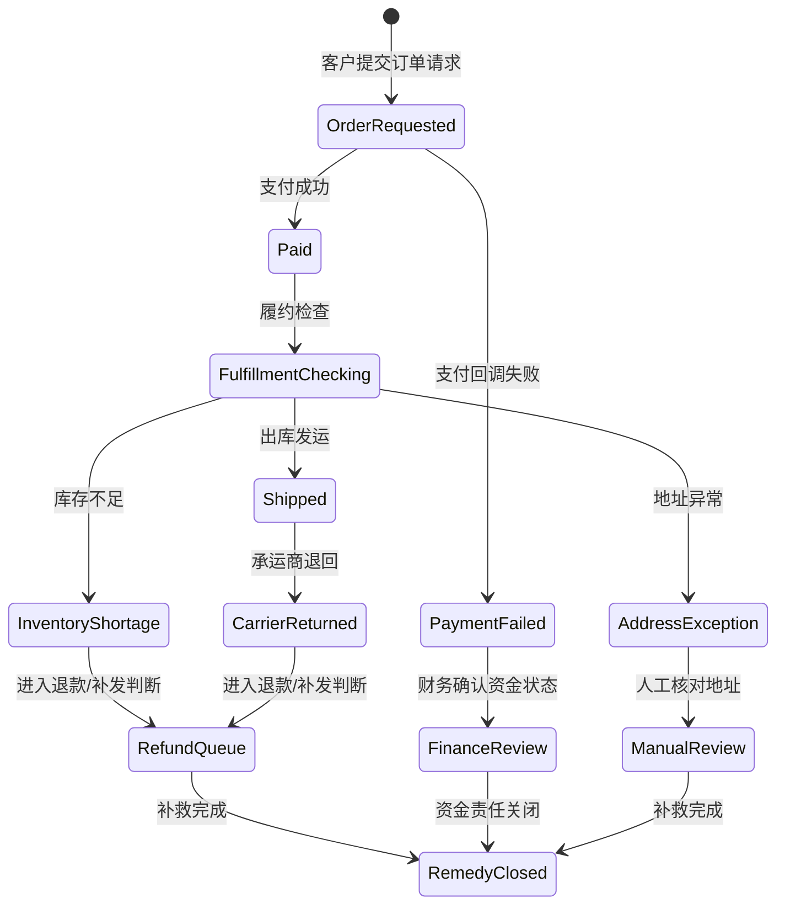

## 2.3 领域语言与流程建模

### 2.3.1 先统一语言，再讨论系统

复杂现场中，许多冲突并不是技术冲突，而是语言冲突。“客户”“订单”“风险”“已完成”“失败”“审核通过”这些词，在不同部门可能对应不同对象、状态或责任。FDE 如果不先统一领域语言，就会把术语歧义固化进数据库、API、权限模型和报表口径，后期修正代价极高。

领域语言的目标不是编一本百科词典，而是让关键概念在当前交付边界内可操作、可验证、可被不同角色共同使用。Martin Fowler 在 [Bounded Context](https://martinfowler.com/bliki/BoundedContext.html) 中解释，领域模型可作为开发者和领域专家沟通的统一语言；当组织变大，不同群体会自然形成不同词汇，因此必须显式划分上下文。对 FDE 来说，术语表、状态机、事件流和上下文边界，比一次性大而全的数据模型更可靠。

在“异常订单归因”案例中，术语冲突通常会先暴露在“订单”“完成”“失败”这几个词上：

| 术语 | 运营部门含义 | 财务部门含义 | 工程落点 |
| --- | --- | --- | --- |
| 订单 | 客户提交后需要履约的业务请求，未支付也可能进入运营队列 | 已支付并产生应收或退款责任的交易记录 | 拆成“订单请求”“支付交易”“履约单”，禁止一个“订单状态”覆盖全部含义 |
| 完成 | 客户收到商品或补救动作结束 | 款项结清，退款或扣款责任关闭 | 状态机中区分“已送达”“已补救”“已结清” |
| 失败 | 需要人工介入的异常，例如库存不足、地址错误、承运商退回 | 支付失败、退款失败或对账失败 | 数据字典中为失败原因建立枚举，并记录来源系统和责任部门 |

落地时，不要要求两个部门放弃自己的词，而是把词放入边界上下文：运营上下文关注履约和补救，财务上下文关注资金和责任。跨上下文报表必须显式映射状态，例如“支付失败”不等于“履约失败”，“已送达”也不等于“已结清”。这一步应进入状态机和数据字典，否则后续归因模型会把不同失败混成一个标签。

一张简化的上下文图可以先用表格表达：

| 上下文 | Owner | 核心对象 | 事实源 | 关键事件 | 跨上下文映射 |
| --- | --- | --- | --- | --- | --- |
| 客服上下文 | 客服主管 | 客户会话、回复时限、工单升级 | 客服系统 | 客户催办、工单升级、首次回复 | 只引用脱敏会话片段，不作为失败原因权威来源 |
| 运营上下文 | 运营主管 | 异常订单、补救动作、处理队列 | 运营工单系统 | 异常进入队列、补救完成 | 映射支付、履约、退款状态后生成一级原因 |
| 履约上下文 | 仓配负责人 | 履约单、库存占用、承运商状态 | WMS、承运商接口 | 库存不足、出库失败、承运商退回 | 向运营提供履约失败证据，不处理退款责任 |
| 财务上下文 | 财务负责人 | 支付交易、退款案件、对账状态 | 支付和退款系统 | 支付失败、退款失败、对账完成 | 区分资金失败和履约失败 |
| 数据上下文 | 数据负责人 | 状态映射、指标口径、数据质量规则 | 数据平台 | 字段变更、口径确认 | 维护跨上下文报表和归因口径 |

### 2.3.2 用流程模型暴露隐藏规则

流程建模应从真实工作流开始，而不是从系统菜单开始。2.1 的现场地图只回答“工作在哪里发生”，本节要进一步回答“状态如何变化、事件从哪里来、规则由谁维护”。先记录事件顺序，再标出角色、系统、数据和决策点，最后补充异常路径。异常路径尤其重要，因为现场价值往往不在“正常单据如何流转”，而在“出错时谁发现、谁补救、谁承担结果”。流程图画完后，FDE 要追问每个判断节点：规则来自制度、经验、模型、人工裁量，还是历史系统的默认行为。

| 状态或事件 | 来源系统 | Owner | 需要澄清的规则 |
| --- | --- | --- | --- |
| 支付回调失败 | 支付系统 | 财务负责人 | 是否算运营异常，是否需要客服联系 |
| 库存不足 | WMS / 库存服务 | 仓配负责人 | 是真实缺货、锁库冲突，还是数据延迟 |
| 地址异常 | 订单系统 / 客服系统 | 运营主管 | 是否允许客服修正，是否需要客户确认 |
| 承运商退回 | 承运商接口 / 履约系统 | 仓配负责人 | 退回后补发、退款和责任归属如何判定 |
| 退款队列进入 | 退款系统 / 工单系统 | 运营与财务共同确认 | 哪些原因可进入第一批切片，哪些必须人工复核 |

| 建模对象 | 关键问题 | 交付价值 |
| --- | --- | --- |
| 术语 | 同一个词是否有多种含义 | 避免口径冲突 |
| 状态 | 对象从哪里来、到哪里去 | 明确系统边界 |
| 事件 | 什么动作改变状态 | 连接流程与日志 |
| 规则 | 判断条件由谁维护 | 决定配置化或代码化 |
| 异常 | 出错后如何补救 | 识别真实成本 |

领域建模完成后，应产生一个轻量但严格的“共同语言包”：核心术语、状态定义、事件清单、上下文边界和未决歧义。任何需求切片进入实现前，都要能回到这套语言中解释自己，否则它很可能只是某个角色的局部愿望。

共同语言包还应进入工程资产，而不是停留在会议白板上。术语可以写入数据字典，状态可以写入测试用例，事件可以写入日志规范，规则可以映射到配置或代码负责人。这样做的好处是，后续每一次变更都能被问到同一个问题：它是否改变了领域语言，是否跨越了边界上下文，是否需要同步用户、数据、权限和报表口径。
