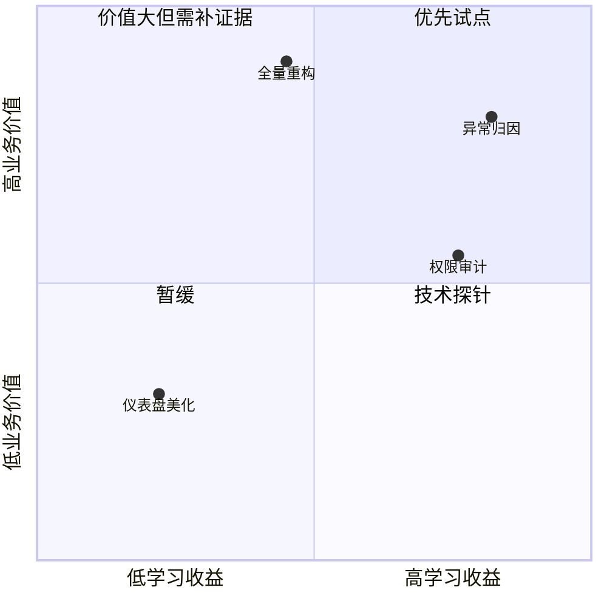

## 2.4 需求切片与优先级

### 2.4.1 切片围绕价值闭环，而不是功能清单

需求切片的目标，是找到最小但完整的价值闭环。一个好的切片应包含明确用户、触发场景、输入数据、关键规则、输出结果、验收条件和运行边界；它可以很小，但不能只是一段中间能力。例如“接入审批 API”不是完整切片，“让运营主管在异常订单进入退款队列后 10 分钟内看到原因、建议动作和审计记录”才更接近可验证的业务切片。这里的 10 分钟不是行业基准，而是为了在 30 分钟客户首次回复时限内给客服补救动作预留时间的教学阈值。

切片应从用户视角说明目标、价值和验收条件，可参考 Atlassian 对 [user stories](https://www.atlassian.com/agile/project-management/user-stories) 的写法。范围排序还需要持续涌现的改进清单和清晰目标，这一点也能从 [Scrum Guide 2020](https://scrumguides.org/scrum-guide.html) 对 Product Backlog 与 Product Goal 的定义中得到支撑。FDE 可以借鉴这些原则，但不能机械套模板；现场项目的切片必须同时考虑业务价值、技术可行性、数据可得性、合规风险和组织可采用性。FDE 的责任是提供证据、工程约束和风险排序依据，最终优先级应由业务或产品负责人确认。

候选切片不应从功能清单里凭空挑选，而应从前面几类发现产物推导出来：

| 来源 | 推导问题 | 候选切片示例 |
| --- | --- | --- |
| 现场地图 | 哪个角色承受了最大可观察损失 | 先覆盖退款队列运营主管的异常归因 |
| 事实表 | 哪个问题已有足够证据可验证 | 先处理证据链完整的支付失败和退款失败 |
| 领域模型 | 哪个状态或事件最容易形成闭环 | 围绕“进入退款队列”建立原因、证据和建议动作 |
| 风险清单 | 哪个不确定性最大且能快速学习 | 先做离线回放，不自动通知客户或写回资金系统 |
| 约束清单 | 哪些数据、权限或组织边界不可跨越 | 只读脱敏样本，所有高风险样本人工确认 |

### 2.4.2 用多维排序替代单一优先级

现场中“优先级最高”的需求，常常只是声音最大的需求。FDE 应帮助团队把排序拆成多个维度：价值、紧迫性、风险降低、学习收益、依赖复杂度、上线成本和可逆性。第一批切片不一定选择最大价值项，而应选择能最大幅度降低不确定性、同时形成可见价值的项。尤其在 AI、数据和跨系统集成场景中，早期切片应优先验证数据质量、权限边界、人工接管和评测标准。

| 切片候选 | 业务价值 | 学习收益 | 风险 | 依赖 | 决策依据 | 建议 |
| --- | --- | --- | --- | --- | --- | --- |
| 退款队列异常归因 | 高 | 高 | 中 | 日志、工单系统 | 影响首次回复时限，且证据链可抽样验证 | 先做 |
| 全量流程重构 | 很高 | 中 | 高 | 多部门、多系统 | 价值大但跨越过多上下文，无法快速验证 | 延后 |
| 只做仪表盘美化 | 低 | 低 | 低 | 报表系统 | 不能减少归因和补救决策时间 | 不优先 |
| 权限审计闭环 | 中 | 高 | 中 | IAM、审计日志 | 直接影响试点能否使用真实样本 | 并行验证 |

图中的数值是教学示意，表示团队把业务价值和学习收益主观校准到 0-1 区间后的排序结果；真实项目应保留评分依据、置信度、时间窗口和决策参与人。若排序出现争议，FDE 应回到证据和风险，而不是替业务 owner 拍板。

切片的最终表达应包括一句用户故事、一组验收条件、一组不做事项和一个退出条件。不做事项非常关键，它保护团队不被“顺便也做”吞没；退出条件则说明如果数据、权限或采用率不达标，何时停止、转向或缩小范围。

| 切片字段 | 示例 |
| --- | --- |
| 用户 | 退款队列运营主管 |
| 用户故事 | 作为退款队列运营主管，我希望在异常订单进入队列后看到主要原因和证据，以便决定补救动作 |
| 触发 | 新增异常订单进入退款队列后 10 分钟内 |
| 输入 | 订单请求状态、支付交易事件、履约单状态、库存日志、退款案件状态 |
| 输出 | 一级失败原因、证据链接、建议补救动作、审计记录 |
| 验收阈值 | 影子运行中不低于 85.0% 样本能从系统证据复现一级原因；运营主管能在 10 分钟内完成原因确认或人工升级；高风险样本全部进入人工确认 |
| 高风险触发 | 金额超过业务阈值、涉及敏感数据、证据缺失、建议动作不可逆、客户影响高或跨合规边界 |
| 数据边界 | 只读脱敏样本；不导出客服原文；审计记录保留访问人、时间、字段范围和用途 |
| 不做事项 | 不自动回复客户，不自动退款，不覆盖非退款队列 |
| 退出条件 | 连续两轮样本验证无法达到证据覆盖阈值，或权限/合规负责人不同意试点范围 |
| 负责人 | 运营主管负责业务验收和优先级确认，数据负责人负责证据口径，安全/合规负责人负责数据边界，FDE 负责工程验证 |
