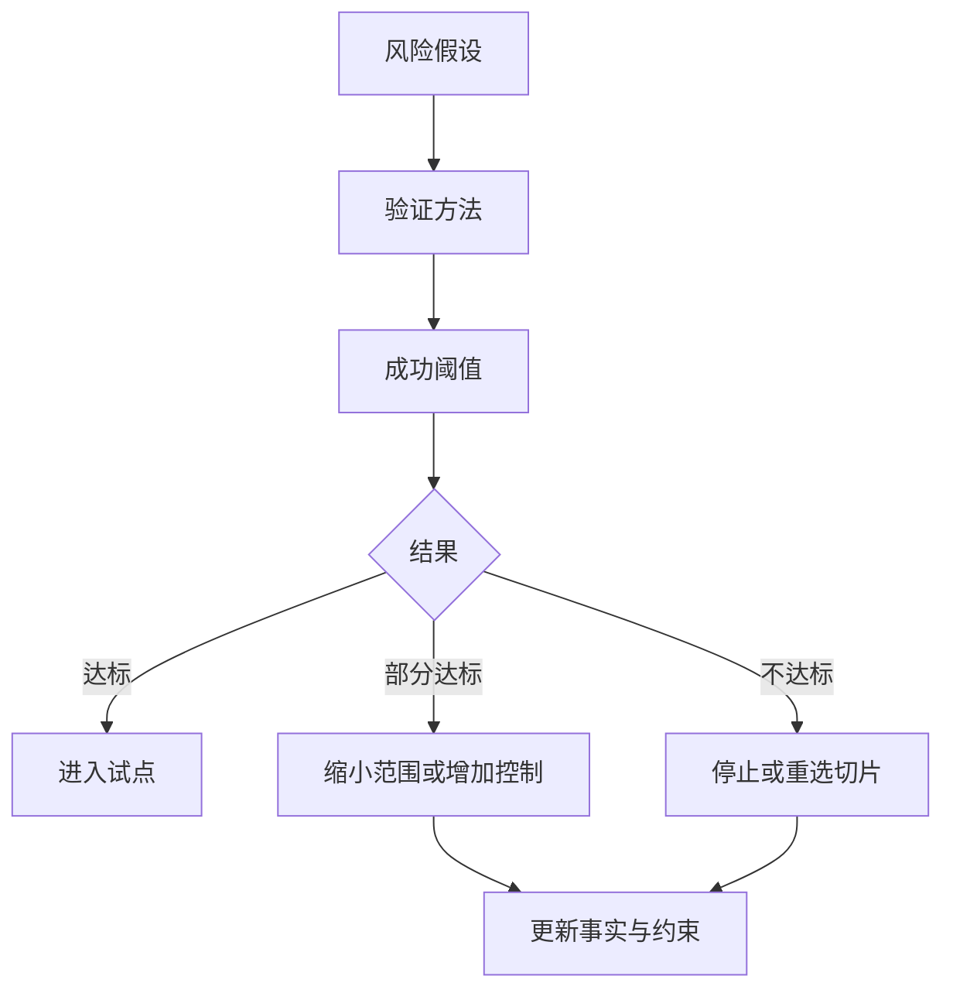

## 2.5 风险假设与验证计划

### 2.5.1 把风险写成可验证假设

风险管理在现场发现阶段不是合规附录，而是交付设计的一部分。FDE 应避免写“存在数据风险”“存在上线风险”这类空泛句子，而要把风险改写成可验证假设：如果某数据源缺失率超过阈值，模型建议不可用于自动决策；如果关键系统只允许夜间变更，试点节奏必须改成离线回放；如果一线人员不信任建议结果，系统应先提供解释和人工确认，而不是自动执行。

风险假设最终要服务于应对措施选择；NIST 在 [SP 800-30 Rev.1](https://csrc.nist.gov/pubs/sp/800/30/r1/final) 中也这样定位风险评估。OWASP 的 [Threat Modeling](https://owasp.org/www-community/Threat_Modeling) 可作为安全提问框架，用来识别、沟通和理解威胁及缓解措施，并建议回答“正在做什么、哪里会出错、准备怎么做、做得是否足够好”。FDE 可以借鉴这组问题，而不是把它机械扩展成万能模板：业务、数据、集成、可靠性、合规、采用和运营风险都需要写成可验证假设，但每类风险的 owner、证据和失败动作不同。若切片包含 LLM 或 Agent，还应参考 OWASP [LLM Top 10 2025](https://genai.owasp.org/llm-top-10/) 和 [Agentic AI Threats and Mitigations](https://genai.owasp.org/resource/agentic-ai-threats-and-mitigations/) 检查提示注入、敏感信息泄露、向量/嵌入弱点、过度代理权和工具越权等风险。

### 2.5.2 验证计划要能改变决策

验证计划只有在能改变决策时才有价值。每个实验都应说明验证对象、方法、样本、成功阈值、失败动作和负责人。例如，数据质量验证可抽样检查关键字段缺失率和冲突率；集成验证可用沙箱 API 测试认证、限流、幂等、超时、错误码和生产/沙箱差异；采用验证可观察一线用户是否愿意在真实任务中使用原型；安全验证可用威胁建模识别资产、信任边界和缓解措施；运行验证则要确认最小 SLI/SLO、告警 owner、trace/correlation ID、降级路径和人工接管时限。

以“异常订单归因”为例，第一轮实验可以限定为退款队列内的离线回放，不接入生产自动决策。下列阈值是教学样例，用于展示如何写清决策边界，不是行业标准：

| 实验项 | 设计 |
| --- | --- |
| 验证对象 | 系统证据是否足以支持退款队列异常订单的一级原因归因 |
| 样本量 | 从最近两周进入退款队列的异常订单中分层抽样 200 单，覆盖支付失败、库存不足、地址异常、承运商退回、退款失败五类候选原因；若某类不足 20 个有效样本，应降低自动化承诺或单独标注样本不足 |
| 方法 | FDE 和运营各自独立标注原因；再用订单请求状态、支付交易事件、履约单状态、库存日志和退款案件状态复核；冲突样本进入联合复盘 |
| 通过阈值 | 证据覆盖率不低于 85.0%；人工标注与证据复核一致率不低于 80.0%；每类原因至少有 20 个有效样本；高风险样本 100% 进入人工确认 |
| 部分达标 | 证据覆盖率在 70.0%-84.9%，或人工一致率低于 80.0% 但问题集中在少数原因；只允许缩小范围、增加人工复核或补采证据 |
| 失败阈值 | 可复查证据覆盖率低于 70.0%，或任一高频原因无法定位来源系统，或跨部门对“失败”定义无法形成状态映射 |
| 通过后的决策 | 进入小范围影子运行，只给运营主管展示原因、证据和建议动作，不自动通知客户 |
| 失败后的决策 | 停止智能归因界面设计，先补日志字段、状态字典或人工标注流程；必要时把切片缩小到单一失败类型 |

| 风险类别 | 假设示例 | 验证方式 | 失败动作 |
| --- | --- | --- | --- |
| 数据 | 关键字段缺失率低于 5% | 抽样查询、血缘核对 | 改为人工补录或缩小场景 |
| 隐私 | 样本不需要导出客服原文或个人敏感字段 | 数据分级、脱敏复核、访问审计 | 缩小样本、改用合成数据或停止实验 |
| 集成 | 核心 API 支持试点吞吐且错误语义稳定 | 沙箱压测、错误码、幂等、重试和超时测试 | 增加缓存、异步队列或重选切片 |
| 合规 | 试点不触碰受限数据或不可授权动作 | 数据分级、权限审查、法务/合规确认 | 改用脱敏或合成数据 |
| 采用 | 一线用户愿意在真实任务中使用 | 影子运行、访谈、行为日志 | FDE 提供证据和工程影响，业务负责人决定改界面、改流程或停止 |
| AI / Agent | 模型不会在证据缺失时编造原因，工具调用不越权 | 引用一致性评测、提示注入红队、工具权限负例、拒答/升级测试 | 降级为人工辅助、限制工具权限或停止自动建议 |
| 安全 | 新入口不扩大攻击面 | 威胁建模、控制清单 | 增加认证、审计和限权 |
| 可靠性与运营 | 影子运行期间告警、trace、人工接管和降级路径可用 | 演练、可观测性检查、值班确认 | 暂停试点，先补监控、runbook 和 owner |

本节结束时，FDE 应得到一份短而硬的验证计划：哪些假设证据基础最薄弱，如何在最短时间内验证，什么结果允许继续，什么结果必须停止。它把“项目风险”转化为工程节奏，也为下一章的系统边界和架构取舍提供依据。

### 2.5.3 发现阶段的退出判据

发现阶段不是无限延长的调研期。当下列判据同时满足时，团队可以从“认识问题”进入“构建原型”。在写原型代码前，还应把这些发现产物带到下一章的最小系统边界讨论中，避免原型一开始就跨错责任边界。

- 风险假设已按业务、数据、隐私、集成、合规、采用、AI/Agent、安全和可靠性等类别完成分类，并标注脆弱程度；
- 至少一项最脆弱的假设已通过一次实验取得证据，证据可复查；
- 业务负责人、数据负责人和安全/合规负责人对范围、约束和不做事项达成一致并留痕；
- 已选定一个最小切片，其用户、价值、验收阈值和失败动作都能写成一句话，可进入原型；
- 不可外推的边界已明确，包括不进入的流程、不接触的数据、不承诺的指标和不替代的现有系统；
- 最小运行边界已明确，包括告警 owner、人工接管条件、审计字段、trace/correlation ID、降级或回滚触发条件。

任一条未满足，应回到事实、约束或验证计划补齐，而不是带着模糊前提进入工程阶段。
