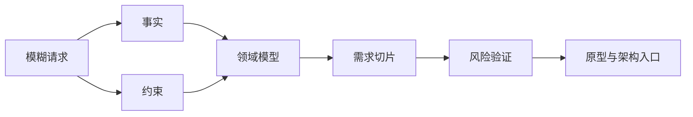

## 2.6 本章小结

现场问题发现的核心，是把模糊请求转化为可验证的工程入口。本章从五个动作展开：业务场景进入、事实收集与约束识别、领域语言与流程建模、需求切片与优先级、风险假设与验证计划。它们共同解决一个问题：在投入真实工程资源前，团队是否知道自己正在改变什么、为什么改变、受哪些边界约束、如何判断第一步做对了。

FDE 不是被动记录需求的人，也不是带着预设方案进入现场的人。它要在现场建立证据链：从业务触发事件到成功指标，从系统与数据事实到组织约束，从领域术语到流程状态，从候选切片到验收条件，再从风险假设到验证实验。这个证据链越清晰，后续原型、试点和生产化越不会陷入范围膨胀或责任漂移。

本章引用的外部依据可以转成几类动作：用 DORA 的 [DevOps capabilities](https://dora.dev/capabilities/) 观察系统级交付与运营能力；用 Martin Fowler 的 [Bounded Context](https://martinfowler.com/bliki/BoundedContext.html) 处理领域语言边界；用 [Atlassian User Stories](https://www.atlassian.com/agile/project-management/user-stories) 和 [Scrum Guide 2020](https://scrumguides.org/scrum-guide.html) 组织目标、价值和可检验增量；用 NIST [SP 800-30 Rev.1](https://csrc.nist.gov/pubs/sp/800/30/r1/final)、OWASP 的 [Threat Modeling](https://owasp.org/www-community/Threat_Modeling) 和 [LLM Top 10 2025](https://genai.owasp.org/llm-top-10/) 把风险转化为可讨论、可验证、可缓解的模型。

| 本章产物 | 判断标准 |
| --- | --- |
| 现场地图 | 能说明角色、流程、系统、数据和异常路径 |
| 事实与约束清单 | 每条结论有来源，每个未知项有验证动作 |
| 领域语言包 | 关键术语、状态、事件、上下文 owner 和边界无明显歧义 |
| 需求切片 | 小而完整，包含用户、价值、验收、不做事项和决策 owner，并明确采用形态（规则/自动化/智能体） |
| 验证计划 | 每个实验都有阈值，结果能改变后续决策 |
| 数据与运行边界 | 样本授权、脱敏方式、审计字段、人工接管和告警 owner 明确 |

进入下一章之前，团队应避免急于承诺完整架构。更稳妥的做法，是带着本章产物讨论系统边界、集成方式、数据契约和架构取舍：哪些能力需要现在建设，哪些只需验证，哪些必须明确不做。
