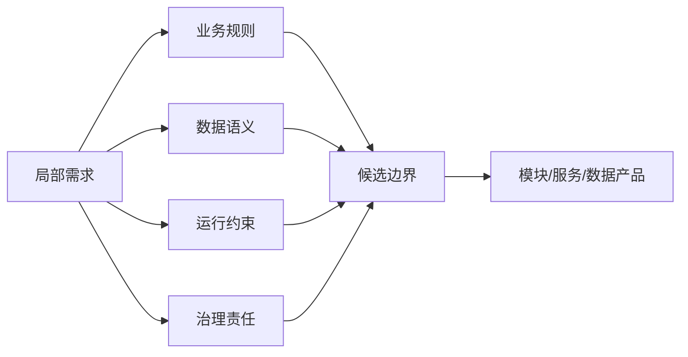

## 3.1 从局部需求到系统边界

### 3.1.1 从功能请求看到系统责任

FDE 接到的需求常以局部功能出现：一个报表、一个审批流、一次数据同步、一个模型调用。若只按工单拆分，系统会变成临时脚本和点对点接口的集合。边界设计的第一性原理不是“这次要写多少代码”，而是“哪些状态、规则、数据责任和运行约束必须一起变化”。边界划错，后续每次变更都会穿透多个团队、数据库和权限域。

边界识别可以借用 [ISO/IEC/IEEE 42010](https://www.iso.org/standard/74393.html) 的架构描述思想：系统、利益相关方、关注点和视角要被显式表达。放到现场交付，边界识别应先回答五类关注点：业务价值流如何闭环，数据事实由谁拥有，运行失败如何恢复，权限和审计由谁负责，数据分类、保留和合规约束是否允许这样流动。能同时回答这些问题的边界，才是可维护的工程单元。

### 3.1.2 用责任、数据和变化频率划线

边界设计要避开两种极端：每个按钮都拆成服务，会让集成成本超过收益；所有规则都堆进“大平台”，会让长期演进失去局部性。更稳妥的做法是按责任、数据所有权和变化频率划线：一起变化的规则靠近，不同 SLA、不同权限模型、不同审计责任、不同数据处理目的的能力隔离。

Team Topologies 对平台团队、流对齐团队、使能团队和复杂子系统团队的划分提醒我们：架构边界最终会变成沟通路径和认知负担。Atlassian 对 [Team Topologies](https://www.atlassian.com/devops/frameworks/team-topologies) 的说明中，平台团队的目标是让流对齐团队更自治地交付。FDE 也应把身份、审计、数据接入、部署流水线沉淀为平台能力，把业务差异留给最接近场景的团队。

还要区分三类沉淀路径。若能力被多个场景反复使用、接口稳定、运维责任清楚，可平台化；若它带有可销售或可复制的业务语义、需要路线图和支持承诺，可产品化；若它依赖客户特有政策、一次性集成、低复用数据清洗或客户自有知识产权，就应保持项目特定，避免把噪声抽象进平台或产品。

### 3.1.3 贯穿案例：用 Agent 处理制造业库存异常

某制造企业提出需求：“库存数量异常时，让 Agent 自动判断原因并推动处理。”本章中的 Agent 指受控的业务编排服务：它可以使用模型或规则完成归因、摘要、建议和工具调用，但动作范围由系统契约、权限和人工审批限制。若把它当成一个聊天入口，系统边界会落在提示词和页面；若从责任出发，边界会变成一条跨库存、生产、采购、工单和权限系统的业务闭环。

需求入口应先被拆成可验证的触发源：仓库盘点差异、生产领料失败、采购到货少收、ERP 安全库存告警、人工在工单中标记“疑似异常”。这些入口不一定属于同一个服务，但它们都指向同一个业务事实：某个物料、批次、仓库、时间窗口内的可用库存和系统记录不一致。

候选边界可以先列三种，再用数据和权限收敛：

| 候选边界 | 适用条件 | 风险 |
| --- | --- | --- |
| 报警聚合模块 | 只做提醒和分派 | 无法负责处置闭环 |
| 库存异常 Agent 服务 | 负责异常归因、建议、工单编排 | 必须清楚哪些库存事实不能写 |
| 库存域核心服务 | 库存规则和写入都在同一团队 | 容易把 Agent 推理和核心交易耦合 |

更稳妥的边界通常是“库存异常 Agent 服务”：它读取库存、采购、生产和工单数据，生成异常归因和处置建议，创建或更新处理工单，但不直接改写权威库存。库存数量、批次状态、库位余额仍由 ERP 或 WMS 拥有；Agent 拥有的是异常事件、归因记录、建议版本、人工确认结果和处置编排状态。这样既能形成业务闭环，又避免 AI 推理越过交易系统的所有权边界。

权限边界也要前置定义。Agent 可读取的字段应按角色最小化：仓库主管可看本仓库明细，采购可看供应商和到货差异，生产计划可看领料影响，财务成本字段默认不可见。异步事件进入后，还要说明下游读取使用谁的权限：触发用户、岗位角色、仓库范围、服务账号还是经过授权的委托身份，并记录策略版本。写操作只允许落到异常工单、通知和审批建议；若需要调整库存，必须转成人工审批或调用库存域已暴露的受控接口。审批状态至少包含待审批、通过、拒绝、过期和升级，记录审批人、原因、有效期、覆盖阈值和可回滚动作。审计日志至少记录触发事件、读取的数据范围、模型或规则版本、建议内容、人工确认人、最终动作、幂等键和证据快照引用。

部署单元应跟运行责任一致。可拆成一个异常事件接入器、一个归因与建议服务、一个工单编排器和一组只读数据适配器；它们可在同一仓库或同一服务内起步，但生产化前要有独立的配置、密钥、监控和回滚边界。若客户网络隔离严格，数据适配器可以部署在客户内网，归因服务只接收脱敏后的异常上下文。

验收信号不要只看“Agent 是否能回答”。更关键的是：一个真实异常能从入口进入，带着业务键和 trace ID 穿过数据读取、归因、建议、工单、人工确认和审计；重复事件不会创建重复工单；无权限字段不会进入提示词或日志；核心库存写入仍由库存域完成；运维面板能看到异常量、自动归因率、人工改判率、工单关闭时长、失败重试结果和人工覆盖原因。

### 3.1.4 边界验收

| 检查项 | 可接受信号 | 风险信号 | 处理动作 |
| --- | --- | --- | --- |
| 责任 | 一句话说明负责什么 | 需要大量例外才能解释 | 指定唯一 owner 和升级路径 |
| 数据 | 写入方和读取方清楚 | 多系统同时写同一事实 | 选定权威写入方，其他系统改为读模型或派生视图 |
| 变化 | 常见变更局限在边界内 | 小需求牵动跨团队发布 | 拆出独立配置、契约或适配层 |
| 权限与合规 | 权限、审计、数据分类、保留和出境边界可说明 | 依赖共享账号、人工导出或未确认数据用途 | 暂停写动作，补齐信任边界和安全/法务确认 |
| 外部依赖 | 依赖方、SLA、降级路径和接管责任清楚 | 下游不可用时只能人工猜测 | 记录降级策略、接管 owner 和恢复条件 |

边界不是一次会议的结论，而是随验证推进而收敛的工程假设。早期可用模块、数据表、队列主题表达；生产化前必须落实到仓库、部署单元、权限模型、信任边界、监控面板和交接文档。边界越清楚，架构取舍越能围绕事实讨论。
