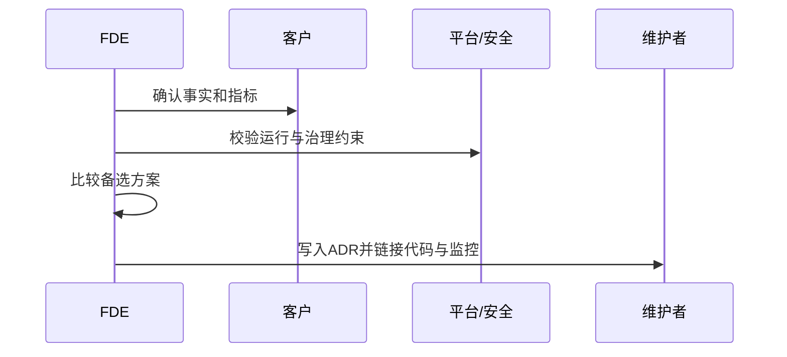

## 3.2 架构决策记录

### 3.2.1 记录为什么

现场交付中的架构争议，往往不是“选 A 还是 B”，而是三个月后没人记得为什么排除了 C。FDE 环境尤其容易丢失上下文：客户政策变化、数据权限临时放开、供应商接口不稳定、上线窗口被压缩、模型能力快速迭代。若只留下最终代码，后来者只能从实现倒推意图，甚至把临时绕路误认为长期架构。

ADR 可按 Martin Fowler 的 [Architecture Decision Record 介绍](https://martinfowler.com/bliki/ArchitectureDecisionRecord.html) 理解为：记录并解释单个架构相关决策的短文档。这个定义适合 FDE：ADR 不应成为大而全的设计说明，而应捕捉“难以轻易逆转、影响多个模块或团队、带来明显取舍”的决定，例如是否采用事件驱动集成、是否接入客户私有模型、是否允许同步调用跨越安全域。

### 3.2.2 最小 ADR

常见 ADR 模板通常包含状态、背景、决策和后果。本书建议 FDE 在现场交付中再补上备选方案、复审条件、风险接受人和回滚边界。状态说明它是提议、接受、废弃还是被替代；背景说明事实来源、利益相关方、质量属性和约束；决策用明确语句表达选择；备选方案说明为什么不选；后果同时写收益、代价和新增风险；复审条件说明什么变化会触发重看。已接受的 ADR 不应被静默改写；若事实变化导致决策失效，应新增一条替代 ADR，并链接旧记录。

ADR 的价值在于降低“重新争论成本”。当新成员质疑为什么不用某个流行框架时，ADR 可以说明当时的网络隔离、审计要求、运维能力和迁移窗口。当业务方要求快速加功能时，ADR 可以指出容量假设和可扩展边界。讨论因此从“谁说了算”变成“哪些事实变化了”。

现场时间被压缩时，可以先写一条 5 分钟 ADR，后续再补细节。

| 字段 | 最小写法 |
| --- | --- |
| 决策 | 选择什么，不选择什么 |
| 约束 | 哪些事实、指标、合规或运行条件驱动这个选择 |
| 替代方案 | 至少一个被排除方案及原因 |
| 风险接受 | 谁接受剩余风险，是否客户可见 |
| 回滚边界 | 哪些状态、数据、配置或模型版本可回退，哪些不可逆 |
| 复审触发 | 哪个指标、日期、政策或依赖变化会触发重看 |

### 3.2.3 ADR 示例：库存异常处理该用事件驱动还是同步调用

**状态：接受。**

**背景。** 库存异常处理 Agent 需要接收 WMS 盘点差异、ERP 安全库存告警、生产领料失败和人工工单标记。异常处置通常需要读取多系统数据、生成归因建议、创建工单并等待人工确认。客户现场存在接口限流、网络分区和人工审批窗口；本案例假设业务要求异常进入系统后 5 分钟内可见，30 分钟内形成可处理工单，但不要求触发方同步等待归因完成。这个数值来自案例设定，真实项目应由现场指标和客户承诺决定。

**备选方案。**

| 方案 | 优点 | 代价 |
| --- | --- | --- |
| 全同步调用 | 调用链直观，入口系统可立即得到结果 | 调用方被 Agent、数据源和工单系统的延迟共同拖慢，失败时容易产生跨系统半完成状态 |
| 事件驱动 | 入口系统只发布异常事件，Agent 异步归因和编排，天然支持重试与削峰 | 需要事件契约、幂等键、死信队列和可观测链路 |
| 批处理轮询 | 对老系统侵入小，实施快 | 实时性差，重复处理和遗漏检测成本高 |

**决策。** 采用事件驱动作为主路径：各入口系统发布 `InventoryAnomalyDetected` 事件，事件必须包含异常类型、物料、仓库、批次或批次不适用标记、业务时间窗口、来源系统、幂等键和 trace ID。库存异常 Agent 订阅事件后异步读取上下文、生成归因建议并创建或更新工单。对无法发布事件的遗留系统，允许短期批处理适配器把变更转成同一事件契约；不允许入口系统同步等待 Agent 完成归因。

**后果。** 收益是入口系统解耦、失败可重试、突发异常可削峰、人工审批和模型推理延迟不会阻塞核心交易。代价是必须建设事件契约治理、重复事件去重、死信处理、延迟监控和跨系统 trace。事件平台还必须明确投递语义、保留与重放窗口、分区与顺序保证、schema registry owner、死信 owner、补数和回放规则。新增风险是消费者滞后导致异常处理延迟，所以需要监控事件积压、归因耗时、死信数量和工单创建失败率。

**风险接受与回滚。** 业务 owner 接受“事件进入后异步归因”的用户体验风险；平台 owner 接受事件总线和监控的运行责任。回滚边界是关闭 Agent 消费者、暂停自动创建工单、回到只读建议或人工处理队列；已经创建的工单必须通过状态机补偿，不能直接删除审计记录。

**复审条件。** 若 95% 异常需要 30 秒内同步返回处置结果，或客户平台不允许部署事件总线，或事件投递延迟连续两周超过业务窗口，应复审决策。上述阈值是案例假设，真实项目应写入客户承诺或 SLO 来源。若库存域提供稳定的受控调整接口，也应复审 Agent 是否可从“建议和工单编排”扩展到“自动提交待审批调整”。

### 3.2.4 贴近系统

| 决策类型 | 触发记录 | 复审信号 |
| --- | --- | --- |
| 系统边界 | 影响团队责任或数据所有权 | 需求频繁跨边界变更 |
| 集成方式 | 同步、异步、批处理之间取舍 | 延迟或一致性假设失效 |
| 安全与隐私 | 信任边界、权限、密钥、审计、脱敏、数据保留 | 合规要求或数据用途变化 |
| 平台依赖 | 采用云服务、开源组件或供应商能力 | SLA、价格、锁定风险变化 |
| 可靠性承诺 | 可用性、延迟、恢复时间、降级方式 | SLO 或客户承诺变化 |
| 产品化路径 | 项目特定、平台能力、产品能力之间取舍 | 多个场景重复出现同一能力 |

ADR 应与代码、接口和运行证据放在同一条链路中。关键模块、API、数据管道或部署环境应能找到对应决策；ADR 也应链接需求切片、验证结果、威胁模型、性能测试、OpenAPI 或事件 schema、事故复盘和客户 owner 确认。判断标准很简单：未来维护者若需要知道“当时为什么这样做”，就写。
