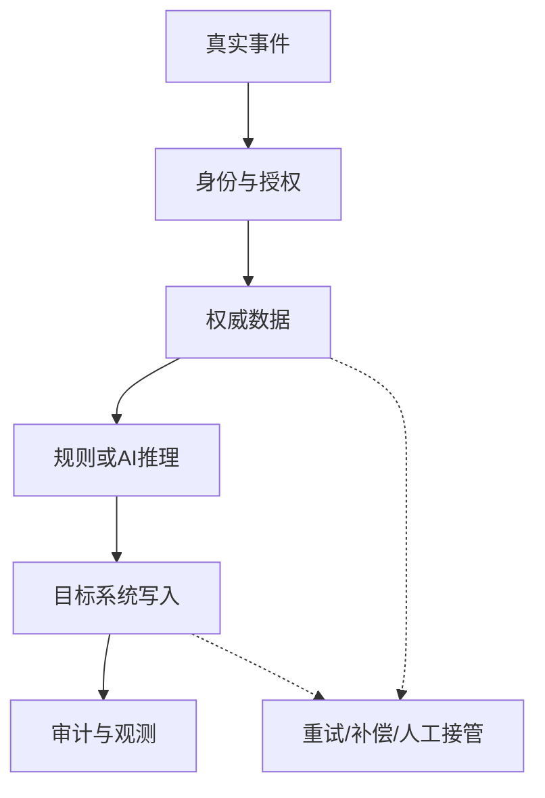

## 3.3 集成优先的设计原则

### 3.3.1 风险在连接处

企业现场很少缺少单点工具，真正的困难通常发生在连接处：身份系统与业务系统权限口径不同，主数据平台与报表系统更新频率不同，供应商 API 的错误语义不稳定，批处理任务和实时工作流争夺同一份状态。FDE 若先做漂亮原型、最后再补集成，常会发现原型最顺畅的路径恰好绕开了生产环境最硬的约束。

集成优先不是一次接完所有系统，而是优先验证跨边界事实：哪些身份可以调用，哪些字段是权威来源，失败能否重试，幂等键放在哪里，审计日志能否还原责任。云厂商框架可作为检查清单，但不应被当成固定不变的完整列表：运行卓越、安全、可靠性、性能效率、成本优化和可持续性可参考 [AWS 的 Well-Architected Framework](https://docs.aws.amazon.com/wellarchitected/latest/framework/the-pillars-of-the-framework.html)；运行卓越、安全、隐私与合规、可靠性、成本和性能等维度也可参考 [Google Cloud 的架构框架](https://docs.cloud.google.com/architecture/framework)。FDE 应让这些维度先落在集成路径上，而不是停留在架构评审表格里。

### 3.3.2 最薄可运行路径

集成设计应从“最薄可运行路径”开始。这里的“薄”指业务范围薄，不是生产约束薄。选择一条真实业务流，包含真实身份、真实数据、真实权限、真实错误和真实审计；功能覆盖面可以小，但关键约束不能被模拟掉。例如库存异常 Agent 可先只覆盖一个仓库和一个异常类型，但必须使用生产等价身份和真实权限模型，读取真实库存源，写入受控试点租户、沙箱、影子工单或带人工确认的真实工单系统，并在失败时留下可追踪记录。未通过验收前，不应直接触发不可逆的生产动作。

这条路径是未来生产系统的脊柱。围绕它扩展时，新增场景只是在已验证的身份、数据、写入、审计和观测机制上增加分支。这样最早暴露的是系统性风险，而不是等功能堆满后才发现基础连接不可用。

时间压力很大时，FDE 可以把现场动作压缩成三步：前 30 分钟确认不可逆写入、真实 owner 和必须停下来的风险；前 60 分钟选出一条生产等价薄路径，写下身份、数据源、写入目标和回滚边界；前 120 分钟完成一次真实事件穿透或明确阻塞证据。若 owner、权限、回滚或审计任一项无法确认，就不应把演示路径升级为试点路径。

### 3.3.3 工程约束

| 原则 | 现场问题 | 工程约束 |
| --- | --- | --- |
| 真实身份优先 | 测试账号绕过权限 | 使用生产等价权限模型 |
| 权威数据优先 | 报表口径冲突 | 标注权威来源（source of truth）与延迟 |
| 失败路径优先 | 接口失败导致脏状态 | 设计重试、补偿和人工接管 |
| 可观测优先 | 无法定位跨系统故障 | 统一 trace ID、业务键和审计字段 |

| 集成失败模式 | 必要控制 | 验收证据 |
| --- | --- | --- |
| 超时 | 超时预算、重试上限、熔断和降级 | 超时测试能触发明确错误、告警和降级 |
| 重复投递 | 幂等键、去重记录、重复事件监控 | 同一事件重放只更新同一业务对象 |
| 权限拒绝 | 明确错误码、审计、最小权限修正流程 | 越权请求被拒绝且能定位请求主体和策略版本 |
| 部分写入 | 补偿动作、状态机、人工接管 | 人工队列 owner、补偿动作和终态可查询 |
| 数据延迟 | 新鲜度指标、延迟告警、只读降级 | 过期数据进入降级路径，不生成高置信动作 |
| 下游不可用 | 队列缓冲、死信、回放和业务通知 | 死信 owner、重放窗口、重放命令和业务通知路径清楚 |

### 3.3.4 集成验收

发现阶段的风险假设进入架构阶段后，应变成可执行控制。以库存异常 Agent 为例，集成验收至少要回答下表。

| 验收问题 | 应落到的具体值 |
| --- | --- |
| 谁能触发 | 触发系统、调用身份、授权主体、仓库或租户范围 |
| 事件怎样到达 | 投递语义、发布确认、保留时间、重放窗口、checkpoint 或 outbox 规则 |
| 状态怎样推进 | 新建、归因中、待人工确认、已派单、已关闭、已拒绝、需补偿等状态和 owner |
| 失败谁接管 | DLQ owner、人工队列 owner、升级路径、最长等待时间 |
| 如何回滚 | 关闭消费者、暂停写入、回到只读建议、补偿已创建工单的规则 |
| 如何扩面 | 从一个仓库/异常类型扩到更多范围时必须重新验证的契约和指标 |

FDE 的架构能力不在于画出复杂拓扑，而在于把系统接起来后仍能解释、运行和演进。只要真实集成路径成立，功能扩展就有稳定基础；若它不成立，再多局部功能也只是暂时可看的孤岛。
