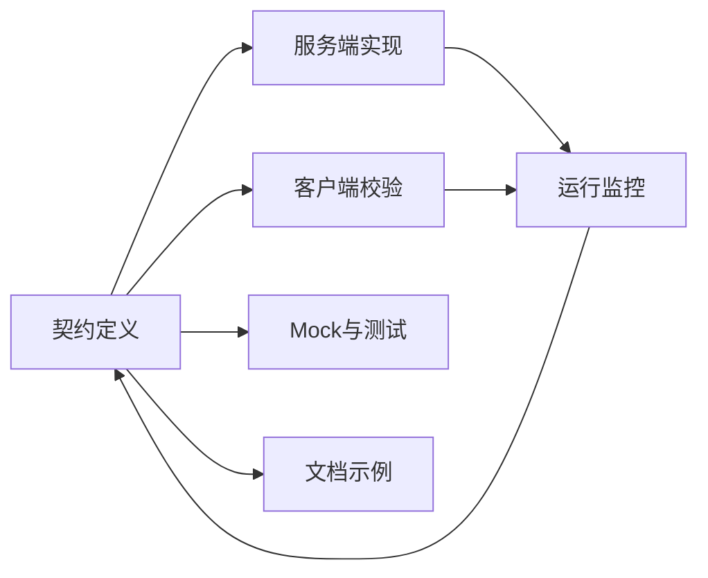

## 3.4 可演进接口与契约

### 3.4.1 接口是承诺

在 FDE 项目中，接口不只是技术调用方式，而是组织之间的承诺。API、事件主题、数据表、文件格式或模型工具调用，一旦被其他团队依赖，就形成契约。契约含糊，调用方会靠猜测实现；变化没有治理，生产系统会在意外处断裂。接口设计的核心不是“今天调用成功”，而是“明天变化时仍保护消费者”。

HTTP API 的契约表达可借鉴 [OpenAPI Specification](https://spec.openapis.org/oas/latest)：它用与编程语言无关的接口说明，使人和工具无需读取源码或抓包即可理解服务能力。这个思想可推广到所有集成形式：契约应表达输入、输出、错误、权限、幂等、版本和弃用策略。AI 工具调用还要说明副作用和安全拒绝边界。

### 3.4.2 面向演进

可演进接口遵循三条原则：新增可选字段、枚举扩展、事件附加元数据，不破坏旧消费者；删除字段、改变语义、收紧权限、修改错误码，必须有版本、迁移窗口和消费者清单；文档、mock、测试和监控基于同一份契约，而不是各自维护。

| 契约元素 | 应说明的内容 | 破坏性变化示例 |
| --- | --- | --- |
| 数据结构 | 字段类型、必填性、枚举、单位 | 必填字段新增 |
| 行为语义 | 幂等、排序、一致性、重试结果 | 覆盖变为追加 |
| 错误模型 | 错误码、可重试性、人工处理 | 认证与权限错误混用 |
| 生命周期 | 版本、弃用、迁移期限 | 无通知删除旧接口 |



可复制的契约模板应至少包含以下字段。

| 字段 | 用途 |
| --- | --- |
| owner / consumer | 明确提供方、消费者和升级联系人 |
| schema / version | 记录 schema 引用、主次版本和兼容策略 |
| 权限 | 说明授权主体、委托关系、数据范围、策略版本和拒绝条件 |
| 数据安全 | 标注数据分类、保留期限、脱敏要求、日志/提示词暴露边界 |
| 错误模型 | 区分可重试、死信、越权、人工复核等错误 |
| 幂等 | 定义幂等键来源、覆盖范围和重复处理规则 |
| 投递语义 | 说明顺序、重放窗口、checkpoint、死信 owner 和补数规则 |
| 弃用窗口 | 写清通知方式、迁移期限、最后支持日期 |
| mock 来源 | 说明 mock 由契约生成或校验，避免手写漂移 |
| 契约测试 | 记录消费者测试、提供方验证和运行监控指标 |

### 3.4.3 小型契约示例：库存异常事件

以库存异常处理 Agent 为例，入口系统发布事件，Agent 消费事件并创建或更新异常工单。契约可以先保持小，但必须把兼容性和失败语义写清楚。

```json
{
  "eventType": "InventoryAnomalyDetected",
  "schemaRef": "inventory.anomaly.v1.1",
  "producerVersion": "wms-adapter@2.4.0",
  "tenantId": "tenant-acme-mfg",
  "partitionKey": "WH-01:SKU-10086",
  "idempotencyKey": "wms:COUNT_MISMATCH:WH-01:SKU-10086:BATCH-9:2025-12-01T10:00:00Z/2025-12-01T10:30:00Z",
  "traceId": "0f6a8d7c2e3b4a910f6a8d7c2e3b4a91",
  "occurredAt": "2025-12-01T10:15:00Z",
  "businessWindow": {
    "start": "2025-12-01T10:00:00Z",
    "end": "2025-12-01T10:30:00Z"
  },
  "authorization": {
    "subjectType": "service-account-with-delegation",
    "delegatedRole": "warehouse-supervisor",
    "scope": ["warehouse:WH-01"],
    "policyVersion": "inventory-policy@2025-11"
  },
  "sourceSystem": "WMS",
  "warehouseId": "WH-01",
  "sku": "SKU-10086",
  "batchNo": "BATCH-9",
  "anomalyType": "COUNT_MISMATCH",
  "quantityDelta": -12,
  "unit": "EA",
  "severity": "HIGH",
  "links": {
    "sourceRecord": "wms://cycle-count/CC-7788",
    "evidenceSnapshot": "evidence://inventory-anomaly/INV-20251201-0007"
  }
}
```

字段兼容规则应写成可测试约束，而不是写成自然语言承诺。

| 规则 | 含义 | 测试 |
| --- | --- | --- |
| 未知字段 | 消费者应忽略未知字段，新增字段默认可选 | 示例事件附加随机字段后仍可消费 |
| 稳定字段 | `eventType`、`tenantId`、`warehouseId`、`sku`、`anomalyType`、`occurredAt`、`idempotencyKey`、`schemaRef`、`traceId`、`sourceSystem` 不得在同一主版本内删除或改义；`batchNo` 仅在物料或领域受批次管理时必填 | 缺失必填字段进入死信；非批次物料必须有“批次不适用”规则 |
| 分区与顺序 | `schemaRef` 标识契约版本，`producerVersion` 用于事故复盘，`partitionKey` 决定下游分区与局部顺序保证 | 同一仓库和物料的事件按约定分区 |
| 枚举扩展 | `anomalyType` 允许增加新值，消费者遇到未知枚举时降级为 `UNKNOWN` 并转人工队列 | 未知枚举样例进入人工复核 |
| 单位 | 数量字段必须由 `unit` 明确给出，不能靠客户默认单位推断 | 缺失单位被拒绝或转人工 |
| 时间窗口 | 业务窗口必须由 `businessWindow` 或明确窗口规则表达，不能只埋在幂等键里 | 同一窗口重复事件产生同一业务对象 |

错误模型也属于契约。消费者处理失败时至少应区分下列类型。

| 错误 | 含义 | 处理 |
| --- | --- | --- |
| `RETRYABLE_UPSTREAM_TIMEOUT` | 读取上下文超时 | 自动重试，超过预算后告警 |
| `INVALID_EVENT_CONTRACT` | 必填字段缺失或类型错误 | 进入死信并通知来源系统 |
| `FORBIDDEN_DATA_SCOPE` | 事件要求读取越权数据 | 拒绝、审计并要求权限复核 |
| `STALE_EVIDENCE` | 关键库存或工单快照超过新鲜度窗口 | 只读降级或转人工 |
| `CONFLICTING_EVIDENCE` | ERP、WMS、MES 或工单事实冲突 | 进入人工复核，不自动归因 |
| `UNSUPPORTED_CAUSE` | 现有规则或模型无法支持该异常原因 | 记录新类别，转人工队列 |
| `UNTRUSTED_PROMPT_CONTENT` | 自由文本或外部链接包含可疑指令 | 隔离为不可信内容，不进入系统指令 |
| `MANUAL_REVIEW_REQUIRED` | 数据足够但置信度或影响级别需要人工确认 | 创建人工复核工单 |

幂等键由来源系统生成，并覆盖“来源系统、仓库、物料、批次或批次不适用标记、异常类型、业务时间窗口”。Agent 使用幂等键保证重复投递只更新同一异常记录或工单，不创建重复工单。若来源系统无法生成稳定键，适配器必须在发布事件前补齐，不能把去重责任留给人工处理。生产者还要说明 checkpoint、发布确认、回放窗口和补数规则，否则只能避免重复，不能证明不会漏事件。

弃用窗口要写入契约生命周期。比如 `quantityDelta` 计划从整数改为小数字段时，可先新增 `quantityDeltaDecimal` 并双写一段迁移窗口；当消费者监控显示旧字段已无读取并经过约定观察期后，才能宣布下一主版本删除。具体窗口不应套用固定天数，应按消费者数量、发布周期、客户合规要求和回滚能力决定。弃用通知应列出受影响消费者、迁移示例、最后支持日期和回滚方式。

消费者 mock 与契约测试必须同步。消费者 mock 由同一份事件契约生成或校验，示例事件不能手写后长期漂移。每次契约变更都要同时更新 mock 示例、消费者契约测试和提供方验证：消费者证明自己能处理新增可选字段、未知枚举、错误模型和重放样例；提供方证明实际发布事件满足必填字段、类型、幂等键、授权字段、时间窗口和弃用窗口要求。读取库存上下文的 API、创建工单的命令接口和 Agent 工具调用也要有契约，至少说明新鲜度、一致性、分页、授权、幂等和副作用。

### 3.4.4 契约测试

契约不能只靠评审守住。Pact 文档把 [consumer-driven contract testing](https://docs.pact.io/) 描述为由消费者写出期望交互、提供方再验证这些交互的机制。它把“谁依赖了什么行为”变成可运行证据。HTTP API 可以用请求/响应交互验证；事件和数据契约则需要 schema 校验、样例语料、生产者验证、消费者回放和运行监控共同支撑。

| 测试层 | 库存异常事件应覆盖 |
| --- | --- |
| producer validation | 发布前校验必填字段、授权字段、业务时间窗口、幂等键和 schema 版本 |
| consumer replay | 用样例事件重放新增可选字段、未知枚举、重复投递、乱序和死信场景 |
| error fixtures | 覆盖越权、证据冲突、过期快照、不可信文本、低置信度和不支持原因 |
| mock drift check | mock 与契约样例来自同一来源，不能由消费者长期手写 |
| runtime monitor | 监控契约错误率、未知枚举量、死信量、旧字段读取和消费者版本 |

契约测试不替代端到端测试，也不证明业务流程完整正确；它主要证明跨边界交互仍满足消费者假设。因此应覆盖高价值调用、关键错误路径和兼容性约束。FDE 交付时，应把契约、mock、测试、监控和迁移说明作为同一交付包，避免“代码能跑、契约已漂移”的隐性失败。
