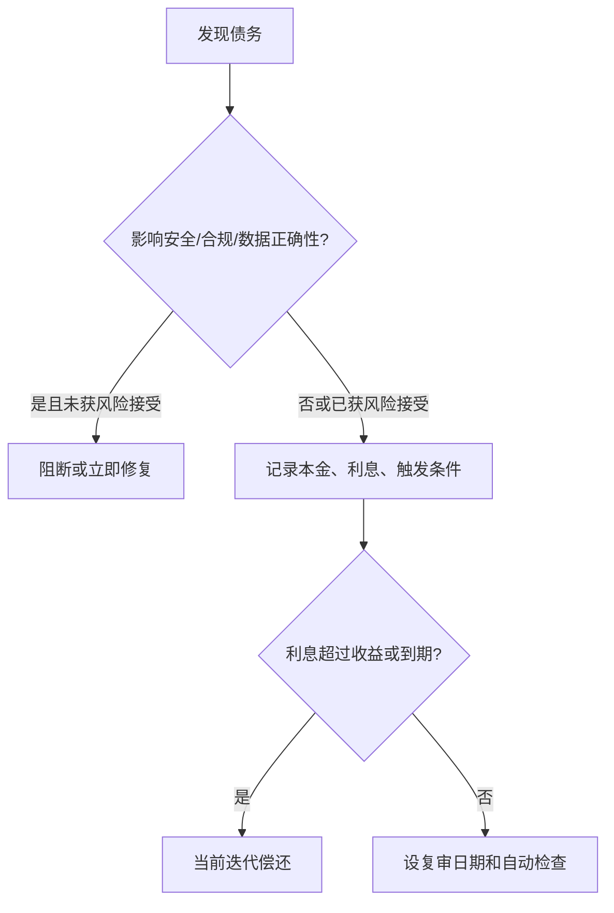

## 3.5 技术债管理

### 3.5.1 技术债的边界

现场交付常在时间压力下做取舍：先用手工配置接通权限，先把数据落到临时表，先用同步调用替代事件流，先把模型提示写在配置里。这些选择不一定错误。技术债的关键不在于“有没有不完美”，而在于团队是否有意识地借用了未来维护成本来换取当前学习速度或交付窗口。

CMU 软件工程研究所对 [technical debt](https://www.sei.cmu.edu/library/managing-technical-debt-in-complex-software-systems/) 的定义强调：短期方便的设计或构造方式，会创造一个使未来同类工作成本更高的技术上下文；若能管理，某些债务可加速探索，若不识别和管理，则会增加开发与维护成本。本书采用更严格的治理口径：缺陷、安全漏洞、无人负责的脚本和错误数据口径，不能被轻描淡写地称为债务。只有被明确记录、限期、有人接受风险、并且有偿还触发条件的取舍，才可作为技术债管理；否则就是需要修复或升级的质量风险。

### 3.5.2 本金、利息、触发条件

FDE 的技术债管理不能只列“代码需要重构”。债务项必须说明它阻碍什么业务变化、增加什么运行风险、影响哪些团队，以及不偿还会产生什么利息。例如“库存同步任务没有幂等键”的利息是重复写入和人工清账；“RAG 索引没有血缘记录”的利息是无法解释答案来源；“权限映射写死在配置中”的利息是每次组织调整都要工程师介入。单项债务模板应包含位置、债务描述、本金、利息指标、风险级别、偿还触发、偿还动作、负责人、风险接受人、到期日期、是否阻断生产、客户可见风险和对应的自动检查或人工复审。

| 债务类型 | 典型表现 | 利息指标 | 偿还触发 |
| --- | --- | --- | --- |
| 架构债 | 边界错位、循环依赖 | 跨团队变更次数 | 新场景无法局部交付 |
| 数据债 | 口径不清、血缘缺失 | 对账工时、数据事故 | 进入生产运营 |
| 安全例外债 | 被批准且限期的临时账号、过宽权限 | 例外数量、审计缺口 | 合规评审或到期日 |
| 运维债 | 无告警、手工部署 | MTTR、夜间介入 | SLA 提升 |
| AI 债 | 提示散落、评测缺失 | 回归失败、人工复核率 | 模型升级 |

### 3.5.3 债务样例

库存异常 Agent 的一个可接受债务项可以这样记录。

| 字段 | 示例 |
| --- | --- |
| 位置 | `wms-batch-adapter` 的事件发布路径 |
| 债务描述 | 暂时用轮询适配器生成库存异常事件，尚未接入 WMS outbox |
| 当前收益 | 不改造 WMS 即可验证一个仓库的异常闭环 |
| 未来利息 | 可能漏掉短时间内创建后撤销的异常；补数时需要人工比对 |
| 风险级别 | 中；不允许进入全量生产 |
| 偿还触发 | 试点超过两个仓库、事件漏报率超过阈值、或准备接入自动库存调整 |
| 偿还动作 | 接入 outbox 或变更日志，补齐 checkpoint、发布确认和回放测试 |
| 负责人 / 风险接受人 | FDE 技术负责人 / 客户 WMS owner |
| 到期日期 | 试点结束前 |
| 自动检查 | 每日比对 WMS 异常数和已发布事件数，差异进入人工复核 |

### 3.5.4 AI 债的常见形态

AI 原生 FDE 项目会引入一类不同于传统架构、数据或运维债的“AI 债”。这类债务常在原型阶段看起来成本很低，但随着模型、数据、工具和安全策略版本演进，维护成本可能快速上升。常见形态包括：

- **提示词漂移**：提示词散落在代码、配置和实验笔记中，没有版本、负责人和评测基线，模型升级后效果难以归因。
- **评测集衰减**：评测样本只在原型阶段构造一次，未随业务真实分布更新，导致回归通过但生产质量下降。
- **向量索引重建成本**：嵌入模型、切分策略或元数据 schema 变更时缺少增量重建路径，每次升级都需全量重算，停机和成本失控。
- **工具版本绑定**：Agent 调用的工具签名、错误码或副作用未被契约化，工具升级时 Agent 行为静默退化。
- **模型供应商更换成本**：提示、上下文格式、Token 计费、安全策略和评测指标紧耦合到单一供应商，切换或多供应商策略需要重写整条链路。

这些债务都应进入 3.5.2 的本金/利息/触发条件清单，并在评测、监控和发布流程中配置对应的自动检查或人工复审。

### 3.5.5 嵌入交付节奏

技术债最怕只在复盘会上承认、从不进入计划。SEI 关于 [识别技术债条目](https://www.sei.cmu.edu/library/managing-technical-debt-identify-technical-debt-items/) 的资料可用于启发团队建立债务条目和影响记录。FDE 可用轻量字段管理：位置、原因、当前收益、未来利息、风险级别、偿还动作、负责人、风险接受人和复审日期。

Thoughtworks 对 [fitness function-driven development](https://www.thoughtworks.com/en-gb/insights/articles/fitness-function-driven-development) 的说明指出，适应度函数能持续反馈系统是否符合架构目标。放到 FDE 场景，可把关键债务转成检查：接口必须有契约测试，数据管道必须有质量规则，生产服务必须有 SLO 指标，AI 提示变更必须跑回归评测。目标不是无债，而是债务可见、可量化、可复审。

进入原型时，债务可以帮助团队快速学习；进入试点时，每个债务都必须有 owner、到期日和客户可见风险；进入生产化时，阻断安全、数据正确性、运行恢复和责任转移的债务必须偿还或由有权负责人正式接受。若一个债务无法说明谁接受、何时复审、如何检测利息，它不应留在债务清单里，而应升级为交付风险。
