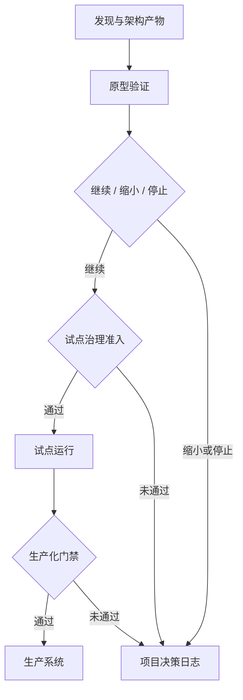

## 4.3 原型、试点与生产化

### 4.3.1 三个阶段解决三类问题

FDE 交付常被误解为“先做一个 PoC，再补工程化”。这种路径容易失败，因为原型、试点、生产化解决的是不同问题。原型回答“这个方向是否值得继续”，试点回答“真实用户和真实流程是否能跑通”，生产化回答“组织是否能长期、安全、可观测地运行”。如果把三者混成一个阶段，团队会在原型里过度建设，或把试点系统直接推上生产，最后既慢又危险。

本节承接第 2 章的现场地图、事实与约束、领域语言、需求切片和验证计划，也承接第 3 章的系统边界、ADR、集成路径、接口契约和技术债清单。进入原型前，团队至少应知道正在验证哪个业务切片、哪些事实仍是假设、哪些边界不能被临时绕过。进入试点前，真实数据、真实用户和有限权限必须先通过轻量治理准入，不能等生产化时才补隐私、审计和数据用途审批。

原型阶段应压缩范围，优先验证最高不确定性的假设：数据是否可得、模型输出是否可接受、接口是否能打通、业务用户是否真的改变工作方式。试点阶段要引入真实用户、真实数据子集、权限控制、失败恢复和运营指标，同时保留最小自动化检查、可回退路径和必要遥测。生产化阶段则必须补齐可维护性、自动化构建、自动化测试、发布回滚、审计、监控、成本治理和交接机制，并按 [Google SRE Workbook 发布工程章节](https://sre.google/workbook/canarying-releases/)所强调的方式落实自动化、可回滚和小批量变更。这些不是“大公司仪式”，而是把现场实验变成生产系统的最低工程纪律。

下表阈值是 AI 工单分流助手的示例下限，不是通用行业基准。实际项目应按业务量、长尾风险、季节性高峰、合规要求和人工接管能力调整。

| 阶段 | 核心问题 | 输入 | 退出标准 |
| --- | --- | --- | --- |
| 原型 | 假设是否成立 | 关键场景、样例数据、最小接口、最高风险假设 | 50 条脱敏样例能完成端到端分流演示；失败样例、成本估算、继续/停止结论和决策人记录到项目决策日志；至少有可重复演示脚本和关键错误样例 |
| 试点准入 | 真实数据能否合规进入受控流程 | 数据用途、字段分级、用户范围、权限方案、保留期 | 客户数据 Owner 确认用途和保留策略；反馈单脱敏规则、访问范围、审计方式和删除责任明确；试点用户与培训对象已确认 |
| 试点 | 真实流程是否可用 | 真实用户、受控数据、有限权限、回退路径、最小遥测 | 连续 2 周覆盖一个业务队列；人工改派率、低置信度升级量、平均处理时长、单位工单成本和用户反馈有基线与方向性变化；严重误分流有记录、回退路径和客户复核 |
| 生产化 | 是否可长期运行 | 完整权限、运维约束、合规要求、运行资产 | 关键路径 SLI/SLO、测量窗口、告警责任人、自动化回归、回滚时限、灰度范围、成本预算和客户签收记录齐备；客户运维至少完成 1 次发布或回滚演练 |

阶段退出标准要写成可验证句子，而不是“效果不错”“用户满意”这类描述。对于 AI 工单分流助手，原型阶段可以只看样例链路和继续投资判断；试点阶段必须看真实用户是否愿意使用、人工覆盖是否可控；生产化阶段则要看告警、回滚、权限、审计和客户接手动作是否全部可执行。

### 4.3.2 未达标时的决策分支

如果 AI 工单分流助手在任一阶段未达到退出标准，团队不应直接“再试一轮”或带病推进，而要按事先约定的失败分支处理。

| 未达标信号 | 默认动作 | 升级条件 | 记录位置 |
| --- | --- | --- | --- |
| 数据证据不足 | 收敛到单一队列、单一字段或单一失败类型，补齐字段口径 | 关键字段无法授权或质量长期不可用 | 项目决策日志；若改变数据边界，补 ADR |
| 模型置信度不稳 | 降级为人工辅助建议，扩大失败样本和评测集 | 连续两轮同一任务低于阈值，或误分流影响高风险客户 | 评测记录、反馈单、项目决策日志 |
| 用户不愿进入真实流程 | 回到第 2.1 节重做场景和基线确认 | 业务 Owner 无法安排试点用户或运营窗口 | 项目决策日志 |
| 权限、合规或成本不可外推 | 停止扩面，提出停止、缩小或更换切片选项 | 需要客户发起人接受风险或调整目标 | 风险清单、治理记录、项目决策日志 |

FDE 应该用证据而非情绪说明哪些假设被证伪、为什么继续投入会放大风险、备选路径的成本与收益是什么，并把决议、责任人和后续动作写入项目决策日志。若决策改变系统边界、接口契约、数据所有权或长期技术债，则同步补充第 3 章定义的 ADR。

### 4.3.3 生产化是一次重新设计

从原型到生产不是把代码“加固一下”，而是重新审视系统边界。原型可以接受手工导入数据、共享账号、离线脚本和临时提示词；生产系统必须有身份边界、数据血缘、错误处理、版本管理和可审计行为。尤其在 AI 原生 FDE 项目中，原型阶段的“效果不错”并不代表生产可用。生产化要回答：模型失败时谁接管，用户误操作能否撤销，敏感数据是否进入不该进入的上下文，输出是否有评测基线，成本峰值是否受控。

从 [DORA 交付指标](https://dora.dev/guides/dora-metrics/)看，团队应把变更前置时间、部署频率、失败部署恢复时间、变更失败率和部署返工率放在一起观察，而不是只追求速度。FDE 生产化也应同时看速度与稳定性：小批量发布让团队快速学习，质量门禁和回滚路径让失败影响可控。第 6 章会展开流水线、制品、GitOps、IaC 和发布策略；本章只定义交付阶段中谁负责、何时必须具备证据、缺证据时如何阻断或降级。

| 门禁 | 检查时点 | 最终负责角色 | 必要证据 | 不通过时动作 |
| --- | --- | --- | --- | --- |
| 工程门 | 原型到试点、试点到生产 | 交付工程师 | 自动化构建、关键测试、依赖清单、回滚脚本、AI 行为资产版本清单 | 补测试、缩小范围或降级为人工辅助 |
| 运行门 | 试点扩面、生产发布 | 客户运维 Owner | 监控、告警、容量、运行手册、演练记录、灰度范围、暂停/回滚触发条件 | 暂停扩面，补运行资产 |
| 治理门 | 真实数据试点前、生产发布前、数据用途变化时 | 客户数据 Owner | 权限矩阵、审计字段、数据用途与保留策略、脱敏规则、反馈数据访问范围、供应商数据边界 | 限制真实数据、禁止写动作或改为离线验证 |
| 业务门 | 试点开始、扩面、生产接手 | 客户业务 Owner | 培训对象、支持流程、验收指标、人工接管规则、风险接受和退出条件 | 继续试点、重新切片或停止 |

