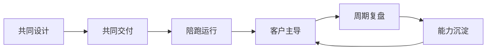

## 4.5 知识转移与客户自治

### 4.5.1 交付完成的标志是客户能独立运行

FDE 不是把系统交给客户后退出，也不是长期替客户操作系统。真正的交付完成，是客户团队能够理解系统边界、独立处理常见问题、判断何时升级支持，并能基于业务变化提出有质量的下一轮需求。知识转移因此不是最后一周的培训课，而是从项目第一天开始的共同建造过程。客户参与需求澄清、验收样例、运行手册和事故复盘，本身就是能力建设。

组织采用新系统不是“通知一下”就会发生；个人层面的改变可参考 Prosci 方法论中的 [Prosci ADKAR® Model](https://www.prosci.com/methodology/adkar)，它把改变拆为 Awareness、Desire、Knowledge、Ability、Reinforcement。FDE 可以把这个模型转成客户自治路径：先让相关人员知道为什么要改变，再让关键角色愿意参与，然后传授如何操作，接着在真实流程中练到能独立完成，最后用制度、指标和复盘把新行为固定下来。这里的“客户”也不只是业务用户，还包括平台、运维、安全、数据治理、培训和管理层。只培训终端用户而不培训运维与治理角色，会导致系统上线后没人敢改、没人会查、没人能恢复。

| ADKAR 阶段 | FDE 知识转移动作 | 重点角色 | 可观察证据 |
| --- | --- | --- | --- |
| Awareness | 说明业务痛点、旧流程成本、系统边界 | 业务、运维、安全、数据治理、管理层 | 各角色能复述目标和不做事项 |
| Desire | 让业务负责人参与优先级和验收，明确个人收益和风险 | 业务 Owner、试点用户、主管 | 试点用户愿意投入真实流程，主管愿意安排运营窗口 |
| Knowledge | 提供操作、配置、故障处理、反馈提交流程和治理材料 | 坐席、主管、运维、安全、数据 Owner | 用户能按手册完成任务，运维能解释告警 |
| Ability | 陪跑生产任务、误分流纠正、低置信度处理和异常升级 | 一线用户、客户运维、支持团队 | 客户能独立处理常见事件并提交有效反馈 |
| Reinforcement | 建立采用率、人工绕行率、支持工单趋势、例会和复盘节奏 | 业务 Owner、运营负责人、培训负责人 | 新流程持续使用，复盘行动项有 Owner 和复核日期 |

如果某个角色卡住，不能只用“再培训一次”解决。业务用户卡在 Desire，通常要重新解释收益和风险；运维卡在 Ability，通常要补手册、权限和演练；安全或数据治理卡在 Awareness，通常说明系统边界、数据用途或审计证据没有讲清楚。按角色诊断阻力，知识转移才不会变成泛泛培训。

### 4.5.2 自治能力需要产品化沉淀

客户自治不是把所有内部细节暴露给客户，而是把可交付能力产品化。FDE 团队应沉淀四类资产：运行资产、学习资产、治理资产和演进资产。运行资产包括部署说明、监控面板、告警规则、回滚步骤和支持分级；学习资产包括用户手册、培训材料、常见问题、演示数据和操作练习；治理资产包括权限矩阵、审计说明、数据处理边界和变更流程；演进资产包括路线图、已知限制、决策记录和待验证假设。

这些资产要沿用 4.1 的 RACI 思路绑定维护责任人，而不是只交付文件。每份文档、每个看板、每条运行手册都要有客户侧维护人、复核周期和更新触发条件，否则它们会很快变成历史快照。FDE 撤场前最重要的不是“把文档交付完”，而是验证客户能否使用这些资产完成一次真实操作：新增用户、处理失败任务、回滚一次配置、解释一条告警、完成一次小版本发布。只有当客户能完成这些动作，系统才从供应商依赖转为组织能力。

| 资产类型 | 典型内容 | 必须绑定的责任 |
| --- | --- | --- |
| 运行资产 | 监控面板、告警规则、运行手册、回滚步骤 | 客户运维 Owner、复核周期、演练记录 |
| 学习资产 | 用户手册、培训材料、FAQ、练习数据 | 客户培训负责人、新人上手流程、效果检查 |
| 治理资产 | 权限矩阵、审计说明、数据处理边界、变更流程 | 客户数据 Owner、平台/安全角色、复核日期 |
| 演进资产 | 路线图、已知限制、项目决策日志、待验证假设 | 客户业务 Owner、产品待办维护人 |

### 4.5.3 撤场验收清单

撤场验收不是项目结束会议，而是确认客户已经能独立运行、治理和演进系统。对于 AI 工单分流助手，FDE 小队应让客户在真实或准生产环境中完成以下检查，并把证据归档到交付记录中。

| 验收项 | 等级 | 客户责任人 | 合格证据 | 复核 / 豁免 |
| --- | --- | --- | --- | --- |
| 业务签收 | 必选 | 客户业务 Owner | 已签收的验收样例、指标窗口、遗留问题清单；坐席或主管能独立处理低置信度、误分流和人工接管 | 签收日期；遗留问题 Owner |
| 运行接手 | 必选 | 客户运维 Owner | 客户运维独立讲解监控面板、告警处置路径、近期变更和回滚入口 | 下一次演练日期 |
| 权限与审计 | 必选 | 客户数据 Owner / 平台安全 Owner | 权限矩阵、审计样例、日志保留期、完整性保护、检索责任、敏感数据处理说明 | 复核周期；审计抽查负责人 |
| 发布与回滚 | 必选 | 客户运维 Owner | 客户主导完成一次小版本发布或回滚演练，记录触发条件、执行人、验证方式 | 演练日期；失败补救动作 |
| 事故升级 | 必选 | 客户业务 Owner | 值班联系人、升级时限、沟通模板、事故编号规则、复盘负责人和行动项 Owner | 下一次联系人复核日期 |
| 知识资产 | 必选 | 客户培训负责人 | 文档清单、维护责任人、新人上手流程、培训效果检查和下一次复核日期 | 材料复核周期 |
| 后续演进 | 必选 | 客户业务 Owner | 路线图、项目决策日志、风险接受、暂缓项和客户确认的取舍说明 | 复核会议日期 |
| 提示词资产 | 条件必选 | 领域/产品负责人 | 提示词仓库访问权、版本说明、评测样本、回滚版本和变更审批人 | 下一次回归日期 |
| 评测样本 | 条件必选 | 领域/产品负责人 / 客户数据 Owner | 评测集版本、构造方式、刷新周期、数据来源和脱敏规则；验收样例已映射到可执行评测样本 | 刷新责任人和日期 |
| 模型供应商 | 条件必选 | 客户运维 Owner / 采购负责人 | 客户独立账户与计费、密钥归属客户、数据保留或零保留配置、区域、SLA、模型弃用通知、价格变更和降级演练 | 供应商复核日期；退出计划 |
| 成本治理 | 条件必选 | 客户财务 / 运维 Owner | 成本看板、预算阈值、单位工单成本、告警接收人和异常成本处置手册 | 月度复核日期 |

只有当必选项都有客户侧责任人和可复核证据，条件必选项要么完成、要么有客户签字的豁免记录，FDE 才应从“主导交付”转为“按需支持”。如果客户仍依赖 FDE 执行发布、解释告警或判断事故等级，撤场就只是形式完成，系统还没有真正进入客户自治。

撤场标准还要匹配运营模型。客户自运维时，客户应能独立发布、回滚、排障和复盘；联合运维时，要明确 FDE 或供应商的 L2/L3 响应窗口、缺陷修复、安全补丁和模型供应商故障边界；供应商托管时，客户至少应掌握业务验收、数据授权、成本治理、审计取证和升级路径。自治不是所有客户都做同样的运维动作，而是每个责任边界都有 Owner、证据和升级路径。

