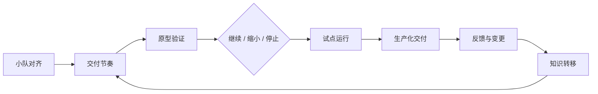

# 第四章：交付节奏与团队协作

前线部署工程的难点不只在技术实现，还在把现场不确定性转化为可持续交付的组织节奏。本章讨论 FDE 团队如何从“能做出一个方案”走向“能让客户组织稳定采用一个系统”：先明确小队模型与角色协同，再建立交付节奏与决策节拍，然后把原型、试点、生产化拆成不同风险阶段，随后建立反馈循环、变更管理和知识转移机制。

贯穿案例：假设 FDE 小队要为客户上线“AI 工单分流助手”，系统需要读取客服工单、识别问题类型、推荐处理队列，并在低置信度或高风险场景下升级给人工坐席。首批试点只覆盖退款队列和账号异常队列，目标是降低人工初分耗时，同时不能让高价值客户、投诉升级或合规敏感工单被自动误导。后续各节会复用这个案例说明角色边界、决策节拍、阶段退出标准、反馈记录和撤场验收，而不是只停留在抽象流程。

DORA 的[交付指标框架](https://dora.dev/guides/dora-metrics/)将软件交付表现拆为吞吐量与稳定性相关指标，强调指标要用于持续改进，而不是用于跨团队排名；Google SRE Workbook 的[发布工程实践](https://sre.google/workbook/canarying-releases/)则说明，自动化、可回滚、小批量发布能降低生产风险。FDE 项目同样需要这两类视角：既要快速学习，也要控制真实业务影响。

本章的核心判断是：交付节奏不是会议频率，也不是项目管理模板，而是团队对价值、风险、责任和学习速度的共同约束。
