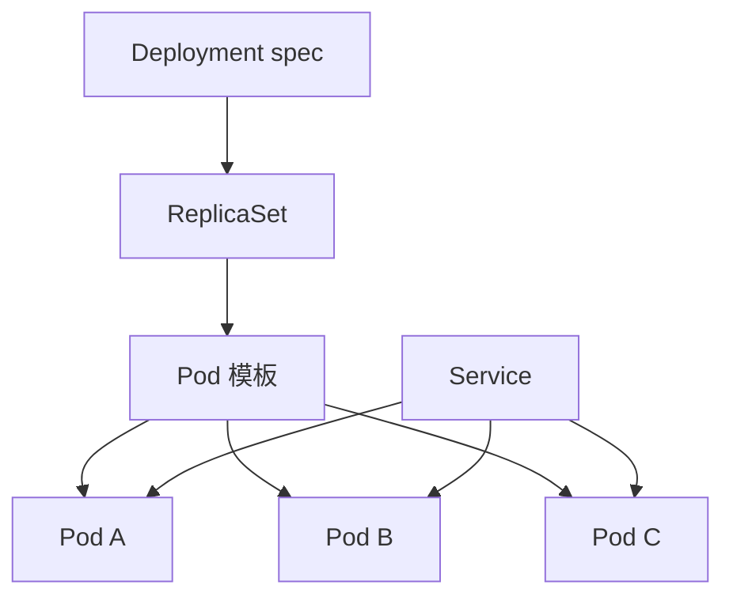

## 5.2 Kubernetes 核心对象

### 5.2.1 声明式对象与控制循环

Kubernetes 的关键抽象不是某个命令，而是对象模型。按照 [Kubernetes 对象文档](https://kubernetes.io/docs/concepts/overview/working-with-objects/)的表述，对象通常包含 `spec` 和 `status`：`spec` 描述期望状态，`status` 反映当前状态，控制平面持续驱动当前状态接近期望状态。FDE 团队要把这种模型当成生产沟通语言：需求不是“到机器上启动三个进程”，而是“声明一个工作负载、三个副本、资源请求、健康检查、滚动更新策略和服务暴露方式”。

Pod 是最小可调度计算单元，可以包含一个或多个共享网络与存储上下文的容器，但 [Pod](https://kubernetes.io/docs/concepts/workloads/pods/) 本身是相对短暂、可替换的实体。通常不应手工管理单个 Pod，而应使用控制器表达意图：Deployment 适合无状态服务，StatefulSet 适合有状态副本，DaemonSet 适合每个节点都要运行的日志、网络、存储、设备或安全代理，Job/CronJob 适合一次性或定时任务。用于应用工作负载时，控制器可通过 [Deployment](https://kubernetes.io/docs/concepts/workloads/controllers/deployment/) 管理一组 Pod，并为 Pod 和 ReplicaSet 提供声明式更新。这个抽象让 FDE 可以把发布、回滚、扩缩容和故障替换交给控制器，而不是把值班手册写成一串手工命令。

### 5.2.2 服务发现、配置与对象边界

工作负载被控制器替换后，访问入口不能绑定 Pod IP。Kubernetes 用 [Service](https://kubernetes.io/docs/concepts/services-networking/service/) 为一个或多个 Pod 暴露稳定访问入口，目标是让应用不必引入陌生的服务发现机制。实践中，Service 常用标签选择后端 Pod，EndpointSlice 记录可达端点，调用方使用稳定服务名访问。迁移或混合云场景还会遇到 selectorless Service、手工管理的 EndpointSlice 或 ExternalName；这些对象可以把外部依赖纳入同一套服务发现口径，但也要求明确 owner、DNS/TLS 责任和健康检查方式。标签与选择器因此成为治理边界，标签也用于[组织和选择对象](https://kubernetes.io/docs/concepts/overview/working-with-objects/labels/)。

配置对象同样需要边界。ConfigMap 适合非敏感配置，Secret 适合凭据类数据，但二者都不应成为无审计的运行时补丁箱；生产环境还要启用 etcd 静态加密、最小 RBAC、外部 Secret Store 或 CSI Secret Store。命名空间适合隔离环境、团队或租户；ServiceAccount 表达工作负载身份，Role、ClusterRole、RoleBinding、ClusterRoleBinding 表达授权边界；NetworkPolicy 决定 Pod 间通信策略，但只有在 CNI/网络插件实现支持时才生效，且默认没有全局 deny。FDE 的交付物应把这些对象作为一个整体审查：Deployment 决定如何运行，Service 决定如何被发现，配置与身份决定能访问什么，网络策略决定能和谁通信。只有对象边界清楚，后续的 GitOps、准入控制、审计和事故复盘才有稳定依据。

现场基线还要记录版本能力，而不是把新特性当作默认能力。这类能力必须按 GA 版本记录：sidecar 容器（`SidecarContainers`）在 v1.33 GA，Dynamic Resource Allocation 核心在 v1.34 GA，in-place Pod resize（`InPlacePodVerticalScaling`）在 v1.35 GA，image volume source（`ImageVolume`）在 v1.36 GA；各自的 alpha/beta 子特性仍在不同阶段（特性阶段的复核节奏见[快变事实核验表](../appendix/volatile_facts.md)）。写「已稳定」而不写版本，对停留在旧版本的客户集群就是假话。它们是否可用于生产还取决于客户集群版本、发行版、运行时、准入策略和团队运维能力。更稳妥的交付方式，是把这些能力写成基线检查表：能力名称、目标用途、最低版本、运行时/插件要求、失败回退方案、是否允许进入生产。这样，读者不会把一条 Kubernetes release note 误认为现场默认可用的交付承诺。

### 5.2.3 有状态与存储边界

并不是所有工作负载都适合 Deployment。缓存、消息队列、搜索索引、关系数据库副本、工作流引擎和许可证服务，往往需要稳定身份、稳定存储和有序启停。对于这类应用，可以用 [StatefulSet](https://kubernetes.io/docs/concepts/workloads/controllers/statefulset/) 这类管理有状态应用的工作负载 API，承载需要持久存储或稳定网络身份的应用。FDE 在客户现场要先判断“状态是否应该进集群”：如果状态来自托管数据库、对象存储或客户既有中间件，Kubernetes 只需要保存连接契约；如果状态必须随服务交付，就要把 StatefulSet、PVC、StorageClass、备份恢复和迁移流程一起设计，而不是只补一个卷挂载。

Kubernetes 通过 [PV/PVC](https://kubernetes.io/docs/concepts/storage/persistent-volumes/) 把存储供给方与使用方分开：PV 是集群中的存储资源，PVC 是用户对存储的请求，PV 生命周期独立于使用它的 Pod。管理员可提供的存储类别由 [StorageClass](https://kubernetes.io/docs/concepts/storage/storage-classes/) 描述，不同类别可以映射到质量等级、备份策略或其他平台策略。现场交付时，应用清单不应硬编码某个云盘产品名，而应声明容量、访问模式、性能等级和是否允许扩容；环境覆盖再把这些要求映射到客户的块存储、文件存储、分布式存储或本地高性能盘。

一个脱敏案例是：同一套事件审计服务在公有云使用托管块存储，客户内网使用 CSI 对接的企业 SAN，测试环境使用低成本文件存储。三者都暴露 `fast-retain`、`standard-delete` 两类 StorageClass 名称，但背后的 IOPS、快照能力、回收策略、扩容限制和多可用区能力完全不同。团队如果只验证 Pod 能启动，生产迁移时会遇到快照不可用、扩容要停机、跨节点挂载失败或恢复时间超出窗口等问题。正确口径是把存储差异写入对象契约：哪些 PVC 必须 `Retain`，哪些可以随环境销毁；哪些卷允许在线扩容，哪些需要维护窗口；哪些数据可以从上游重放，哪些必须纳入备份。

备份恢复和数据迁移必须按对象边界设计。备份不是简单复制 `/data`，而是要定义一致性点、快照触发方式、密钥与配置版本、恢复顺序、恢复演练频率和 RPO/RTO。迁移也不能只搬数据文件：要先冻结写入或开启双写，校验源端和目标端 schema、索引、权限、时区、字符集和序列号，再按灰度读流量、双读比对、切写入口、保留回滚快照的顺序执行。FDE 交付清单中，StatefulSet 解决的是有序身份与挂载，PVC/StorageClass 解决的是资源申请与平台供给，备份恢复解决的是失败后如何回到可信状态，数据迁移解决的是状态如何跨环境安全移动；这四者缺一项，现场运行底座都不完整。
