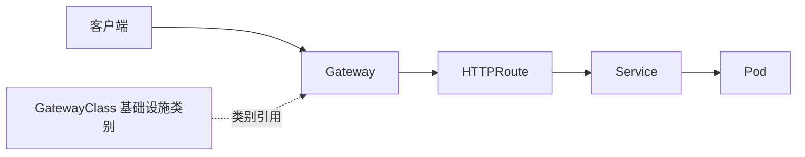

## 5.4 入口治理与服务网格

### 5.4.1 入口治理从 Ingress 走向 Gateway API

网络治理要先接住 Kubernetes 的基础对象，再讨论入口和网格。Service 提供稳定访问名，EndpointSlice 表达后端端点，集群 DNS 让服务名可解析，CNI 决定 Pod 网络和 NetworkPolicy 是否真正生效。这一层不清楚时，Gateway API 或服务网格只会把问题包到更复杂的控制面里。FDE 在现场应先确认四件事：服务名是否稳定、端点 owner 是否清楚、默认拒绝策略是否落地、入口日志和后端 trace 是否能关联。

入口是客户、伙伴系统和内部调用进入平台的第一道生产边界。早期 Kubernetes 常用 Ingress 描述 HTTP 入口，但 Kubernetes 官方文档已经推荐 Gateway API，并说明 Ingress API 已冻结、不再继续扩展。复杂现场往往需要更清楚的角色分离：平台团队管理网关基础设施，应用团队管理路由规则，安全团队管理 TLS、策略和审计。Kubernetes 的 [Gateway API](https://gateway-api.sigs.k8s.io/docs/introduction/) 面向 L4 和 L7 路由，并已将 Gateway、GatewayClass、HTTPRoute 推进到 Standard Channel。它的价值不只是“新版本 Ingress”，而是把基础设施拥有者和应用拥有者的职责拆开。

现场还必须检查是否依赖 `ingress-nginx`。Kubernetes Steering and Security Response Committees 已宣布 Ingress NGINX 于 2026 年 3 月 24 日退休，之后不再发布 bugfix 或安全补丁。仍使用它的客户应规划迁移到 Gateway API 实现或其他受维护入口控制器，而不是只把现有 Ingress 规则原样保留。

在 FDE 项目中，入口治理要回答四类问题。第一，外部请求从哪个域名、证书和负载均衡器进入；第二，请求按主机、路径、头或权重路由到哪个服务；第三，认证、限流、跨域、超时和请求体大小在哪里生效；第四，入口日志和追踪如何串到后端服务。Gateway API 可以把 GatewayClass、Gateway、HTTPRoute 等对象分层表达，减少所有规则都堆进一个控制器注解的脆弱做法。入口迁移的交付证据不应只是“路由可访问”，还要包括 DNS/TLS owner、认证与限流生效点、旧入口回滚路径、错误响应样例、访问日志字段和 trace 贯通截图。

### 5.4.2 服务网格治理东西向流量

入口解决南北向流量，服务网格解决服务之间的东西向流量。在 Istio 的[服务网格](https://istio.io/latest/about/service-mesh)模型中，网格作为基础设施层提供零信任安全、可观测性和高级流量管理；其[流量管理](https://istio.io/latest/docs/concepts/traffic-management/)能力覆盖超时、重试、熔断、故障注入、A/B 测试、金丝雀和按比例流量切分。厂商中立的 traces、metrics、logs 采集与导出可参考 [OpenTelemetry](https://opentelemetry.io/docs/)，适合把网格、入口和应用埋点串成统一证据链。这些能力对 FDE 很有价值，因为客户现场的依赖系统通常不稳定，发布窗口也有限。

但服务网格不能被当成默认答案。Istio 的传统 Sidecar 模式将代理注入每个 Pod，能力完整但资源占用与升级成本较高；[Ambient 模式](https://istio.io/latest/docs/ambient/)把 L4 安全覆盖与 L7 策略处理拆开，`ztunnel` 负责节点侧安全覆盖，`waypoint proxy` 承担需要 L7 语义的策略和路由，具体作用范围取决于配置。两种模式都会引入数据面复杂度，mTLS、证书轮换、代理资源消耗、协议识别和故障定位都需要运维能力。网格适合服务数量多、跨团队调用复杂、安全和审计要求高、需要精细流量治理的场景；对少量服务、简单入口、团队尚未建立可观测体系的项目，先用 Gateway、Service、NetworkPolicy 和应用级超时重试可能更稳。FDE 的判断标准应是：网格是否减少了业务代码中的通信治理负担，是否提升了故障隔离和审计能力，是否有足够团队能力维护它。若答案不成立，网格会把网络问题从“不可见”变成“更难解释”。
