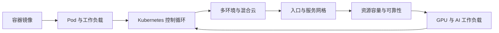

# 第五章：云原生运行底座

第四章讨论了原型、试点和生产化的交付门槛；本章展开其中的运行底座。前线部署工程进入真实客户环境后，问题会从“能否实现”转向“能否稳定运行、持续变更并被可靠治理”。云原生不是把应用放进容器的同义词。CNCF 对[云原生计算](https://github.com/cncf/toc/blob/main/DEFINITION.md)的定义强调在公有云、私有云和混合云等计算环境中，以可编程、可重复的方式开发、构建和部署工作负载，并形成安全、韧性、可管理、可持续、可观测的松耦合系统。本章把这个定义落到 FDE 的运行底座：容器提供可复制的交付单元，Kubernetes 提供声明式调度与控制循环，多环境治理处理客户现场差异，入口与网格统一服务通信边界，容量与可靠性把系统从“可启动”推进到“可运营”，GPU 与 AI 工作负载补齐生成式应用所需的异构资源调度与推理服务底座。

本章的核心判断是：云原生运行底座的价值不在工具清单，而在统一抽象。FDE 团队需要把镜像、部署、网络、身份、容量、观测和恢复能力设计成可以被审查、自动化和迁移的工程资产。这样，客户现场的差异不会变成每次交付的手工例外，生产运行中的风险也不会只依赖个人经验。
