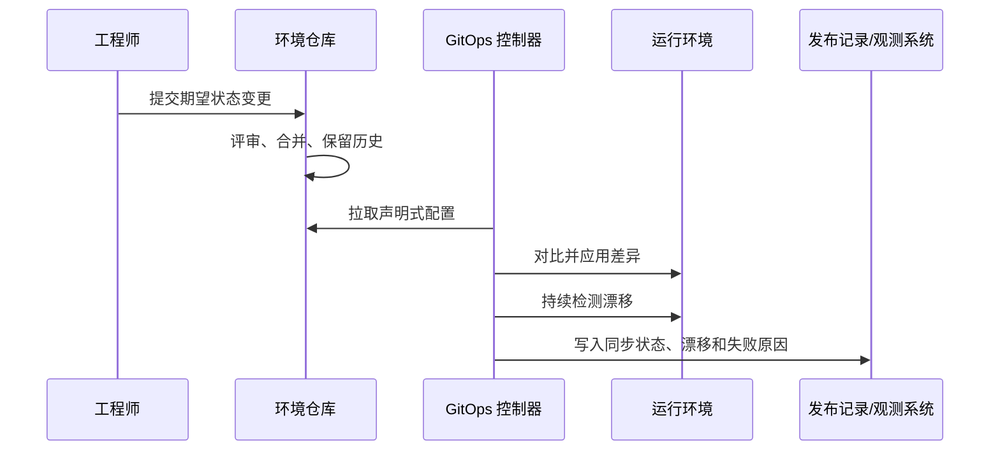

## 6.2 GitOps 与声明式交付

### 6.2.1 Git 作为期望状态边界

GitOps 不是“用 Git 存部署脚本”，而是把系统期望状态写成声明式配置，并让运行环境持续向该状态收敛。按 [OpenGitOps](https://opengitops.dev/) 的四项原则，系统期望状态必须声明式表达；期望状态以不可变、版本化、保留完整历史的方式存储；软件代理自动从来源拉取声明；代理持续观察实际状态并尝试应用期望状态。

这组原则把交付权力从个人终端迁移到可审计的提交历史中。但 Git 可靠记录的是“期望状态”的变更与审批，不自动覆盖所有运行事实。实际环境里的执行结果、控制器重试、人工热修、漂移、暂停同步和客户现场例外，还需要控制器事件、集群审计日志、发布记录和变更单补齐证据链。

### 6.2.2 Pull 模型与漂移修复

传统推送式 CD 常由外部流水线持有集群凭据并主动执行命令。GitOps 更偏向 pull 模型：集群内控制器读取 Git 中的目标状态，然后对比实际状态并执行收敛。这个方向减少了外部系统直接写生产的权限，也让环境漂移更容易暴露。GitOps 首先适合 Kubernetes 这类声明式控制面；在其他系统中，只有当目标状态、差异检测、权限边界和回滚语义都能清晰表达时，才适合采用同样模式。



环境仓库不应只保存镜像 tag。最小对象集通常包括 workload、Service、Gateway/HTTPRoute、ServiceAccount/RBAC、NetworkPolicy、resources/HPA/PDB、PVC/StorageClass 引用、观测标签、admission policy 和 release manifest。对 AI 或数据工作负载，release manifest 还应记录 `prompt_version`、`eval_suite`、`retrieval_index_version`、`tool_schema_version`、`model_route_policy_version`、`safety_policy_version`、数据契约版本、回滚版本和已批准报告 URI，使第 10 章的评测与第 12 章的运行观测能够读取同一组版本字段。

### 6.2.3 与 CI/CD 的边界

GitOps 并不替代 CI。CI 负责把源码变成可信制品，执行测试、扫描、签名和 SBOM 生成；GitOps 负责把“环境应运行哪个制品、以什么配置和策略运行”声明出来，并让环境收敛。两者的接口应是不可变制品引用和 release manifest，例如容器镜像 digest、配置版本、策略版本和证据链接，而不是可变标签。对多团队组织而言，GitOps 的价值还在于职责分离：应用团队提交环境意图，平台团队通过策略、控制器和审计日志保障变更边界。

一个常见结构是拆分应用仓库和环境仓库。应用仓库保存业务源码、Dockerfile、测试和流水线定义；CI 合并主干后构建镜像，输出 `imageDigest=registry.example.com/payments/callback@sha256:7f...`。环境仓库保存声明式部署状态，例如：

```text
environments/
  dev/payments-callback/kustomization.yaml
  staging/payments-callback/kustomization.yaml
  prod/payments-callback/kustomization.yaml
  prod/payments-callback/release-manifest.yaml
policies/
  admission/signature-policy.yaml
clusters/
  prod/flux-kustomization.yaml
```

提升到预发环境时，流水线或发布机器人只打开一个 PR，把 `environments/staging/payments-callback/release-manifest.yaml` 中的镜像从旧 digest 改成新 digest，并附上提交号、镜像签名、SBOM、provenance、测试报告和验证结果。PR 合并后，GitOps 控制器拉取环境仓库，发现期望状态变化，再把集群同步到新 digest。按 [Argo CD 的自动同步文档](https://argo-cd.readthedocs.io/en/stable/user-guide/auto_sync/)，自动同步可以让流水线通过提交环境仓库完成部署，而不需要直接持有集群写凭据；状态查询、暂停和手工同步仍应走受控 API 或只读权限。

### 6.2.4 工具语义与客户现场例外

自动同步不等于默认纠正所有漂移。在 Argo CD 中，Git 目标状态变化可以触发自动同步，但 live cluster 手工漂移需要 `automated.selfHeal=true` 才会自动修正；删除类变更需要启用 prune。Flux Kustomization 则按 `.spec.interval` 调谐并通过 server-side apply dry-run 检测和纠正漂移，删除旧资源由 `.spec.prune` 控制。

暂停同步也要按工具区分。Argo CD standalone Application 可通过 `spec.syncPolicy.automated.enabled=false` 暂停自动同步；若 Application 由 ApplicationSet 生成，直接改子 Application 的 `spec.syncPolicy.automated` 可能无效，应在 ApplicationSet/template/generator 层控制。Flux 的 [Kustomization](https://fluxcd.io/flux/components/kustomize/kustomizations/) 支持通过 `.spec.suspend` 暂停调谐；恢复同步时可使用 Flux 的 [resume kustomization 命令](https://fluxcd.io/flux/cmd/flux_resume_kustomization/)。

FDE 使用 GitOps 时，还必须设计例外流程。客户现场可能出现紧急补丁、断网环境、监管冻结窗口或生产事故，完全自动收敛并不总是合理。成熟做法是为暂停同步、人工批准、临时漂移和事后补提交设置规则：谁能触发，持续多久，留下哪些证据，何时恢复到 Git 中的期望状态。断网或冻结窗口内，应明确客户现场本地 Git 镜像、签名发布包或变更单中哪一个是临时权威源；恢复连接后必须在限定时间内把差异补回环境仓库 PR，并记录现场 revision、制品 digest、审批人和过期时间。

| 对象 | 推荐所有权 | 关键规则 |
| --- | --- | --- |
| 应用源码仓库 | 供应商或产品团队 | 只产出制品和证据，不直接写客户生产 |
| 部署模板仓库 | 平台团队或双方共管 | 复用基线、策略和运行对象模板 |
| 客户环境仓库 | 客户平台/运维团队主控 | 生产期望状态、审批和审计以客户为准 |
| 离线 Git 镜像 | 客户安全边界内 | 固定同步频率、签名校验和差异回填 |
| GitOps 控制器凭据 | 客户运行环境 | 最小权限、命名空间边界和审计日志 |
| break-glass 权限 | 客户 incident 流程 | 有负责人、TTL、补 PR 和事后复盘 |

GitOps 的目标不是消灭所有人工判断，而是让人工判断可见、可控、可追责。
