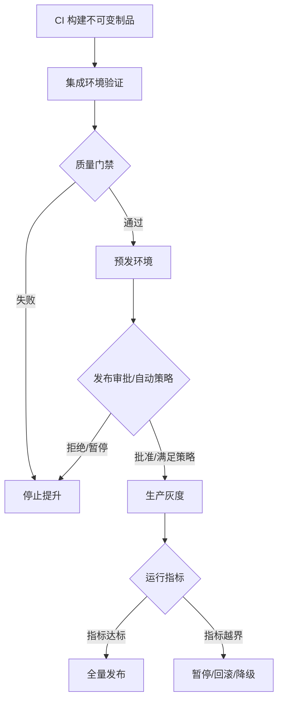

## 6.4 环境提升与回滚

### 6.4.1 提升同一个制品和同一份发布清单

环境提升的核心原则是“提升制品，不是重建制品”。同一提交在 CI 中构建出不可变镜像或包，测试、预发和生产都引用同一个 digest；环境差异通过配置、密钥引用、容量、策略和流量规则表达，而不是重新编译。按 [CISA/NTIA 的 SBOM 资料](https://www.ntia.gov/page/software-bill-materials)，SBOM 是软件组件清单，可用于提高供应链透明度；在提升过程中，SBOM、签名和来源证明应随制品一起传播，而不是在生产前临时补齐。

同一个镜像 digest 并不足以保证发布可复现。每次提升还应有 release manifest：制品 digest、配置版本、secret reference 版本、IaC/GitOps revision、SBOM/provenance digest、迁移 changeset、数据契约版本、AI 资产版本、质量门禁结果和每个环境的提升证据。这样，环境差异是受控输入，不是隐藏在脚本或控制台里的隐性状态。

### 6.4.2 回滚是一种预设计能力

回滚不能等事故发生后再设计。在 [Kubernetes Deployment 更新文档](https://kubernetes.io/docs/tasks/run-application/update-deployment-rolling/)描述的机制里，Deployment 可以查看 rollout history，并使用 `kubectl rollout undo` 回滚到上一版本或指定 revision；同时 `maxUnavailable` 和 `maxSurge` 控制滚动更新期间不可用和额外创建的 Pod 数量。这个能力的边界也要写清楚：Deployment revision history 存在于旧 ReplicaSet 中，默认保留 10 个，`revisionHistoryLimit=0` 会禁用回滚；`rollout undo` 只回滚 Pod template，不回滚 ConfigMap、Secret、IaC 资源、外部依赖、消息语义或数据库状态。

因此，回滚对象至少要拆成五类。应用制品可回到上一 digest；配置和特性开关可回到上一版本；基础设施变更需要 IaC plan 或手工恢复流程；流量入口可 failback 到旧环境；数据损坏通常需要前滚修复、恢复流程和业务补偿。只有在制品、配置、schema、消息、外部副作用和数据写入都兼容时，自动回滚才是安全动作；不可逆数据变更只能自动暂停或降级，并进入人工处置。

### 6.4.3 数据库迁移与数据回滚边界

数据库是最常见的回滚阻塞点。破坏性 schema 变更应按 expand/contract 设计，而不是与应用发布绑成一个不可逆动作。下表给出本书建议的最小决策框架：

| 阶段 | 允许动作 | 失败优先处理 | 禁止动作 |
| --- | --- | --- | --- |
| expand | 新增可空列、新表、新索引、影子字段 | 回滚应用或禁用迁移 | 删除旧列、改变旧语义 |
| 双写 | 同时写旧结构和新结构 | 前滚修复新路径或进入补偿队列 | 把补偿队列视为成功状态 |
| 兼容读取 | 新结构优先，缺失回退旧结构 | 切回旧读取路径并保留双写 | 隐藏回退比例和差异 |
| 切流 | 主读写路径切到新结构 | 切回旧读取路径并修复数据 | 关闭补偿和对账 |
| contract | 删除旧字段、旧索引或旧表 | 依赖备份、事件流或审计设计前滚恢复 | 未验证备份前删除旧结构 |

双写必须定义工程控制：原子边界或 outbox/CDC 策略、幂等键、对账 checksum/count、补偿队列 SLO、告警和明确的 single source of truth。contract 前必须有删除前快照、可测试 restore 路径、保留窗口和数据导出/校验；普通审计日志不能被默认视为完整备份，只有被设计和演练为可回放来源的事件流或日志才能承担恢复职责。

### 6.4.4 提升策略的审计线

环境提升需要一条连续审计线：哪个提交生成了哪个制品，经过哪些测试，谁批准进入哪个环境，生产运行了多久，是否触发过回滚。手工审批可以保留，但必须基于机器可读证据。最低发布证据字段包括：commit、artifact digest、SBOM digest、provenance/attestation 验证结果、配置/IaC revision、迁移 changeset 与 checksum、测试和门禁结果、审批人身份、例外 owner/expiry、canary 观察窗口指标、回滚决策、时间戳和不可变留存位置。

FDE 现场还要补客户维度：客户 UAT 证据、发布窗口 owner、供应商访问过期时间、客户运维权限、沟通路径、rollback operator、外部依赖冻结、接管包更新和发布后证据交接。未演练的回滚路径不能视为生产可用能力。
