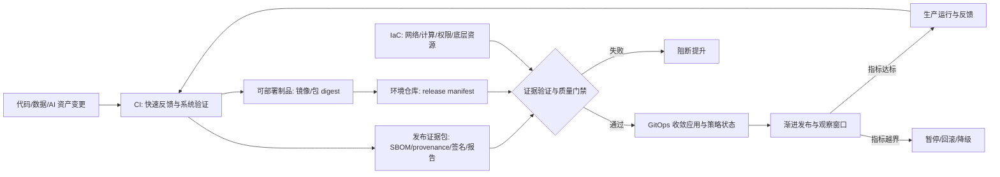

# 第六章：自动化交付流水线

自动化交付流水线的目标不是把手工命令搬进工具，而是把“从变更到生产”的关键判断变成可重复、可审计、可回滚的工程系统。对 FDE 来说，这条流水线还要适应客户现场：客户自有基础设施、受限网络、离线镜像仓库、监管发布窗口、客户安全团队审批、运维接管和不能依赖供应商临时登录的回滚路径。

一个成熟团队会把可部署制品和发布证据分开管理：镜像或包按 digest 固化，SBOM、provenance（来源证明）、签名、测试报告、扫描结果、发布单和验收证据作为证据包绑定到同一个 digest。环境变更不直接由个人终端执行，而是通过基础设施即代码、环境仓库、GitOps 控制器、发布门禁和运行观测形成一条证据链。

本章从五个层面展开。6.1 讨论持续集成与持续交付如何建立最短反馈回路，并产出现场可验证的制品包；6.2 说明 GitOps 为什么把 Git 作为期望状态的协作边界，同时补齐运行态审计；6.3 讨论基础设施即代码如何把网络、计算、权限和客户环境从“经验资产”变成“版本化资产”；6.4 聚焦环境提升、回滚和变更可追溯；6.5 将发布策略、质量门禁、数据/AI 资产、SLSA 与 SBOM 放到同一条发布控制线上。

本章采用的基线来自官方资料：OpenGitOps 定义的四项 GitOps 原则、HashiCorp Terraform 对 IaC 工作流和 state 的描述、SLSA v1.2 Build Track / Source Track 及 build provenance 格式、CISA/NTIA 对 SBOM 的定义，以及 Kubernetes、Argo CD、Flux 和 Argo Rollouts 对滚动、同步、漂移、金丝雀和蓝绿发布的实践说明。
