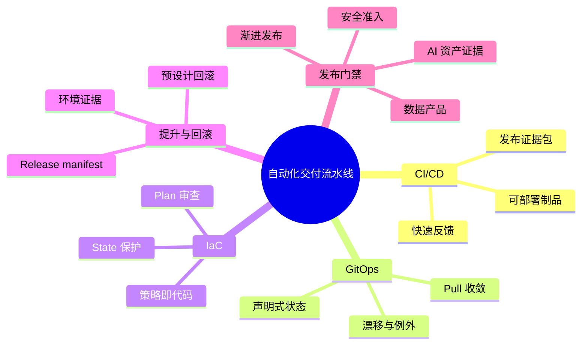

## 6.6 本章小结

自动化交付流水线是一条把工程判断固化为证据链的系统。持续集成提供快速反馈，持续交付把已验证代码变成随时可部署的制品；GitOps 将环境期望状态放进 Git，并通过控制器持续收敛；基础设施即代码让网络、计算、数据和权限从手工配置变成可版本化、可审查、可复现的资产；环境提升坚持提升同一个不可变制品和同一份 release manifest，而不是在每个环境重新构建；发布策略则通过滚动、蓝绿、金丝雀和特性开关控制风险暴露。

本章最重要的原则有三条。第一，制品和证据要分开但绑定：可部署制品用 digest 固化，SBOM、签名、SLSA provenance、AIBOM/ML-BOM、测试报告、eval set、RAG 索引和模型/系统卡作为证据包绑定到同一发布。第二，环境变更必须声明式、版本化，并能处理漂移、暂停同步、断网现场和客户审批；否则自动化只会扩大手工错误的影响面。第三，回滚和质量门禁必须预先设计并定期演练；没有验证过的回滚路径，在真实事故中不能视为生产能力。

面向生产的流水线不是为了消灭人工，而是让人类只在真正需要判断的地方介入。越是关键的系统，越应把重复动作交给自动化，把不可逆动作交给审查，把发布信心建立在机器可验证证据之上。
