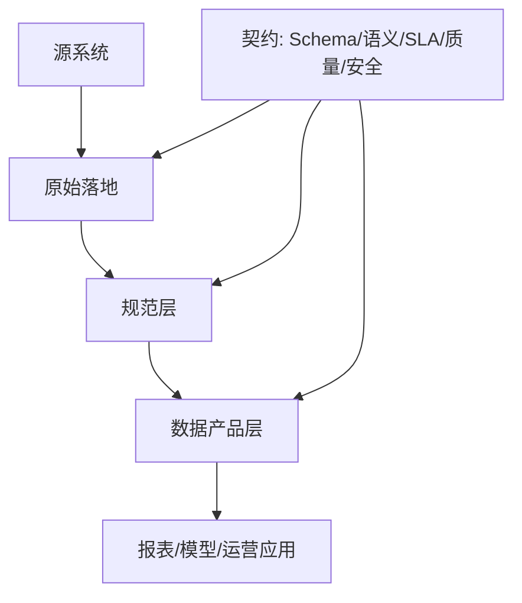

## 7.1 数据源接入与契约

### 7.1.1 先定义边界，再搬运数据

数据接入的第一性原理是边界管理：源系统产生事实，数据平台保存和加工事实，消费系统基于事实做判断或动作。FDE 现场常见错误是先把数据库、接口、文件和日志全部接进来，再试图在下游解释字段含义。这样会把源系统的命名混乱、缺失值、权限例外和业务口径争议一并复制到平台。正确顺序应当是先识别数据产品的消费者、使用场景、更新频率和失败影响，再决定接入方式。对订单、库存、设备状态、客户触点这类高价值对象，源表不是简单的输入，而是跨团队协作的接口。

数据契约要把“谁生产、谁拥有、字段代表什么、何时算新鲜、变更如何通知、谁可以看”写成机器可检查的约束。它不是工具清单，而是生产方、数据平台和消费者之间的运行协议。

实现时可以分三层看：规范层可参考 Linux Foundation Bitol 项目的 [Open Data Contract Standard（ODCS）](https://bitol-io.github.io/open-data-contract-standard/v3.1.0/)；平台元数据层可参考 [OpenMetadata 的 Data Contract 标准](https://openmetadatastandards.org/data-contracts/data-contract/) 对 Schema、语义规则、质量期望、SLA 与安全定义的拆分；开发工具层可参考 [dbt Sources](https://docs.getdbt.com/docs/build/sources) 对源表声明、字段描述、测试、freshness 和 `source()` 血缘依赖的支持。ODCS v3.1.0 将标准拆分为 Fundamentals、Schema、Data Quality、Support、Pricing、Team、Roles、SLA、Servers 等章节。下面是便于阅读的简化示例；生产落地应按所选标准的当前 schema 校验，不应直接复制伪代码上线。

```yaml
apiVersion: v3.1.0
kind: DataContract
id: orders-v2
status: active
domain: commerce
owner: data-platform@example.com
team:
  - username: orders-platform@example.com
    role: producer
  - username: ops-data-owner@example.com
    role: data-owner
roles:
  - role: data-owner
    access: read
classification: confidential
purpose: operational_order_risk
retention:
  raw: 30d
  product: 400d
schema:
  - name: orders
    physicalName: prod.orders_v2
    properties:
      - name: order_id
        logicalType: string
        required: true
        unique: true
      - name: account_id
        logicalType: string
        required: true
        pii: false
      - name: customer_contact
        logicalType: string
        required: false
        pii: true
        maskingPolicy: hash_for_non_privileged_users
slaProperties:
  - property: frequency
    value: 5
    unit: m
    element: orders.updated_at
  - property: maxDelay
    value: 15
    unit: m
    element: orders.updated_at
accessPolicy:
  rowLevel: tenant_id
  columnLevel: pii_masked_by_default
support:
  onCall: data-oncall@example.com
  escalation: operations-owner@example.com
```

| 契约项 | 要回答的问题 | 常见落地形式 |
| --- | --- | --- |
| Schema | 字段名、类型、主键、可空性是否稳定 | OpenAPI/JSON Schema、dbt model contract、表定义 |
| 语义 | 金额、状态、时间戳、删除标记的业务含义是什么 | 字段说明、枚举字典、领域术语表 |
| SLA | 数据多久更新一次，延迟多久算事故 | freshness 规则、告警阈值、运行日历 |
| 质量 | 哪些异常必须阻断下游 | not null、unique、accepted values、行数波动 |
| 安全 | 谁能读取，哪些字段需要脱敏 | 权限组、列级策略、审计日志 |
| 消费者 | 谁依赖这个数据产品，失败会影响什么 | 消费者登记、SLA 通知组、回归查询 |
| AI/LLM 数据边界 | 哪些内容可进入 prompt、检索上下文、eval 或反馈标签 | context policy、eval dataset 版本、禁止用途、标注责任 |

最小责任模型应同时声明 producer、data owner、data steward、consumer owner、on-call 和 escalation owner。producer 对源事实和变更通知负责，data owner 对业务口径和风险接受负责，steward 对质量规则和目录说明负责，consumer owner 对下游回归负责，on-call 对事故响应负责，escalation owner 对跨团队阻塞做最终裁决。安全项只定义数据产品访问边界；身份、脱敏、审计和合规控制应接到 [8.1 身份、权限与零信任](../08_security/8.1_identity.md)、[8.2 数据隐私与分级保护](../08_security/8.2_privacy.md) 和 [8.4 审计、留痕与合规证据](../08_security/8.4_audit.md)。

### 7.1.2 契约要服务变更，而不是冻结系统

数据契约的目的不是让源系统永远不变，而是让变更可预期。业务系统会增加字段、废弃状态、拆分流程、迁移数据库；如果平台只靠“今天能跑”的 SQL 维持，下游报表、模型和应用会在某次小改动后集体失真。[dbt model contracts](https://docs.getdbt.com/docs/mesh/govern/model-contracts) 把模型契约（model contract）定位为对模型输出形状的前置保证（upfront guarantee），并在构建时验证输出是否匹配；其文档也建议优先给被下游依赖的公共模型（public model）定义契约。这个取舍对 FDE 很关键：不是所有中间表都需要重治理，但所有对外承诺的数据产品都需要契约。

现场可采用三层接入策略。第一层是原始落地区，保留源系统事实与加载元数据，尽量少改动；第二层是规范层，把主键、时间、状态、删除语义和隐私处理标准化；第三层是产品层，只暴露有所有者、有文档、有测试、有 SLA 的数据集。原始层不能成为永久数据垃圾场：应按数据分类定义保留期、删除请求传播、历史快照清理、legal hold 例外审批和 purge 验证记录。非生产环境只能使用合成数据或经过验证的脱敏样本，不能把生产 PII 直接复制到测试库。

新源接入时，先给出最小契约：主键、增量字段、时间语义、失败重跑方式、权限边界。CDC 场景还必须声明操作类型、删除/tombstone 语义、source offset 或 LSN/binlog position、事务顺序、snapshot 标记和 schema 变更兼容性；否则下游无法正确处理乱序、重放和删除。等使用场景稳定后，再补充字段级质量、版本兼容和语义层定义。这样既避免为了治理而治理，也避免把脆弱的探索性数据直接推给运营应用。

破坏性变更要当作一次小型产品发布管理。以订单数据产品为例，源系统准备把 `customer_id` 重命名为 `account_id`，并在 `order_status` 中新增 `RISK_HOLD` 枚举。错误做法是直接删掉旧字段，让旧报表关联失败，再让下游把未知状态默认归入 `OTHER`；如果运营应用把 `RISK_HOLD` 当成可发货状态，可能触发错误承诺。正确做法是按“变更前评估 -> 双字段兼容 -> 消费者迁移 -> 切换 -> 退役旧字段”的状态推进。

变更提案应说明字段重命名的业务原因、旧字段和新字段的映射关系、新枚举进入哪些指标和应用、哪些消费者会受影响。兼容窗口内同时输出 `customer_id` 和 `account_id`，并把 `customer_id` 标记为 deprecated；质量规则同时检查两个字段的一致性，语义层把旧指标继续映射到旧字段，把新应用迁到新字段。新增枚举不能被下游默认归入 `OTHER` 或忽略，必须在枚举字典、accepted values 测试、指标过滤条件和状态机流转中同时登记。

消费者通知要给出可执行信息，而不是只发“字段要改”的邮件。通知内容至少包括变更编号、目标发布时间、兼容窗口结束时间、受影响资产、迁移示例 SQL、联系人、脱敏样例数据、回滚标准、审批人和消费者回归确认。版本切换可以采用 `orders_v1` 与 `orders_v2` 并行，或同一数据产品的 contract version 切换；无论哪种方式，都要在切换前确认核心消费者已经通过回归查询。回滚标准应提前写清楚：如果新字段空值率超过阈值、旧新字段映射不一致、关键消费者未迁移、`RISK_HOLD` 导致自动动作误触发，立即停止发布，恢复旧版本指针，保留原始事件与审计日志，后续通过补偿任务重放。

| 变更类型 | 例子 | 处理规则 |
| --- | --- | --- |
| 兼容 | 增加可空字段、补充描述、增加非阻断质量规则 | 记录版本，通知消费者，不要求双跑 |
| 条件兼容 | 新增枚举、默认值变化、历史回填、单位或时区标准化 | 需要消费者影响分析、样例数据、回归查询和兼容窗口 |
| 破坏性 | 删除字段、主键变化、空值语义变化、权限收紧、指标分母变化 | 走 RFC 审批、dual-run、cutover、deprecated、retired 状态机 |

破坏性变更 RFC 的最小字段是：变更编号、owner、审批人、目标发布时间、兼容窗口、受影响资产和消费者、迁移 SQL 或 API 样例、测试样本、质量门、回滚触发条件、消费者 sign-off 和强制切换标准。


