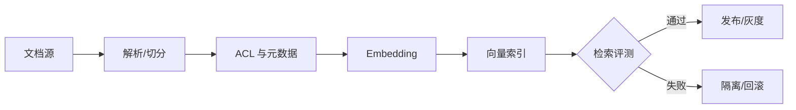

## 7.2 批处理、流处理、编排与索引管道

### 7.2.1 批与流是延迟和一致性的选择

批处理和流处理不是新旧技术之争，而是对业务时效、一致性、成本和复杂度的不同取舍。批处理适合财务结算、日终库存、历史回填和复杂汇总，因为它可以在确定窗口内重跑、校验和对账；流处理适合告警、订单状态、设备遥测和用户行为触发，因为它把事件延迟压缩到秒级或分钟级。FDE 现场要避免把“实时”当成默认目标。真正的问题是：如果数据晚 15 分钟、1 小时或 1 天，业务损失是什么；如果数据重复、乱序或临时不一致，下游能否承受。

以 [Delta Lake](https://docs.delta.io/) 为代表的 Lakehouse 表格式支持同一张表服务批处理和流处理，体现批流统一的方向；Kafka 的 [exactly-once 设计](https://kafka.apache.org/41/design/design/)则依赖事务性、幂等写入以及 offset、状态和输出的原子提交，但这类保证主要覆盖 Kafka topic 内的读-处理-写链路；写外部系统仍需要外部系统事务、幂等键或补偿机制配合。因此，管道设计要把语义讲清楚：摄取层可以 at-least-once，当前快照层按源系统提交顺序或 offset 做条件更新，事件序列产品保留 append-only log、operation、source position 和 tombstone/delete 语义，产品层再给消费者稳定快照或事件流。

| 模式 | 适用场景 | 关键风险 | 工程控制 |
| --- | --- | --- | --- |
| 批处理 | 日终、回填、对账、复杂聚合 | 窗口口径不清、重跑覆盖错误 | 分区快照、幂等写入、审计表 |
| 微批 | 近实时指标、频繁增量同步 | 小文件、延迟抖动、重复消费 | 合并策略、watermark、去重键 |
| 流处理 | 告警、状态机、事件驱动应用 | 乱序、重复、外部副作用 | 事务、状态存储、补偿流程 |
| 混合 | 既要低延迟又要可回算 | 双路径口径漂移 | 同源逻辑、统一表格式、回放测试 |

选择模式时先问四个问题：业务能接受的延迟是多少，失败后是否需要精确重放，是否会触发外部副作用，团队能承担多少实时运维成本。日终对账和历史回填优先批处理；近实时队列、频繁刷新指标和低风险提醒优先微批；需要秒级状态变化且能处理乱序、重复和补偿时才选流处理；既要低延迟又要权威月结时，用同源事件构建流式当前态和批式权威账，避免两套口径。

### 7.2.2 编排要表达数据依赖，不只是定时任务

管道失败往往不是因为某个 SQL 写错，而是因为调度系统只知道“几点运行”，不知道“哪个数据产品已经更新”。传统 cron 式编排适合固定节奏任务，但在多源系统、迟到数据和跨团队依赖下，很容易出现上游未完成、下游提前运行的情况。Airflow 2.x 文档使用 Dataset 和 data-aware scheduling 表达这种能力；Airflow 3.x 稳定文档将这一能力称为 [Asset-aware scheduling](https://airflow.apache.org/docs/apache-airflow/stable/authoring-and-scheduling/asset-scheduling.html)，用 Asset 表达可被任务更新并触发 DAG 的数据资产。命名从 Dataset 到 Asset 的变化不改变核心原则：任务之间依赖的不是脚本名称，而是数据资产状态。

事件触发也不能替代幂等、补偿和重跑设计。Airflow 的资产事件可以减少“下游跑早了”的问题，但它不能保证源系统没有重复事件、外部 API 没有部分成功、消费者动作没有副作用，也不能自动决定多个资产事件应该按单次合并处理还是逐个处理；其文档也提醒，多租户环境里创建 Asset Event 的权限可能等价于触发依赖该资产的下游 DAG。每条关键管道仍要定义幂等键、写入覆盖策略、失败后的补偿步骤、可重跑的数据窗口和人工介入边界。事件负责告诉系统“可以开始”，工程设计负责保证“重复开始、晚开始、失败后再开始都不会破坏业务事实”。

FDE 项目可以把编排分为四类。第一类是摄取编排，关注凭证、连接、增量位点和失败重试；第二类是转换编排，关注依赖图、模型选择、分区和成本；第三类是质量编排，把阻断性检查放在发布门前，把非阻断性异常送入观察与工单；第四类是应用编排，把数据产品更新转换成缓存刷新、任务分配、告警通知或运营动作。编排系统不应吞掉业务语义。每个 DAG 或 job 都应暴露输入、输出、所有者、SLA、重跑方式和失败影响。否则团队只会知道“任务红了”，不知道“哪个业务能力不可用了”。

关键 DAG/job 至少要有一张设计卡：输入资产、输出资产、owner、freshness SLA、幂等键、写入语义、重跑窗口、异常记录位置、失败影响、补偿动作、人工介入入口和成本预算。坏记录不要悄悄丢弃，应进入隔离表或死信队列，保留原始 payload、错误规则、批次 ID、血缘信息和修复状态；修复后通过受控 replay 合并回产品层。回填或重算要先 dry-run，限定分区范围，估算成本，通知消费者，写入审计记录，并在完成后做源目标对账。

### 7.2.3 向量索引也是数据产品

生成式应用引入了一类新的数据产品：向量索引。维修手册问答、合同条款检索、售后工单助手和政策解释系统，都依赖把非结构化文档转成可检索、可审计、可删除、可重建的索引。第 9 章会展开 RAG 交互与答案质量，第 10 章会展开 LLMOps 评测；本节只讨论索引作为数据产品时必须具备的契约、版本、权限和回滚边界。

第一是 chunking 策略。固定窗口（如 512-1024 token，overlap 64-128）只是经验起点，不是通用最佳值，需要按文档结构、检索评测和上下文预算调参；结构化文档（合同、条款、API 文档）应优先按标题、章节和段落语义切分，表格与代码块应保持原子性。每个 chunk 必须保留 `chunk_id`、来源文档 ID、版本、位置、内容 hash、parser/chunker 版本、索引构建 ID、ACL 元数据、`content_type`、`sensitivity_class`、`retrieval_policy`、`intended_use`、`citation_required`、删除/过期标记和回滚策略。PII 扫描、脱敏、加密、删除传播和查询时 ACL enforcement 都必须进入管道，而不能只靠应用层承诺。

第二是 embedding 与索引版本管理。embedding 模型升级、维度变化、预处理、距离度量、索引参数或 reranker 调整都会让旧向量与新查询不可比。管道中应显式记录 `embedding_model`、`model_version`、`dimensions`、`preprocess_version`、`tokenizer`、`normalization`、`distance_metric`、`index_params`、`reranker_version` 和 `query_encoder_version`，并把它们作为索引名或 collection 名的一部分；切换时采用双写、双查、灰度切流和回滚索引，与 [7.1 的破坏性契约变更](7.1_contract.md) 同样对待。

第三是 eval dataset 生命周期。索引发布前至少要有固定的开发集、回归集和上线验收集，样本来源包括真实问题、专家标注、线上失败案例和合成边界样本；每条样本都应记录问题、可见权限、期望命中文档、禁止命中文档、引用要求和适用场景。Ragas 当前文档列出的 Context Precision、Context Recall、Faithfulness 等指标可以作为 RAG 评测口径之一，但第 7 章只要求“指标退化能阻断发布或触发回滚”，具体生成质量和评测方法放到 [9.3 RAG 与企业知识接入](../09_ai_native/9.3_rag.md) 与 [10.2 提示、检索与工具调用评测](../10_llmops/10.2_eval.md) 展开。

第四是接入语义层与工具调用。模型与外部数据/工具之间的连接可采用 [Model Context Protocol (MCP)](https://modelcontextprotocol.io/) 这样的标准协议，把语义层、数据产品 API 或检索服务封装为 MCP server。MCP 标准化的是上下文与工具连接方式；授权、血缘、权限、契约和审计仍需要 MCP server 与平台策略自己实现并强制执行。索引版本、chunk ID、ACL 命中记录和检索参数应进入后续 trace 字段，供 [10.3 追踪、成本与延迟治理](../10_llmops/10.3_trace.md) 使用。把向量库与 RAG 视作受治理的数据产品，是 FDE 现场区别于“先 demo 再说”的关键。

