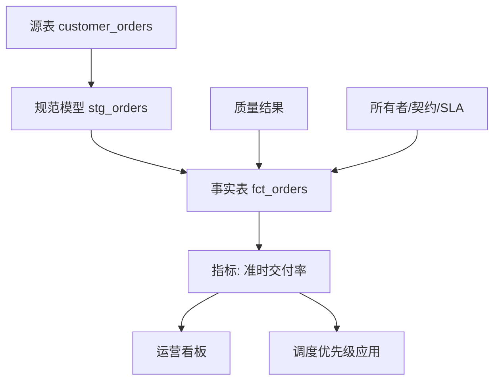

## 7.3 数据质量与血缘

### 7.3.1 质量检查要靠近业务失败模式

数据质量不是抽象的“干净”，而是数据是否足以支撑特定决策。一个字段为空可能无关紧要，也可能让发货、授信或设备停机判断出错。FDE 团队应从失败模式倒推质量规则：重复订单会导致重复履约，库存负数会造成错误补货，状态枚举漂移会让看板漏数，时间戳时区错误会让 SLA 统计失真。质量门不应只追求覆盖率，而要区分阻断、告警和观察。阻断规则保护生产动作，告警规则保护分析可信度，观察规则用于发现趋势变化。

在质量规则落地上，可以把工具分成声明式验证和 SQL 断言两类：[GX Core](https://docs.greatexpectations.io/docs/core/introduction/gx_overview) 用 Expectations 描述并验证数据标准，并提供 Python 接口来构建和运行数据验证工作流；dbt 的 [data tests](https://docs.getdbt.com/docs/build/data-tests)则把测试表达为 SQL 断言，内置 `unique`、`not_null`、`accepted_values` 和 `relationships` 等通用检查，并建议对主键和源数据假设做测试。两类工具的共同原则是：质量规则必须可执行、可复用、可追溯，而不是停留在文档里。

数据质量也需要测试分层。PR/CI 阶段做契约测试、fixture-based transformation tests 和关键 SQL 断言；发布前做源目标对账、控制总额、历史窗口回放和消费者回归查询；生产运行时监控 freshness、volume、distribution、schema、lineage 和动作误触发。这样能把“代码能跑”与“业务事实可用”分开验证。

| 质量维度 | 典型规则 | 失败后的处理 |
| --- | --- | --- |
| 完整性 | 主键非空、关键字段非空、分区齐全、源目标行数和控制总额一致、CDC 位点连续 | 阻断发布，通知数据所有者 |
| 唯一性 | 业务主键唯一、事件幂等键唯一 | 隔离重复记录，触发去重或回放 |
| 有效性 | 枚举值、日期范围、金额范围合法 | 告警并生成异常样本 |
| 一致性 | 外键可关联、状态流转合法 | 阻断运营动作，允许分析降级 |
| 新鲜度 | 更新时间不超过 SLA | 标注 stale，暂停自动决策 |

质量规则需要分级，否则团队会在“全阻断”和“全忽略”之间摇摆。一个实用分级样例如下：

| 等级 | 规则样例 | 处理策略 |
| --- | --- | --- |
| P0 阻断 | `order_id` 为空、同一订单重复进入待执行队列、金额为负且会触发退款 | 停止发布或暂停动作，通知数据所有者和值班负责人 |
| P1 降级 | 新鲜度超过 SLA 但未影响资金动作、部分维度无法关联、异常枚举低于阈值 | 发布 stale 标记，禁止自动执行，允许人工复核或确认后处理 |
| P2 告警 | 行数波动超过历史区间、非关键字段空值率上升、描述字段格式漂移 | 生成样本和工单，不阻断发布 |
| P3 观察 | 分布轻微偏移、低价值字段新增未知值、探索性指标缺少历史基线 | 记录趋势，进入下一轮规则评审 |

每条 P0/P1 规则都应像生产告警一样管理：负责人、检测频率、阻断对象、降级行为、通知对象、修复 SLA、样本输出位置、恢复判据和升级时限必须写清楚。P0 应由值班负责人确认并升级到数据 owner；P1 可以允许人工确认路径，但界面必须显示 stale 标识、触发规则、受影响字段和最后更新时间。告警关闭必须依赖恢复查询或重放验证，而不是手工点掉通知。

### 7.3.2 数据可观测性的五维框架

工程化质量监控还需要一个常态视角，而不仅是发布前门禁。数据可观测性的 5 大支柱可参考 [Monte Carlo](https://www.montecarlodata.com/blog-what-is-data-observability/) 与 [Bigeye](https://www.bigeye.com/blog/data-observability) 等资料的总结，并作为现场落地的最小集：

- 新鲜度（Freshness）：表/分区/topic 是否按预期时间更新，迟到比例如何；模板应区分 event time、ingestion time、processing time、业务日历、允许迟到窗口和 warn/error 阈值。
- 体量（Volume）：行数、字节数、文件数是否落在历史正常区间，是否出现断崖式上升或下降。
- 分布（Distribution）：关键列的空值率、唯一值数、均值/方差、枚举占比是否漂移；核心指标还应按区域、渠道、客户等级等维度做 segment-level drift，避免全局均值掩盖局部异常。
- Schema：列的增加、删除、类型变更、约束变更是否被检测并通知下游。
- 血缘（Lineage）：上下游依赖和影响范围可追踪，事故时可驱动通知与回滚。

这五维与“质量检查要靠近业务失败模式”的质量规则互补：质量规则面向已知失败模式，可观测性面向未知异常。两者都应接入告警系统，并按 P0–P3 同一分级处理。若高风险订单队列突然下降 40%，排查顺序应先看 freshness 是否延迟，再看 volume 是否少了分区或 topic，再看 distribution 是否某个订单状态激增，再看 schema 是否新增枚举，最后用 lineage 找到最近变更和受影响消费者。

AI 数据产品还要补充在线信号：检索空结果率、低相似度命中率、引用缺失率、拒答率、prompt injection 命中、PII 泄漏告警、索引构建失败率和删除传播失败率。这些信号也应进入 P0-P3，而不是只留在模型评测报告里。本节关注数据资产级异常；生产遥测、SLO、值班和事件响应在第 12 章展开。

### 7.3.3 血缘是影响分析，不是装饰图

血缘的价值在事故和变更时才真正显现。字段要改名、源表要迁移、质量规则失败、指标突然下降时，团队必须快速回答：谁生产了这份数据，经过哪些转换，影响哪些报表、模型和应用，应该通知谁。血缘建模可参考 [OpenLineage](https://openlineage.io/) 对 run、job、dataset 和 facets 的定义；schema 等较稳定信息适合放在 DatasetFacet，每次运行读取/写入的分区、版本和统计则应放在 InputFacet 或 OutputFacet。资产发现与治理则可参考 [OpenMetadata](https://docs.open-metadata.org/) 对数据发现、血缘、治理、质量和协作的统一平台设计。血缘不应是后补的静态图，而应从编排、转换、查询和发布过程自动采集。

FDE 现场应建立“技术血缘 + 业务血缘”的双层模型。技术血缘回答列从哪里来、SQL 如何变换、任务何时运行；业务血缘回答这个字段支撑哪个指标、指标进入哪个决策、决策影响哪个流程。只做技术血缘，业务用户看不懂影响；只做业务说明，工程团队无法定位根因。较好的做法是把数据契约、质量结果、运行记录、所有者、消费者和下游曝光点绑定在同一资产目录页上。每个数据产品发布前必须有 upstream/downstream、字段级映射、运行记录来源、缺失血缘告警和 owner 修复时限。

发生事故时，团队可以从失败质量规则跳到上游源表、最近变更、下游 dashboard 和运营应用，形成可行动的排障路径。复盘要记录时间线、影响范围、根因、哪些检测触发或未触发、恢复动作、预防项、owner 和截止日期；否则血缘只帮助找到一次问题，不能让系统变得更稳。

