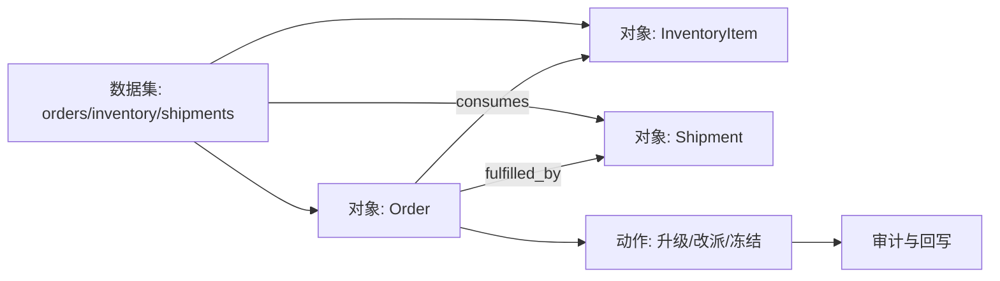

## 7.4 语义层与知识图谱

### 7.4.1 语义层统一指标定义

当同一个指标在财务、销售、运营和客户成功团队中有不同 SQL，组织就会陷入“数字都对，但互相不一致”的状态。语义层的目标是把实体、维度、度量和指标定义集中管理，让 BI、Notebook、应用和 AI 助手共享同一套业务口径。以 dbt 的 [Semantic Models](https://docs.getdbt.com/docs/build/semantic-models) 为例，semantic model 是 MetricFlow 和 Semantic Layer 的基础，并用 entity 表达 join key，区分 primary、unique、foreign、natural 等实体类型；natural key 适合用真实业务属性识别 SCD Type II 等历史记录。

FDE 项目中，语义层尤其适合处理客户现场的口径争议。例如“活跃客户”到底按登录、交易、合同还是服务单计算；“准时交付”按承诺日期、发货日期还是签收日期计算；“库存可用”是否扣除质检冻结和已分配订单。这些问题不能靠每个报表作者自行解释。语义层应把指标拆成事实表、实体键、时间维度、过滤条件、聚合方式、owner、黄金查询和变更历史，并把它们写入版本控制。

| 语义元素 | 作用 | 例子 |
| --- | --- | --- |
| Entity | 连接业务对象的稳定键 | customer、order、asset、shipment |
| Dimension | 切分和过滤指标的属性 | region、product_line、order_status |
| Measure | 可聚合的事实 | revenue、quantity、duration_minutes |
| Metric | 面向业务的计算定义 | on_time_delivery_rate、active_accounts |
| Saved query | 可复用查询视角 | 本周高风险订单、逾期设备清单 |

一个指标定义至少要能回答：业务定义、公式、事实表、实体粒度、时间口径、过滤条件、空值处理、可用维度、质量规则、业务 owner、技术 owner、批准人、兼容窗口和弃用策略。以 `on_time_delivery_rate` 为例，分子是承诺时间内签收的订单数，分母是已签收且未取消的订单数，时间维度使用承诺交付日期，按客户等级、区域和产品线切分；如果承诺日期为空，这条订单不能悄悄进入分母，而应进入质量异常样本。

```yaml
metric: on_time_delivery_rate
business_owner: supply_chain_ops
technical_owner: data_platform
grain: order
entity: order_id
time_dimension: promised_delivery_date
numerator: delivered_at <= promised_delivery_date
denominator: delivered_at is not null and order_status != 'CANCELLED'
null_handling: exclude_and_report_missing_promised_date
allowed_dimensions: [region, customer_tier, product_line]
golden_queries:
  - name: 2026_q1_top_customer_regression
    expected_range: 0.91..0.94
deprecation_policy: 60d dual-run before formula changes
```

不同消费者应通过受控接口复用语义层。BI 使用 saved query 或 export，产品应用使用 API 或物化视图，Notebook 使用只读语义接口，AI 助手只能通过已注册 metric、saved query 或 MCP 工具查询关键指标；未定义实体或口径冲突时，应拒答或要求澄清。语义层还要继承行级、列级、用途和环境权限，避免“统一口径”变成横向越权入口。

### 7.4.2 知识图谱和本体把数据接到行动

语义层解决指标口径，知识图谱解决对象关系，本体（ontology）把对象、关系、动作和权限合成可操作的业务对象层。传统数据仓库擅长回答“过去发生了什么”，但运营应用需要回答“对象之间是什么关系，下一步能做什么”。普通语言说，本体就是把订单、库存、供应商、设备等对象，以及它们之间的关系、可执行动作和权限边界放在同一层管理。

Palantir 在 [Ontology](https://www.palantir.com/docs/foundry/ontology/overview) 中把本体定位为组织的 operational layer，将 datasets、virtual tables 和 models 映射为真实世界对象，并包含 objects、properties、links、actions、functions 和 dynamic security 等元素；其 [Object edits and materializations](https://www.palantir.com/docs/foundry/object-edits/overview) 说明也把 Action 定义为改变一个或多个对象属性的单一事务。

这给 FDE 一个重要启发：数据产品如果只停在报表，就只能影响认知；如果进入本体和运营动作，就能影响流程。以供应链场景为例，表里有订单、库存、供应商和运输事件；本体层把它们建模为对象和链接；应用层允许运营人员对“高风险订单”执行改派、催单、冻结或升级。知识图谱不必一开始覆盖全企业，应该从高价值工作流切入，先建少数稳定对象，再逐步扩展关系和动作。下一节讨论的是这些对象如何进入任务队列、审批、动作执行和审计回写的运行层。


