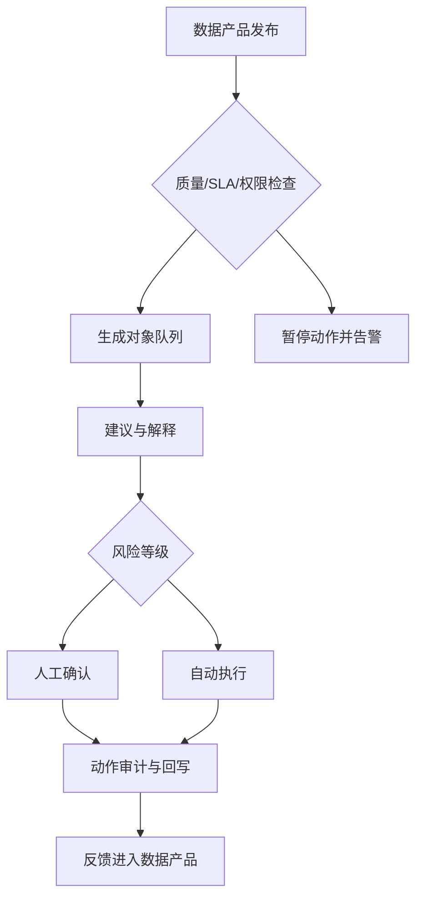

## 7.5 从报表到运营应用

### 7.5.1 报表回答问题，运营应用改变结果

报表的价值是让人看见问题，但 FDE 的目标通常不是“看见”就结束，而是让组织更快、更一致地采取行动。一个库存报表告诉团队哪些 SKU 缺货；运营应用则能把缺货对象分配给负责人、生成补货建议、触发供应商沟通、记录处置结果，并把结果回写到系统。两者的差别不在界面复杂度，而在闭环程度：报表以阅读为中心，运营应用以对象、状态、动作和责任人为中心。

从数据产品演进到运营应用，需要补齐四个能力。第一是对象化，把宽表中的行变成订单、客户、设备、病例、合同等可追踪对象；第二是状态机，定义对象从待处理到已解决、已升级、已关闭的合法流转；第三是动作层，把业务操作封装成可授权、可审计、可回滚或可补偿的命令；第四是反馈层，把用户处置、异常原因和结果质量回流到数据平台。这也是 [Palantir Ontology](https://www.palantir.com/docs/foundry/ontology/overview) 将语义元素和动作元素放在同一 operational layer 中的原因：真实业务系统需要同时理解对象含义和改变对象状态。

| 层级 | 主要产物 | 成功标准 |
| --- | --- | --- |
| 报表 | 指标、趋势、筛选器 | 用户能发现问题 |
| 分析工作台 | 明细、钻取、假设分析 | 用户能解释原因 |
| 任务队列 | 对象列表、优先级、负责人 | 用户知道先处理什么 |
| 运营应用 | 动作、审批、回写、审计 | 用户能完成闭环 |
| 自动化决策 | 规则/模型、人工兜底 | 系统能稳定改善结果 |

状态机要显式定义合法转移、禁止转移、超时转移和补偿动作。对象从“待处理”到“已升级”可能需要质量门通过、权限有效、负责人存在和幂等键可用；从“已升级”回到“待处理”则可能需要撤销外部工单或记录补偿失败。没有状态转移契约时，运营应用会退化成一组按钮，事故后无法解释谁在什么证据下改变了对象状态。

### 7.5.2 运营应用要把治理内嵌到动作里

把数据接入运营应用后，风险也随之上升。错误报表最多误导会议，错误动作可能影响客户、资金、库存、合规或安全。因此，运营应用不能绕开数据治理，而要把治理嵌入动作路径。每个关键动作都应知道它依赖哪些数据产品、最近一次质量检查是否通过、输入数据是否新鲜、操作者是否有权限、执行后如何审计。对自动化建议，也要区分“推荐给人确认”和“系统直接执行”两种风险等级。

工程上可以采用“可解释建议 + 人在回路 + 审计回写”的渐进路线。第一阶段只把高风险对象排队并解释原因；第二阶段允许用户在应用中执行标准动作；第三阶段对低风险、可补偿动作自动执行；第四阶段再把结果反馈给模型和规则。这个过程应持续连接质量、血缘和语义层：质量失败时暂停动作，血缘变更时评估影响，语义定义变更时重新验证指标和任务队列。在这里，运营应用可信任的基础不只是动作设计，还包括 [OpenMetadata](https://docs.open-metadata.org/) 所强调的数据发现、血缘、质量、治理和协作能力。

| 条件 | 允许模式 | 说明 |
| --- | --- | --- |
| P0 质量失败、权限不明、动作不可补偿 | 禁止动作 | fail closed，暂停队列或仅展示事故说明 |
| P1 降级、数据 stale、影响客户或资金 | 人工确认 | 展示受影响字段、最后更新时间、质量规则和限制说明 |
| 质量通过、低风险、可补偿 | 自动执行 | 需要幂等键、补偿流程、误触发率监控和回滚开关 |
| 高风险但证据充分 | 审批后执行 | 需要职责分离、二次确认和动作级审计 |

动作权限要和数据读取权限分开建模。最低要求是区分谁可读、谁可建议、谁可执行、谁可审批、谁可回滚；资金、客户、库存、安全相关动作需要分级审批和 break-glass 审计。降级期间，系统应进入只读或人工确认模式，禁用自动动作；恢复时要重新计算受影响对象队列，而不是简单恢复按钮。

### 7.5.3 高风险订单队列案例

某制造企业希望每天提前识别可能逾期或影响重点客户的订单，并把处理动作闭环到业务系统。数据契约先定义订单、库存、产能、运输和客户等级五类输入：每类输入都有主键、更新时间、枚举字典、SLA、隐私边界和破坏性变更通知规则。管道层按资产更新触发近实时刷新，但重跑窗口应按数据分类、合同、法规和业务恢复目标定义；如果库存事件晚到，系统可以重算受影响订单，而不是覆盖整张订单队列。

质量门把订单队列分成可发布、降级和阻断三种状态。P0 规则包括订单主键为空、客户等级缺失、承诺日期早于下单日期、同一订单重复进入执行队列；任何 P0 失败都阻断动作。P1 规则包括运输 ETA 超过 SLA、库存快照晚于 30 分钟、供应商状态未知；这些订单仍可展示，但只能进入人工确认。语义层集中定义“高风险订单”：承诺交付日期、客户优先级、库存缺口、产能冲突、运输延迟和合同罚金共同决定风险分。运营应用只读取这个语义指标，不允许每个团队在界面里重写一套风险 SQL。

| 字段 | 案例定义 |
| --- | --- |
| 风险分 | `customer_priority * 0.3 + inventory_gap * 0.3 + capacity_conflict * 0.2 + transport_delay * 0.2` |
| 阈值 | `>= 0.8` 高风险，`0.5-0.8` 人工复核，`< 0.5` 观察 |
| 时间口径 | 以承诺交付日期为主，运输 ETA 只作为解释字段 |
| 缺失处理 | 客户等级、承诺日期或库存快照缺失时进入 P0/P1，不得默认低风险 |
| 解释输出 | 主要风险因素、受影响字段、质量门结果、最近更新时间 |

动作层按风险和可补偿性分流。高风险且影响重点客户的订单进入人工确认队列，应用展示风险原因、血缘、最近质量结果和可选动作，例如升级、拆单、改派、冻结承诺或联系供应商。低风险且可补偿的动作，例如刷新客户通知草稿或创建内部跟进任务，可以自动执行。所有动作都写回审计表：记录输入数据版本、语义指标版本、质量门结果、操作者、审批意见、外部系统返回引用和补偿状态。审计字段应采用白名单：敏感值脱敏或哈希引用，禁止记录密钥、token 和完整外部响应；审计日志本身要只读、不可篡改、有保留期并记录访问审计。

回写结果再进入数据产品，用于评估建议准确率、动作完成率和误触发率，形成从契约到执行再到学习的闭环。用户点击、人工纠正和专家标注不能直接等同于训练标签，应分为 raw feedback、reviewed annotation、eval case、training/fine-tuning candidate 四层，并记录标注 schema、rubric、审核人、争议仲裁和版本。只有经过授权用途检查、隐私最小化和标注审核的数据，才能进入评测或训练候选；反馈闭环不能绕过原始数据契约。

