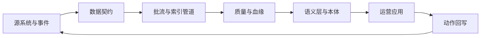

# 第七章：数据集成与数据产品

FDE 项目中的数据工作，不只是把源系统同步到仓库，也不是给业务做几张报表。以“高风险订单队列”为例，团队需要接入订单、库存、运输和客户等级数据，判断哪些订单可能逾期，再把处置动作回写到业务系统。这里的数据不只是分析材料，而是会影响客户承诺、库存调度和人工优先级的生产资产。

数据一旦进入现场交付，就会同时承担三类责任：支撑分析判断、驱动自动化流程、成为运营应用中的可执行对象。本章从五个层面展开：7.1 定义数据源接入与契约，7.2 设计批流管道、编排和索引管道，7.3 建立质量门、可观测性和血缘，7.4 统一语义层、本体和指标口径，7.5 把数据产品推进到对象队列、动作审计和反馈回写。

Lakehouse 和开放表格式的共同目标，是把“文件堆”变成可以演进、可审计、可回滚、可被多个计算引擎消费的数据产品底座。例如 ACID、批流统一、Schema enforcement（模式强制）和 Time travel（历史版本访问）可参考 [Delta Lake](https://docs.delta.io/) 的设计；Schema evolution（模式演进）、Partition evolution（分区演进）和隐藏分区能力可参考 [Apache Iceberg](https://iceberg.apache.org/docs/latest/evolution/)。对 FDE 而言，价值不在名词本身，而在这些能力能否支撑现场数据产品的契约、重跑、质量门和动作闭环。

本章的核心判断是：数据产品不是一张表，也不是一个仪表盘，而是一组有所有者、有契约、有质量门、有语义边界、能进入业务动作闭环的可运行资产。

本章承接第 6 章的发布与质量门禁，输出数据契约、管道设计卡、质量规则、血缘与资产目录、语义指标定义和运营动作闭环；第 8 章会继续展开身份、隐私、审计和合规控制，第 9/10 章会展开 RAG、Agent 与 LLMOps 的模型评测细节。
