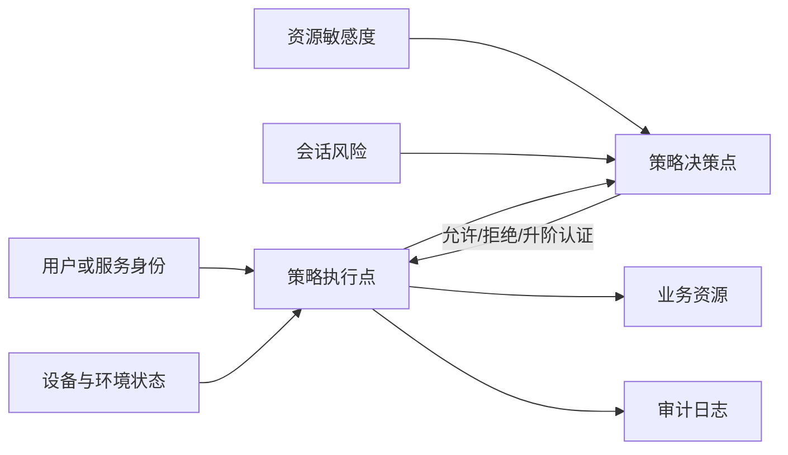

## 8.1 身份、权限与零信任

### 8.1.1 身份是第一边界

FDE 项目最容易犯的错误，是把客户内网、VPN、堡垒机或内部域名当作信任依据。真实现场里，用户可能来自总部、分支、外包团队和集成商；服务也可能运行在客户云、供应商云、本地机房或临时试点环境。边界已经不等于网段。按照 [NIST SP 800-207](https://csrc.nist.gov/pubs/sp/800/207/final)，零信任从静态网络边界转向保护用户、资产和资源，访问资源前要对主体和设备分别认证与授权。FDE 首先要把“谁在什么上下文中访问什么资源”建模清楚。

CISA 的[零信任成熟度模型](https://www.cisa.gov/resources-tools/resources/zero-trust-maturity-model)把身份、设备、网络、应用工作负载和数据列为成熟度支柱，提醒团队不要只接入一个身份产品就宣称完成零信任。现场更有效的路径，是先管住关键动作：人类用户登录、服务间调用、运维提权、数据导出、模型工具调用和后台批处理。

### 8.1.2 最小权限要落到对象

最小权限不是口号，而是一组可检查对象：角色、组、策略、令牌、服务账号、密钥、临时权限和例外单。即使试点也应使用可追责的命名身份和短期凭证；确需临时例外时，必须限定数据范围、负责人、到期日，并禁止接入生产敏感数据。生产化前，人使用 SSO 和多因素认证（MFA）；服务使用工作负载身份；运维使用即时（Just-in-time, JIT）提权；导出、删除、批量更新等高影响操作单独授权。NIST [SP 800-207A](https://csrc.nist.gov/pubs/sp/800/207/a/final) 也强调云原生应用要同时考虑用户身份、服务身份和网络层策略。

跨云、跨集群或服务网格场景下，服务身份应使用可验证、可轮换的工作负载身份，而不是手工分发长效证书。[SPIFFE/SPIRE](https://spiffe.io/) 可作为候选基线：SPIFFE 用 SVID 为工作负载签发可验证身份，SPIRE 负责签发、轮换和证明。是否采用取决于客户现有服务网格、证书体系和运维能力。

工作负载身份只证明“哪个服务在调用”，不等于业务授权。服务代表用户或租户执行时，还必须传递并校验 delegated subject、租户/客户边界、资源、动作、字段范围、过期时间和策略版本；下游系统不得只因为上游服务账号可信就放行。对 Agent、后台任务和批处理尤其要防止 confused deputy：模型或任务只能使用被授权的业务委托，不能把服务账号变成绕过用户权限的通道。

权限设计应从业务动作反推，而不是复制组织架构。合理策略至少用“主体 + 租户/客户边界 + 资源类型 + 动作 + 字段/数据范围 + 环境 + 时限 + 委托来源”表达，并把例外纳入审计。跨租户访问默认拒绝；管理员例外必须有审批、到期日和复核记录；跨租户负例测试必须失败。

| 对象 | 现场风险 | 工程化做法 |
| --- | --- | --- |
| 人类用户 | 共享账号、离职未回收 | SSO、MFA、组映射、定期复核 |
| 服务账号 | 长效密钥散落 | 工作负载身份、短期凭证、轮换 |
| 运维权限 | 永久管理员 | Just-in-time 提权、审批、会话记录 |
| 数据导出 | 绕过字段级保护 | 单独授权、水印、下载日志 |
| 模型工具 | Agent 越权调用系统 | 工具级授权、用户委托、最小作用域 |

最小权限矩阵可以从下列字段起步，随后映射到 IAM、网关、数据库、工具服务和审计日志：

| 主体 | 角色/组 | 租户/客户边界 | 资源与动作 | 字段/数据范围 | 环境 | 认证强度 | 时限 | 审批人 | 审计事件 | 负例测试 |
| --- | --- | --- | --- | --- | --- | --- | --- | --- | --- | --- |
| 客服坐席 | support-agent | 所属区域客户 | `ticket.create` | 非受限字段 | 试点 | SSO + MFA | 会话内 | 服务主管 | 工单创建 | 非授权客户创建失败 |
| Agent 服务 | workload:agent | 用户委托范围 | `crm.search` | allowlist 字段 | 生产 | 工作负载身份 | 短期令牌 | 策略引擎 | 工具调用 | 越权字段检索失败 |

FDE 或供应商人员进入客户现场时，还要单独管理访问生命周期：使用客户签发的命名账号，满足客户设备姿态和堡垒机/PAM 要求，高风险会话可录屏或记录命令；break-glass 账号只用于应急，双人授权，事后复盘；试点结束、人员离场、供应商合同结束或生产交接时必须撤权并验证无法登录。

密钥和 API Key 应在客户批准的 Vault、KMS、HSM 或密钥管理系统中生成和保管。不要把密钥复制到聊天工具、个人文档、本地笔记或模型上下文；交付包只记录密钥用途、owner、轮换周期、撤销路径和验证方式，不记录密钥值。疑似泄露、提示注入命中、日志误采集或人员离场都应触发轮换。

### 8.1.3 权限治理要持续

身份治理的难点不在首次配置，而在组织持续变化。调岗、离职、供应商合同结束、设备姿态变化、密钥泄露、异常访问、租户范围变化、策略更新、试点扩容、新数据源和新自动化任务，都会让旧权限变成风险。上线前确认默认拒绝；扩容前复核角色映射；生产后按月、按版本和按事件触发检查高权限账号、外部用户、长效令牌和未使用权限。高权限会话应支持连续身份验证、设备姿态和上下文风险评估。

最终标准是可解释：任一敏感资源都能说明谁有权访问、代表谁访问、租户边界是什么、依据是什么、何时授权、何时过期、最后一次使用是什么、如何撤销、撤销是否已验证。
