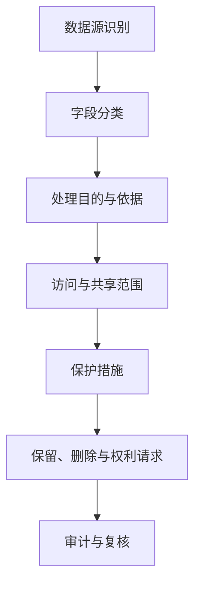

## 8.2 数据隐私与分级保护

### 8.2.1 先识别处理活动

FDE 项目不能只问数据库怎么连，而要先说明数据处理活动：处理哪些数据，目的是什么，谁受影响，输出给谁，保留多久，能否删除或更正。[NIST Privacy Framework](https://www.nist.gov/privacy-framework) 可作为隐私风险管理框架参考；截至 2026-05-18，NIST 仍将 Privacy Framework 1.1 标为 Initial Public Draft / coming soon 状态，出版前应复核最终版本。隐私风险不等同于网络入侵风险，即使系统没有被攻破，过度收集、目的漂移、不透明共享或错误推断，也可能造成隐私损害。

现场数据应先形成处理目录，覆盖数据来源、字段类别、主体类型、处理目的、法律/合同/制度依据、告知和同意证据、控制者/处理者角色、子处理方、共享对象、保留期限、删除或匿名化触发、脱敏方式、权利请求 owner、PIA/DPIA 需求和审批引用。AI 或分析系统还要记录数据是否进入训练、微调、检索、提示词、日志、评测集、人工标注或供应商调用流程。

### 8.2.2 分级要连接业务影响

数据分级不是贴标签，而是把泄露、误用、篡改和不可用的影响转化为工程控制。常见分级可从公开、内部、敏感、受限四级开始，再按行业要求扩展。分级越高，默认暴露面越小，使用证据越完整。分级还要覆盖派生数据和输出：多个低敏字段组合后可能识别个人；模型日志可能含用户原文和检索片段；业务规则输出可能暴露商业秘密。

“数据分类分级”是数据治理和工程控制的输入，不等同于全部合规结论。它与等保、数据出境和行业监管的边界要分清：

- 等保关注网络和信息系统的安全保护等级、技术控制和管理控制；数据分级可以影响系统定级论证、访问控制、日志和加密要求，但不能替代等保定级、测评和整改。
- 数据出境关注个人信息、重要数据和出境场景是否触发安全评估、标准合同、个人信息保护认证或豁免；数据分级能帮助识别敏感性和重要性，但不能单独决定能否出境。
- 行业监管关注金融、医疗、政务、汽车、工业等领域的专门目录、强制标准、报送和留存要求；通用分级标签必须映射到客户所属行业的监管口径。

因此，FDE 在现场不要只交付一张“公开、内部、敏感、受限”的表。更可执行的做法是把每个字段同时标注业务分级、个人信息属性、敏感个人信息属性、是否可能构成重要数据、是否属于商业秘密/客户受限信息、是否为凭证/密钥、适用系统边界、出境状态和行业特殊要求；未知项标记为“待法务/安全确认”，不能默认为可用。

| 分级 | 典型内容 | 最低控制 |
| --- | --- | --- |
| 公开 | 已发布文档、公开价格 | 完整性校验、发布审批 |
| 内部 | 项目计划、汇总指标 | 组织内访问、变更记录 |
| 敏感 | 客户明细、合同、运营数据 | 最小权限、加密、脱敏、访问日志 |
| 受限 | 证件、生物识别、精确位置、未成年人、医疗金融记录、密钥 | 强审批、隔离、短期授权、专门审计 |

高风险行业不能只停留在这四级标签。银行卡数据、非公开金融信息、ePHI、公共记录、执法数据、OT 遥测和商业秘密有不同的法律依据、留存、泄露通报、审计和访问要求，必须映射到客户自己的监管词典和控制 owner。

| 字段属性 | 示例问题 | 工程落点 | 未确认时默认动作 |
| --- | --- | --- | --- |
| 个人信息属性 | 是否能直接或间接识别个人 | 处理目录、访问策略、权利请求流程 | 限制使用，等待 privacy owner 确认 |
| 敏感个人信息 | 是否涉及生物识别、宗教信仰、特定身份、医疗金融、行踪轨迹或未满 14 周岁未成年人 | 单独目的、必要性说明、严格保护、额外告知/同意要求 | 不进入试点数据、prompt、日志和评测集 |
| 重要数据可能性 | 泄露或滥用是否可能影响国家安全、经济运行、社会稳定、公共健康和安全 | 法务/安全确认、出境评估、隔离存储 | 作为受限数据处理 |
| 商业秘密/客户受限 | 是否涉及合同价格、策略、供应链、客户名单、未发布产品 | 字段级权限、水印、导出审批 | 禁止导出，限制到最小团队 |
| 凭证/密钥 | 是否为口令、令牌、私钥、API Key、连接串 | Vault/KMS/HSM、密钥扫描、轮换 | 禁止写入文档、日志、prompt 和 trace |

### 8.2.3 控制要在系统路径生效

隐私不能只靠培训和承诺。工程上要把控制放进数据路径：采集阶段最小化，接入阶段分类和血缘，存储阶段加密和保留策略，查询阶段行列级权限，导出阶段审批和水印，日志阶段过滤敏感字段，模型调用阶段约束上下文和供应商数据使用。NIST Privacy Framework 的 Core、Profile 和 Implementation Tier 思路适合 FDE 使用：先定义目标画像，再评估当前差距，最后按风险排序补控制。

新增数据源、字段、用途、外部模型、保留期限、共享对象或人工标注流程，都应触发轻量隐私复核。结论要具体：允许、允许但需脱敏、仅限隔离环境、需法务确认或禁止接入。这样的结论才能转化为代码、配置、权限和验收项。

| 复核项 | 需要回答的问题 | 可执行结论 |
| --- | --- | --- |
| 数据路径 | 是否进入 prompt、日志、trace、评测、训练、导出或人工标注 | 允许 / 脱敏 / 隔离 / 禁止 |
| 字段最小化 | 当前用途是否需要完整字段，能否只用类别、摘要、引用 ID 或掩码 | 字段 allowlist、上下文裁剪、导出列限制 |
| 保留与删除 | 最短必要保留期、最长保留期、删除/匿名化触发、备份清除滞后 | 保留矩阵、删除任务、销毁证据 |
| 共享与出境 | 接收方、地点、合同机制、行业限制、子处理方 | 合同/评估编号、区域路由、禁止共享 |
| 验收负例 | 不必要敏感字段是否能进入 prompt、日志、导出或评测集 | 自动测试、抽样查询、阻断记录 |

现场样本默认使用合成或脱敏数据。确需使用真实生产样本时，应由数据 owner 批准，限定字段、数量、环境、人员、保留期和删除方式；截图、日志、下载文件、本地缓存、临时向量索引和调试数据都要纳入同一套清理和审计规则。没有工单、合同或客户批准，客户数据不应离开客户环境。

### 8.2.4 跨境、AI 与行业监管映射

涉及跨境数据、AI 系统或高监管行业的项目，还要把 FDE 视角对齐到外部监管口径。下表不替代法律意见，只说明交付清单中需要提前准备的工程证据。

| 口径 | 触发场景 | FDE 应准备的工程证据 | 需法务/合规确认项 |
| --- | --- | --- | --- |
| 中国数据出境 | 向境外提供个人信息、重要数据，或由境外供应商远程访问境内数据 | 数据目录、个人信息/敏感个人信息数量、重要数据判断、接收方、传输路径、合同/评估编号 | 按 [《促进和规范数据跨境流动规定》](https://www.gov.cn/gongbao/2024/issue_11366/202405/content_6954192.html) 判断豁免、标准合同/认证或安全评估 |
| 欧盟 GDPR 跨境传输 | 从 EEA 向第三国或国际组织传输个人数据，或第三国供应商访问 EEA 数据 | 数据出口方/进口方、数据类别、子处理方、区域路由、加密和访问控制 | 充分性决定、SCC、BCR、认证/行为准则、例外情形和传输影响评估 |
| EU AI Act | 在欧盟投放或服务欧盟用户的 AI 系统 | 风险分级记录、技术文档索引、日志留存策略、人工监督设计、上市后监测证据 | 高风险系统义务、GPAI 义务、系统性风险、事件报告和版权政策 |
| 中国生成式 AI 服务 | 面向中国境内公众提供生成式 AI 服务 | 训练数据来源证据、内容标识、个人信息保护、未成年人保护、违法内容处置记录 | 安全评估、算法备案、深度合成/内容标识等专项规则适用性 |
| 中国拟人化互动与智能体规则 | 拟人化互动服务，或智能体进入敏感领域/重点行业 | 拟人化标识、行为边界、权限管控、风险监测、问题产品召回/回滚、供应链清单 | [2026-07-15 生效的拟人化互动服务规则](https://www.cac.gov.cn/2026-04/10/c_1777558395078289.htm) 与 [2026-05-08 智能体实施意见](https://www.cac.gov.cn/2026-05/08/c_1779979789523320.htm) 是否触发备案、检测或行业管理 |

行业画像要单独落地，避免把所有高敏数据都塞进一个“受限”桶：

| 行业 | 额外交付关注点 | 不能简化成 |
| --- | --- | --- |
| 金融 | 客户非公开信息、多因素认证、交易/支付数据、第三方外包、运营韧性、审计留存 | 只做普通个人信息脱敏 |
| 医疗 | ePHI 范围、BAA/委托关系、临床决策支持或 SaMD 边界、患者安全监测、变更控制 | 只做通用隐私告知 |
| 公共部门 | RMF/ATO、FedRAMP 或本地等效授权、控制继承、POA&M、持续监控、可访问性 | 只交一个证据包即等于授权 |
| 关键基础设施/OT | 区域与管道、IT/OT 分段、被动监测、维护窗口、人工接管、故障安全和恢复演练 | 只用互联网应用安全门禁 |

实践上，FDE 与法务/合规团队的接口是“把监管条文翻译成现场可验收的工程项”：数据集来源与同意证据、模型卡与系统卡、用户告知与水印、人工监督机制、人工接管/停止机制及启停条件、日志与可追溯性保留期、跨境传输的合同/评估编号。把它们落到 8.1 的身份与权限、8.3 的供应链证据、8.4 的审计留存、8.5 的验收门禁、8.6 的 AI 安全控制中，而不是单独列一份合规清单。
