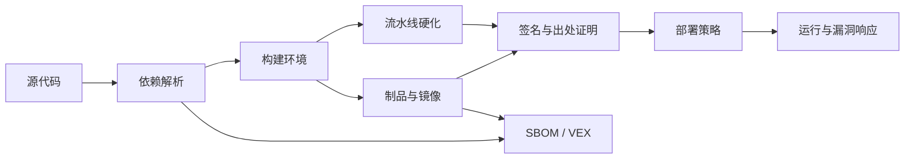

## 8.3 供应链安全与 SBOM

### 8.3.1 可信边界延伸到构建

FDE 只要交付可运行制品，就必须回答四个问题：来源是否可信，构建是否可复现，内容是否可检查，部署是否可阻断。依赖、基础镜像、CI 插件、构建脚本、制品仓库、部署凭证和客户 registry 推广流程都属于这条供应链。

NIST [SP 800-218 SSDF](https://csrc.nist.gov/pubs/sp/800/218/final) 将安全软件开发实践嵌入 SDLC，目标是减少发布漏洞并处理根因。针对生成式 AI 与双用途基础模型，NIST 又在 [SP 800-218A](https://csrc.nist.gov/pubs/sp/800/218/a/final) 中扩展了数据集、模型权重、提示词模板和评测集等组件的安全开发实践，项目涉及相关 AI 工作负载时应一并对齐。

供应链控制应沿代码到生产布置：源代码需要保护和密钥扫描；依赖需要锁定版本、漏洞告警、许可证检查和可利用性状态；构建要隔离并记录输入；制品要签名和不可变；部署要策略校验和回滚。

流水线自身也是供应链资产。第三方 action、插件和 reusable workflow 应固定到不可变版本或 full-length SHA；workflow 目录应有 CODEOWNERS 或等效评审；默认令牌权限最小化；签名和发布 job 才获得 OIDC/id-token 或 registry 写权限；云和 registry 凭证尽量使用短期 OIDC 令牌替代长期 secret；高权限 workflow 不应 checkout 或执行 fork/untrusted code；self-hosted runner 应隔离、一次性或 JIT 分配，避免持久污染。否则，后续 SBOM、签名和出处证明都可能由被攻陷的流水线生成。



### 8.3.2 SBOM 是风险管理输入

SBOM 的价值在于把“软件包含什么”变成机器可读事实。CISA 的 [SBOM 页面](https://www.cisa.gov/topics/information-communications-technology-supply-chain-security/sbom) 将 SBOM 定位为软件透明度工具；CISA 的 2025 年 [SBOM 最小元素草案](https://www.cisa.gov/resources-tools/resources/2025-minimum-elements-software-bill-materials-sbom)进一步强调组件信息、自动化支持和生成上下文。FDE 应把 SBOM 接入漏洞扫描、许可证审查、采购评估和应急响应，而不是只放进交付包。

格式选择要服务互操作。[SPDX](https://spdx.dev/use/specifications/) 是 ISO/IEC 5962:2021 国际开放标准，但该 ISO 版本对应 SPDX 2.2.1；**SPDX 3.0 已由 SPDX 项目正式发布**（提供 PDF/HTML/SHACL 三种发行形态），ISO/IEC 5962 是否同步至 3.0 应以 ISO 官方目录为准。组件、服务、依赖、漏洞、证明和 ML-BOM 等对象模型可参考 [CycloneDX](https://cyclonedx.org/specification/overview/)。项目应确认客户工具链能消费哪种格式。关键是自动生成、随版本发布、与制品 digest 绑定。

| 控制点 | 目标 | 证据 |
| --- | --- | --- |
| 依赖锁定 | 防止隐式升级 | lockfile、镜像 digest |
| SBOM | 说明组件和关系 | SPDX 或 CycloneDX 文件 |
| VEX/CSAF | 说明漏洞是否受影响和如何处置 | affected/not_affected/fixed/under_investigation、justification、owner、expiry |
| 漏洞管理 | 跟踪受影响组件 | 扫描报告、修复记录、例外单 |
| 制品签名 | 证明发布者和完整性 | 签名、证书、验证策略 |
| 出处证明 | 说明构建输入和过程 | 签名的 in-toto/SLSA provenance attestation，绑定 artifact digest；CI run/log 仅作辅助证据 |

### 8.3.3 签名和策略要闭环

扫描回答“已知风险是什么”，签名和出处证明回答“制品是不是预期制品”。在出处证明（provenance attestation）上，provenance 和 attestation 如何说明制品产生方式、构建者、输入和消费者验证方式，可参考 [SLSA v1.2](https://slsa.dev/spec/v1.2/)。签名、短期证书和透明日志能力可由 [Sigstore](https://docs.sigstore.dev/about/tooling/) 的 Cosign、Fulcio、Rekor 等工具提供。FDE 应把 SBOM、VEX/CSAF、漏洞扫描、签名、出处证明生成和部署验证放入流水线；更成熟的做法是在部署入口强制策略：没有 SBOM、高危可利用漏洞未处置、签名不匹配、attestation 缺失或出处证明不符合预期，不允许进入生产。

部署准入策略的最小例子不是“人工看过扫描报告”，而是把机器可验证条件放到发布入口：

```yaml
部署准入策略:
  适用范围: 生产环境镜像和 AI 推理制品
  必须满足:
    - 制品使用 digest 引用，禁止只使用 latest 或可变标签
    - 签名可验证，签名身份属于允许的发布流水线
    - SBOM 或 ML-BOM 与 digest 绑定，并随版本归档
    - provenance attestation 存在，且 subject[].digest、predicate.runDetails.builder.id、predicate.buildDefinition.buildType 与预期一致
    - source/workflow/commit 对应的 predicate.buildDefinition.externalParameters 或 predicate.buildDefinition.resolvedDependencies[] 与发布策略一致
    - predicate.buildDefinition.resolvedDependencies[] 的 uri/digest 与锁文件/发布记录一致；兼容旧谓词时才使用 materials 口径
    - 证书 issuer、SAN、OIDC claims 或透明日志条目符合发布策略
    - 严重或高危漏洞没有可利用且超期未处理项
  evidence_bundle:
    - artifact_digest
    - SBOM 或 ML-BOM
    - 签名/证书或 Sigstore bundle
    - provenance attestation
    - VEX/扫描摘要
    - 准入策略决策
    - 例外单和到期日
  例外:
    - 必须有风险负责人、到期时间、补救计划和审计记录
```

离线、半隔离或客户 registry 推广场景也要保持同一证据边界。交付包至少包含签名制品 bundle、digest manifest、SBOM/ML-BOM、漏洞库时间戳、扫描摘要、VEX/例外、出处证明、离线验证脚本、客户 registry 导入记录、回滚 bundle、补丁 SLA 和例外到期日。不能因为环境没有公网，就把“可验证来源”降级成“从 U 盘复制过来”。

这类策略应先在试点环境以告警方式运行，确认误报和例外路径后再切到生产阻断。关键不是一次性达到最高等级，而是让每次部署都能自动回答：这个制品是否来自可信源，是否经过预期构建，是否带着可追溯证据进入运行环境，当时为什么允许发布。
