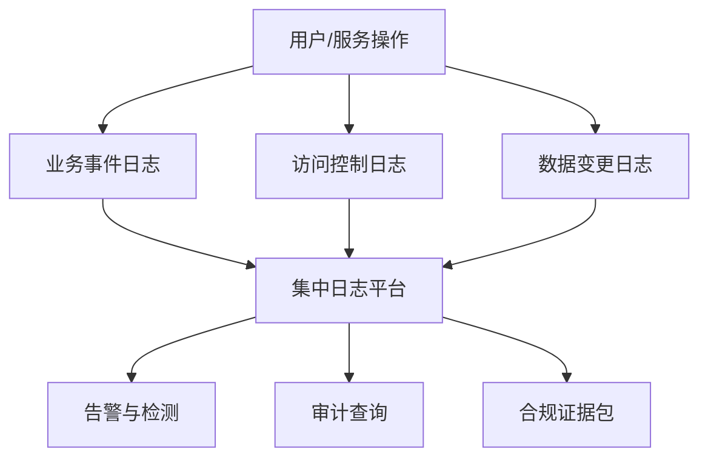

## 8.4 审计、留痕与合规证据

### 8.4.1 审计服务事实还原

很多团队把日志当作排障工具，把合规证据当作上线前临时材料。FDE 项目不能这样做，因为现场系统往往跨越客户、供应商、云平台和内部团队。一旦发生越权、误删、错误推荐、数据泄露或合规检查，团队必须回答：谁在何时以什么身份访问了什么资源，执行了什么动作，依据什么审批或策略，影响哪些数据，系统当时返回什么结果。

NIST [SP 800-53 Rev. 5](https://csrc.nist.gov/pubs/sp/800/53/r5/upd1/final) 的 AU 审计与问责控制族覆盖审计策略、事件生成、内容、存储、审查、分析、报告和保护等能力。FDE 不需要逐条搬入项目，但要理解核心思想：审计记录本身也是安全资产，必须完整、可检索、受保护、可保留，并能支撑问责。

### 8.4.2 留痕粒度按风险分层

审计不是记录越多越好。过少无法还原事实，过多会增加成本、噪声和隐私风险。普通读取记录主体、资源、时间、结果和请求来源；敏感读取增加字段类别、查询范围和业务理由；写入、删除、授权、导出、模型工具调用和生产配置变更，则必须记录前后状态、审批引用、操作者身份、影响范围和失败结果。

所有审计事件都应有共同 envelope，避免每个系统自定义到无法关联：`event_id`、`schema_version`、`timestamp_utc`、`actor_id`、`actor_type`、`tenant_id`、`role`、`session_id`、`source_ip/device/service`、`resource_type`、`resource_id`、`action`、`result`、`reason/error`、`trace_id`、`span_id`、`request_id`、`policy_version`、`retention_class`。表格中的字段是在共同 envelope 之外的事件特有字段。

AI 系统还要特别留痕。一次输出可能由用户输入、系统提示词、检索文档、工具调用、模型版本、后处理规则和人工确认共同生成。若只记录最终回答，事后无法判断问题出在权限、检索、提示词、模型、数据源还是人工操作。记录要足够还原，同时过滤敏感内容，避免日志成为新的泄露面。

| 事件类型 | 必记字段 | 额外要求 |
| --- | --- | --- |
| 登录认证 | 主体、时间、结果、来源、认证方式 | 异常失败告警 |
| 授权决策 | 主体、资源、动作、策略、结果 | 保存策略版本 |
| 数据读取 | 数据集、范围、字段类别 | 敏感读取需业务理由 |
| 数据变更 | 前后状态、审批、影响范围 | 支持回滚和追责 |
| 导出共享 | 内容类别、接收方、目的、审批 | 水印和下载记录 |
| 发布配置 | 版本、制品、验证结果 | 关联 CI、签名和回滚 |
| 模型调用 | provider、model、version、配置、token/cost、策略版本 | 原始敏感 prompt 默认不入日志 |
| 检索 | index_id、chunk_id、source_doc、ACL 版本、字段类别 | 可复盘引用来源，避免记录完整受限文本 |
| 工具调用 | tool_id、schema_version、参数摘要、授权上下文、结果 | 高风险工具记录审批和 payload hash |
| 人工确认/接管 | approver、确认动作、风险标签、payload hash、TTL | 确认 UI 不依赖模型摘要 |
| 自动化业务动作 | 目标系统、动作、前后状态、幂等键、回滚引用 | 失败和拒绝也要记录 |

### 8.4.3 审计日志要按工程资产设计

审计日志要从一开始按工程资产设计，而不是上线后临时补字段。最低要求包括：

- 统一时钟：所有服务、任务和日志平台使用统一时间源，记录时区和精度，避免跨系统事件无法排序。
- 全链路关联：入口请求、身份决策、数据读取、模型调用、工具执行和写入操作共享 `trace_id`，必要时增加 `span_id` 和业务单号。
- 防篡改：高风险日志写入集中平台或不可变存储，关键批次做签名、哈希链或对象锁，保留验证方式。
- 保留期：按法律、合同、行业和客户策略设置不同事件的最短/最长保留期，明确在线查询、归档、legal hold、恢复 SLA、删除触发和销毁证据。
- 访问审计：谁查询了审计日志、查询条件是什么、是否导出，都要再次留痕；审计系统本身不能成为无审计的超级入口。
- 敏感字段过滤：默认不记录口令、令牌、密钥、完整证件号、完整联系方式、原始提示词中的敏感片段和客户受限字段；确需记录时使用脱敏、摘要或加密字段。
- 遥测隐私契约：trace/span/log 属性使用 allowlist；用户和租户标识优先使用可回溯的伪名；baggage 默认 denylist；原始 prompt、检索文档正文和高基数字段不进入普通 span 属性；日志、trace 和证据导出使用单独访问控制。
- 审计管道健康：记录 delivery acknowledgement、buffer/replay、drop counter、ingestion gap、clock drift 和 sampling change；对导出、删除、提权、生产配置变更和高风险写工具，审计写入失败时应阻断、排队或转入人工审批，而不是静默放行。
- 抽样查询演练：每个试点和生产版本至少保留一组查询脚本或仪表盘，用来演练“谁在何时通过哪个 Agent 读取了哪个客户字段并触发了哪个工单动作”。

日志字段要稳定、可解释、可查询。字段重命名、采样比例、脱敏规则和保留期调整都应作为变更管理的一部分，因为它们会直接影响事故调查和合规证据的完整性。

### 8.4.4 合规证据持续生成

合规最怕事后考古。更稳妥的方式是证据即流程产物：需求阶段留下数据处理和风险结论，设计阶段留下架构与威胁模型，开发阶段留下评审和测试，构建阶段留下 SBOM、签名和扫描，发布阶段留下变更审批和回滚计划，运行阶段留下告警、事件和权限复核。

证据包应按系统而不是个人整理，至少包含系统说明、数据分类、权限矩阵、接口清单、供应链材料、审计日志说明、运行指标、事件响应联系人、例外清单和残余风险决策。每个证据包还应有 manifest：`control_id/obligation`、`source_system`、`artifact_version`、`generated_at`、`owner/reviewer`、`hash/signature`、`retention_until`、`supersedes`、`query/runbook link` 和 `verification steps`。没有 manifest 的证据很难证明真实性、时效性和适用范围。

公共部门或强监管项目要区分“项目证据包”和“正式授权”。例如 ATO、FedRAMP、RMF 或本地等效流程通常还需要 SSP、SAR、POA&M、控制继承、持续监控、重大变更评审和授权官员决策；FDE 可以生成工程证据，但不能把工程交付包说成已经完成授权。

证据要有版本和有效期，失效材料要被替换。客户交接时，FDE 应留下可查的证据目录：架构图、数据地图、权限矩阵、服务账号清单、密钥清单但不含密钥值、SBOM/ML-BOM、签名和出处证明、日志 schema、仪表盘、运行手册、事件联系人、开放风险、已接受例外和到期日。
