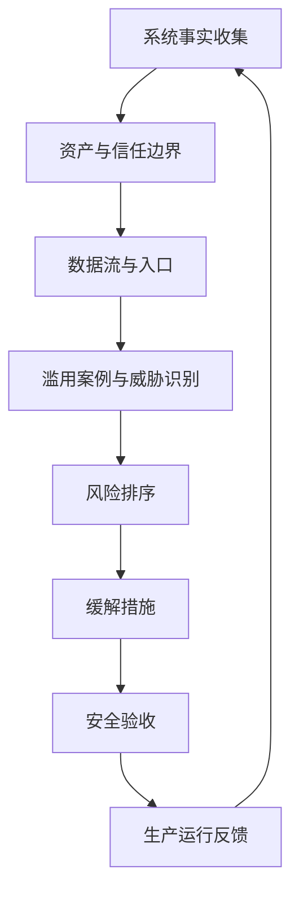

## 8.5 威胁建模与安全验收

威胁建模应在发现、设计、试点、生产化各阶段反复触发，而不是只在上线前做一次。发现阶段确认资产、身份主体、数据来源、客户约束和监管边界；设计阶段确认信任边界、权限模型、隐私控制、供应链控制和审计证据；试点阶段用真实角色、最小化或脱敏后的真实样本、真实工具链验证负例；生产化阶段关注权限漂移、依赖更新、日志保留、例外到期和事件响应。

每次威胁建模都要回连前面的控制：身份决定主体能否访问和操作，隐私决定字段能否被处理和输出，供应链决定代码、模型、镜像和工具是否可信，审计决定事后能否还原事实。只列风险而不回连控制，威胁建模就会停留在文档；把风险绑定到权限矩阵、数据分级、部署策略、日志字段和验收测试，才会改变系统行为。

合规要求也要落成验收项，而不是停留在“需符合法规”的章节标题。涉及医疗、金融、公共部门、跨境数据或关键基础设施时，威胁卡片应追加适用法规/合同条款、证据 owner、保留期限、例外审批人和审计抽样方式；如果团队无法说明某项控制如何产生可提交证据，就不能把它写成已满足。

### 8.5.1 威胁建模从事实开始

威胁建模不是上线前补一张攻击树。它的起点是系统事实：资产、角色、信任边界、数据流、依赖、权限、失败模式和业务影响。OWASP [Threat Modeling Cheat Sheet](https://cheatsheetseries.owasp.org/cheatsheets/Threat_Modeling_Cheat_Sheet.html) 将威胁建模描述为从安全视角建模系统、识别威胁并确定响应措施。FDE 应把现场用户、客户系统、第三方服务、模型工具和人工流程都纳入图中。

不同阶段关注点不同：原型看敏感数据边界、共享账号和外部 API 越权；试点看真实权限、批量导入、错误输出、用户反馈和工具链；生产化看权限漂移、供应链更新、日志保留、备份恢复、事件响应和供应商退出。

滥用案例要成为一等产物，而不是口头例子。每条滥用案例至少记录：攻击者或误用者、前置条件、被滥用功能、攻击路径、预期阻断或降级行为、审计证据、测试 fixture、门禁等级。然后把它映射成安全需求和负例测试。

### 8.5.2 从威胁到验收要求

威胁如果停留在“可能越权”“可能泄露”，就无法指导交付。FDE 要把威胁改写成可验收要求。例如，“用户可能访问非授权客户数据”应转化为：所有客户级数据读取必须经过租户隔离策略；跨租户访问测试必须失败；审计日志记录拒绝事件；管理员例外需要审批并有时限。OWASP [ASVS](https://owasp.org/www-project-application-security-verification-standard/) 提供应用安全验证要求基础，可作为 Web 应用、API 和身份控制验收参考；NIST [SP 800-160v1r1](https://www.nist.gov/publications/engineering-trustworthy-secure-systems) 则强调在系统工程生命周期中建立可信安全系统。

安全验收要覆盖三类证据：设计证据，包括架构图、数据流图、权限矩阵和威胁模型；测试证据，包括权限负例、依赖扫描、动态测试和恢复演练；运行证据，包括日志、告警、仪表盘、事件流程和责任人。

| 威胁类别 | 可验收要求 | 验证方式 |
| --- | --- | --- |
| 越权访问 | 只能访问授权租户、字段和动作 | 权限负例测试 |
| 数据泄露 | 敏感字段不进日志或未授权导出 | 日志抽样、脱敏测试 |
| 注入滥用 | 输入、提示词和工具参数有边界，策略由非模型组件执行 | 安全测试、红队用例 |
| 供应链篡改 | 只部署签名且出处可信的制品 | 签名验证 |
| 不可追责 | 高风险操作关联身份和审批 | 审计查询演练 |
| 恢复失败 | 关键数据可恢复到目标时间点 | 恢复演练 |
| 资源/成本滥用 | 输入长度、调用频率、工具循环、租户配额和成本预算受限 | 限流测试、循环终止测试、预算告警/阻断演练 |

一张可执行的威胁到验收卡片应包含：`threat_id`、资产、信任边界、滥用故事、控制、负例测试、预期拒绝/降级/日志行为、证据路径、owner、残余风险决策。关闭威胁时，不接受“已讨论”作为证据；必须对应设计决策、代码/配置控制、测试结果、运行监控或正式接受的残余风险。

### 8.5.3 贯穿案例：客户现场 RAG/Agent

下面的 RAG/Agent 只作为安全验收案例。RAG 架构设计在第九章 9.3 展开，Agent 工作流在第九章 9.4 展开，安全评测和红队测试在第十章 10.4 展开；本节只关心上线前必须关闭的安全失败路径。

假设 FDE 在客户现场交付一个售后 RAG/Agent：它检索知识库和 CRM，读取客户合同、设备、联系人、历史工单和服务等级，并在用户确认后调用工单系统创建、升级或关闭工单。这个系统看似只是“问答加自动化”，实际同时触碰身份、隐私、工具权限、供应链、审计和验收。

身份授权要先拆清主体。现场工程师、客户经理、外包坐席、服务主管、系统 Agent 和后台任务不能共用一个 CRM 服务账号。用户登录后，Agent 读取 CRM 必须携带用户身份、租户、区域、客户范围和动作；系统只允许把用户本来有权读取的字段放入检索上下文。工单创建、升级和关闭是写操作，应独立授权，不能因为用户能查看客户资料就默认允许 Agent 代其改工单。

字段脱敏要按使用场景处理。模型回答通常不需要完整手机号、邮箱、证件号、合同金额明细或内部折扣条款；检索层应优先返回字段类别和最小必要片段，提示词和日志中使用掩码、摘要或引用 ID。若主管确需查看完整字段，应通过显式业务理由、短期授权和审计记录完成，而不是让 Agent 在上下文里长期持有受限字段。

工具权限要小于人的权限，并按动作拆分。`crm.search_customer` 只读，限制字段和条数；`ticket.create` 只能创建草稿或低风险工单；`ticket.escalate` 需要用户二次确认和策略校验；`ticket.close` 默认要求人工审批。任何工具参数都要做服务端校验，不能信任模型生成的客户 ID、优先级、接收人或文本说明。确认界面必须展示由已验证工具参数生成的动作、目标、差异、范围和风险标签，而不是模型写出的摘要；审批应绑定 payload hash、幂等键、审批人、TTL 和审批后的策略复核。

审计追踪（trace）要能串起完整事实：用户问题、身份决策、检索到的文档和字段类别、模型版本、工具调用参数、用户确认动作、工单系统返回结果、失败或拒绝原因。日志保存 `trace_id`，但过滤敏感原文；需要复盘时通过受控查询把证据拼回完整链路。

| 攻击/失败路径 | 受影响资产 | 控制点 | 负例验收 |
| --- | --- | --- | --- |
| 坐席读取非授权客户 | CRM、合同、工单 | 租户边界、用户委托、字段 ACL | 跨客户读取失败并记录拒绝 |
| 检索文档携带恶意提示 | CRM、导出工具、用户信任 | 检索内容标为不可信，工具策略由非模型执行 | 文档中的指令不能触发导出或提权 |
| 模型把完整个人信息写入工单 | 个人信息、工单系统 | 输出过滤、字段最小化、工单 schema 校验 | 完整证件号/手机号不能进入描述 |
| 高优工单无确认升级 | 工单流程、SLA | 二次确认、payload hash、策略复核 | 未确认时升级请求被拒绝 |
| 工具镜像签名不匹配 | 工具执行层 | 签名、出处证明、部署策略 | 策略阻断部署 |
| 审计链路缺失 | 事故调查、合规证据 | 审计 envelope、日志管道健康 | 限定时间内能还原创建链路 |
| 递归工具调用或高成本请求 | 模型预算、外部 API、队列 | token/cost quota、工具迭代上限、熔断 | 超限后降级或阻断并告警 |

### 8.5.4 验收是上线门

FDE 交付速度快，但安全验收不能变成上线后补。推荐设分层门禁：原型可接受临时控制，但必须禁止接入生产敏感数据；试点必须通过身份、数据、日志和回滚最低门；生产必须通过威胁模型关闭项、权限负例、供应链证明、审计查询和事件响应检查。任何例外都要有负责人、到期时间和补救计划。

| 阶段 | 允许的临时控制 | 必须通过的门禁 | 硬阻断条件 | 例外要求 |
| --- | --- | --- | --- | --- |
| 原型 | mock、合成/脱敏数据、临时隔离环境 | 命名身份、无生产敏感数据、基本日志、删除计划 | 共享生产账号、真实受限数据进入本地或未审计工具 | 负责人、到期日、禁止生产使用 |
| 试点 | 小范围真实角色、最小化真实样本、告警型供应链策略 | 权限负例、数据最小化、审计查询、回滚演练、变更窗口 | 跨租户读取成功、敏感数据入日志、审计不可用、未签名制品部署 | 客户 owner 批准、补救计划、升级生产前关闭 |
| 生产 | 经批准的残余风险和有限例外 | 威胁关闭、SBOM/ML-BOM、签名/出处证明、事件响应、监控和复核节奏 | 未处置可利用高危漏洞、审计重放失败、提权无审批、例外过期 | 风险接受人、业务 owner、复核触发、监控信号 |

关键基础设施或 OT 场景还要加安全影响门禁：区域/管道、IT/OT 分段、主动扫描限制、被动监测、操作员批准的变更窗口、人工接管、故障安全、恢复演练和安全影响签字。不能把普通 Web 应用门禁直接套到会影响物理过程的系统上。

残余风险接受也要有结构，不能写成“业务接受”。最低字段包括：`risk_id`、场景、处置方式（mitigate/avoid/transfer/accept）、剩余影响、补偿控制、owner、approver、expiry、review trigger、monitoring signal、production eligibility。没有授权人、到期日和监控信号的风险接受，不应进入生产。

治理闭环包括 owner、决策权、例外登记、复核节奏、残余风险接受、运行监控和交接责任。FDE 的目标不是把风险文档写完，而是让客户组织能在人员变化、系统扩容、供应商切换和事故发生后，继续解释和执行这些安全决策。
