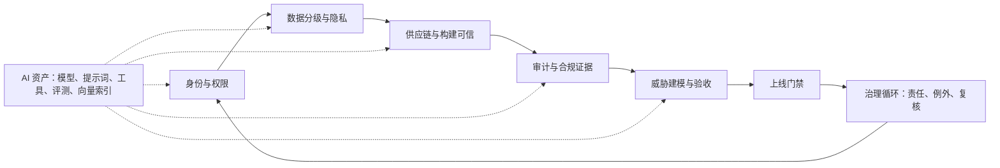

# 第八章：安全、合规与治理

FDE 进入客户现场时，安全不是项目后期的“审批项”，而是系统能否被真实组织长期使用的前置条件。现场系统通常连接身份目录、业务数据库、第三方 SaaS、模型服务、日志平台和交付流水线；任何一个环节的边界不清，都可能把一次快速试点变成不可审计、不可交接、不可扩展的风险资产。

本章按一条现场安全链路展开：先确认身份与权限，再限定数据处理边界，随后证明代码、依赖、模型和制品可信；运行后用审计留痕还原事实，最后用威胁建模和验收门禁把控制落到上线决策。AI 系统的模型、提示词模板、工具、向量索引和评测集不另起一套治理，而是进入同一条链路。

第七章已经把数据契约、质量规则、血缘、语义边界和运营动作边界作为数据产品交付物。本章接收这些产物，把它们映射为访问策略、隐私分级、审计字段、供应链证据、威胁模型资产和上线门禁。否则，安全会变成独立评审，而不是工程系统的一部分。

零信任不再依赖静态网络边界；NIST [SP 800-207](https://csrc.nist.gov/pubs/sp/800/207/final) 将其描述为转向保护用户、资产和资源的安全范式；身份、设备、网络、应用工作负载和数据的持续成熟也可参考 [CISA Zero Trust Maturity Model](https://www.cisa.gov/resources-tools/resources/zero-trust-maturity-model)。对 FDE 而言，这意味着不要把“在客户内网运行”视为信任依据，也不要把“上线前做一次扫描”视为安全闭环。安全应成为从发现、架构、交付到运营的连续控制面。

| 控制面 | 关键问题 | 最小交付物 | 验收信号 |
| --- | --- | --- | --- |
| 身份与权限 | 谁代表谁访问哪些租户、资源、字段和动作 | 权限矩阵、服务身份清单、提权与撤权流程 | 跨租户负例失败，高风险动作有审批和审计 |
| 数据隐私 | 哪些数据能被处理、输出、保留和删除 | 数据处理目录、字段治理表、保留与删除计划 | 敏感字段不会进入未授权 prompt、日志、导出或评测集 |
| 供应链 | 制品是否来自可信源，构建和发布是否可验证 | SBOM/ML-BOM、签名、出处证明、漏洞处置状态 | 未签名或证据缺失的制品不能部署 |
| 审计留痕 | 事故后能否还原事实，证据是否可信 | 日志字段说明、查询脚本、证据清单、保留策略 | 能在限定时间内重放一次敏感操作链路 |
| 威胁验收 | 风险是否转成可测试门禁 | 威胁模型、滥用案例、负例测试、残余风险决策 | 阻断项关闭或被授权接受，例外有到期日 |
| AI 安全 | 模型、检索、工具和代理是否扩大攻击面 | AI 资产清单、红队用例、工具权限、运行时策略 | 提示注入、越权检索、工具篡改和成本滥用负例可回归 |

进入客户现场时，FDE 应先完成一份轻量安全启动清单：客户安全负责人、系统 owner、数据 owner、运行环境、身份目录、外部用户范围、服务账号、密钥保管位置、入口和出口网络、日志/SIEM 去向、变更窗口、事件联系人、例外流程、证据交付位置。清单不是审批文档，而是后续所有权限、数据、供应链、审计和门禁设计的输入。

读完本章，读者应能把安全要求翻译为 FDE 可执行的工程动作：权限模型、数据分类、SBOM、签名与出处、日志证据、威胁模型、安全验收门禁，以及生产交接时必须留下的治理材料。
