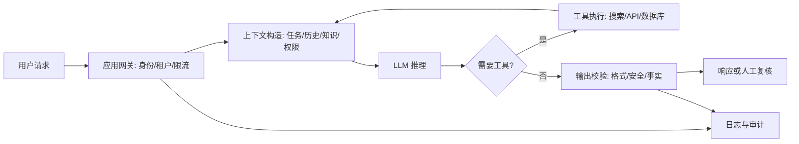

## 9.2 LLM 应用架构

### 9.2.1 从单次调用到应用系统

LLM 应用架构的核心，不是“选择哪个模型”，而是把不确定的语言模型放进可控制的软件系统。一个生产应用至少包含入口层、上下文构造、模型调用、工具执行、输出校验、评估观测和审计留痕。入口层处理用户、租户、权限和速率限制；上下文层决定给模型看什么；模型层处理推理和生成；工具层把模型意图转成数据库查询、搜索、工单或业务动作；校验层检查格式、权限、事实和安全；观测层记录延迟、成本、错误、命中来源和用户反馈。

新建代理与工具调用应用可优先采用 [OpenAI 的 Responses API](https://developers.openai.com/api/docs/guides/migrate-to-responses)；Chat Completions 仍是受支持接口，适合已有简单对话链路继续运行。Responses API 工具能力可按四类管理：内置检索工具（如 web search、file search）、执行工具（如 code interpreter、computer use、image generation）、外部系统连接（如 remote MCP server）和自定义函数。具体可用性取决于模型、账号权限、区域和安全策略；生产系统不应把某个工具默认为永久可用。它还与 Agents SDK、Evals 和 tracing 集成。提示工程也应先定义成功标准，再设计角色、上下文和示例，这一点可参考 [Anthropic 的提示工程文档](https://platform.claude.com/docs/en/build-with-claude/prompt-engineering/overview)。FDE 在客户现场应避免把提示词当作唯一架构，把 prompt、检索、函数 schema、策略、评测和日志一并纳入版本控制。

### 9.2.2 上下文是新的运行时资源

传统应用主要管理 CPU、内存、连接池和数据库事务；LLM 应用还要管理上下文窗口、token 成本、检索片段、会话历史和提示注入风险。上下文不是越多越好。过长的上下文会增加成本和延迟，也会把无关信息、旧政策或恶意指令带入模型。FDE 应把上下文构造视为一个可测试模块：输入是什么、过滤规则是什么、片段如何排序、是否包含来源、是否符合当前用户权限、超出预算时如何降级。

生产架构中还需要模型网关。模型网关不只是转发请求，而是统一处理模型选择、降级、重试、超时、缓存、成本标签、敏感数据处理和供应商切换。对高风险场景，网关应支持不同模型或规则的交叉检查：一个模型生成，另一个模型或确定性规则做判定；结构化输出必须按 schema 校验，不能让业务系统直接执行自然语言。这样做会增加工程量，但可以把模型的不确定性隔离在受控边界内。

确定性策略控制面应在模型之外执行。身份、租户、字段权限、工具白名单、动作审批、成本预算、输出 schema 和合规拒绝原因，都应由普通软件组件或策略引擎计算并记录；模型可以提出建议和参数，但不能自己决定是否有权读取、写入、发送或删除。

生产架构控制面清单应至少覆盖以下内容：

| 控制面 | 售后工单 Agent 中的要求 |
| --- | --- |
| 模型网关 | 按任务类型选择模型，统一限流、超时、重试、缓存、供应商切换和敏感字段处理 |
| prompt 版本 | 分类、摘要、回复草稿、升级建议分别版本化，记录发布人、发布时间、适用场景和回滚版本 |
| 工具 schema | 工单查询、客户查询、知识检索、回复草稿、升级单创建都要定义参数、返回结构、错误码和权限条件 |
| 上下文预算 | 区分系统指令、用户问题、历史工单、RAG 片段和工具结果的 token 配额，超限时按可信度和时效性裁剪 |
| 审计字段 | 记录用户、租户、工单 ID、模型版本、prompt 版本、检索片段、工具参数、人工确认人和最终动作 |
| 数据留存 | 明确 Responses 是否使用有状态会话、是否设置 `store: false`、是否适用 ZDR、file/vector store 是否按供应商资源保留到显式删除以及删除后的清除窗口、reasoning item 是否回传或加密、审计日志保留到哪里；例如 OpenAI 的[数据控制说明](https://developers.openai.com/api/docs/guides/your-data)将 vector store 列为非 ZDR，并说明相关对象在 API 或控制台删除后仍需 30 天从服务器清除 |
| 成本/延迟预算 | 为一次分类、一次检索回答、一次升级建议设置费用和 P95 延迟上限，超过预算时降级到模板或人工队列 |
| 降级路径 | 模型不可用时保留规则分类、关键词检索、人工分派和只读知识库入口；工具失败时不得伪造执行结果 |

工具接入也要按风险分层。web search、file search 和只读数据库查询通常属于证据增强，但仍可能带来外部内容注入、数据外发、索引留存和引用误导；code interpreter、image generation 和批量文档处理会引入执行环境、文件和版权边界；remote MCP server、业务 API 和 computer use 则可能触达真实系统。以 OpenAI Responses API 为例，live `web_search` 与 `external_web_access: false` 的 offline/cache-only 模式有不同的 HIPAA/BAA、ZDR 和外部访问边界，preview 形态也可能忽略该参数，不能把“web search”笼统标成同一合规能力。FDE 应把每个工具按副作用、数据外发、留存边界、运行沙箱、审批模式和不可信内容处理方式标注为只读、草稿、需人工确认或可自动执行，并在发布门禁中记录工具版本、scope、审批人、禁止动作和回滚路径。Remote MCP 接入应限制 `allowed_tools`，用 `require_approval` 控制敏感工具；如使用 OAuth，再限制 token scope。敏感动作默认人工批准，MCP 返回内容按不可信数据处理。

### 9.2.3 模型选型矩阵

模型选型不是“选最强的那个”，而是按任务的推理深度、工具调用密度、上下文长度、区域合规和成本/延迟预算落点匹配。模型清单属于高漂移事实，不应在书稿中长期固定为“某一代模型族”。现场应把模型选型做成版本化记录：状态（GA/preview/弃用）、模型 ID、上下文窗口、工具支持、区域/数据驻留、价格口径、默认留存、ZDR 支持、供应商 SLA、回退模型和禁止使用场景。

| 选型维度 | 必填记录 | 现场判断 |
| --- | --- | --- |
| 模型状态 | 官方模型 ID、GA/preview、发布日期和弃用说明 | preview 模型不得默认承载高风险写动作 |
| 接入路径 | 直连 API、AWS Bedrock、Google Agent Platform、Microsoft Foundry、私有部署等 | 同一模型在不同通道下的工具、审计、留存、支持和区域能力可能不同 |
| 能力边界 | 推理、工具调用、多模态、上下文窗口、结构化输出 | 按任务切分，不用单一模型覆盖所有场景 |
| 合规边界 | 区域、数据驻留、默认存储、ZDR、日志保留 | 合规优先时先筛区域和留存，再比质量 |
| 成本延迟 | 输入/输出/推理/缓存 token、批处理、工具另计 | 用 trace 实测，不用公开价估全链路成本 |
| 回退路径 | 降级模型、只读模式、人工队列、缓存答案 | 强模型失败时系统仍能安全响应 |

现场选型建议：高风险写动作和复杂多步 Agent 优先用强推理模型，分类、抽取、路由用低延迟/低成本模型，长文档/长会话场景按上下文长度和引用质量而不是“总分”挑模型；数据合规要求严的场景优先评估区域部署或开权重本地部署，但要预留至少一个质量基线模型和可解释的回退路径。若客户通过云平台采购或调用同一模型，还要把云账号归属、IAM / Bedrock / Agent Platform / Foundry 控制、区域与数据驻留、GovCloud / 商用区差异、配额、支持路径、功能缺口和切换回退纳入接管证据。

### 9.2.4 评估与观测要先于规模化

没有评估的 LLM 应用无法稳定改进。OpenAI 在[评估最佳实践](https://developers.openai.com/api/docs/guides/evaluation-best-practices)中强调，eval 应围绕生产任务设计，用样本和指标测试模型在真实环境中的表现。FDE 应至少准备三类评估：离线黄金集，用于比较模型、提示词和检索策略；上线前红队集，用于覆盖提示注入、越权、敏感信息和误操作；线上反馈集，用于把用户修改、人工拒绝和事故样本回流到测试集中。观测指标也要超出“请求成功率”，包括 token 成本、工具调用失败率、检索无结果率、引用覆盖率、人工接管率和高风险拒答率。

在售后工单 Agent 中，eval 不能只评回复文本，还要评分类、检索证据、工具参数、升级判断和拒答行为。红队样本应覆盖客户伪造身份、邮件正文提示注入、跨客户数据索取、诱导承诺赔偿、要求绕过 SLA、引用过期政策和伪造日志等路径。线上回放要保留输入、上下文构造、检索命中、工具调用、模型输出、人工修改和最终结果，确保每次事故都能复现到同一控制面版本；进入回放库前，应沿用第 10 章和第 12 章的 trace 治理，把原文替换为证据 ID、内容 hash、脱敏片段或受控快照，并记录敏感级别、访问范围、保留期和删除责任。

平台化工具正在把构建、连接、评估和追踪收敛到同一控制面，这也体现了生产 Agent 需要工作流版本、数据连接治理、交互界面和 trace 级评估。这里先说明 LLM 应用的控制面；更详细的 eval 设计、红队方法、回放数据集和发布门禁，详见 [§10.2 提示、检索与工具调用评测](../10_llmops/10.2_eval.md)，该节将其作为独立质量体系展开。

> **API 选型注意**：OpenAI Assistants API 已于 2025-08-26 弃用、2026-08-26 完全下线，弃用公告给出的推荐替代是 Responses API **与 Conversations API** 两者，迁移路径见[官方迁移指南](https://developers.openai.com/api/docs/assistants/migration)。Responses API 于 2025-03-11 发布时公开的内置工具包括 web search、file search 和 computer use，Code Interpreter 当时仍属于 Assistants parity 路线；按当前 Responses 文档，code interpreter、remote MCP 等也已进入 Responses 工具体系。既有 Assistants 集成应规划迁移路径，并在每次上线前按官方文档复核工具可用性。
