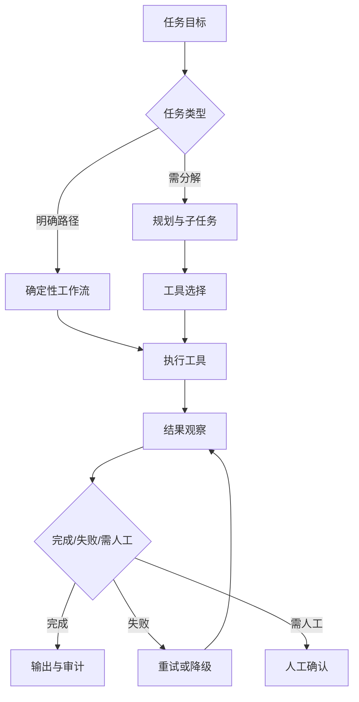

## 9.4 Agent 工作流

### 9.4.1 Agent 的本质是受控行动

Agent 不是更长的提示词，而是能围绕目标规划步骤、调用工具、读取结果并继续推进的系统。它的价值在于把语言理解、推理和工具执行连接起来，例如查找资料、生成变更、创建工单、更新记录、发送通知或触发审批。OpenAI 在 [agents 工具发布说明](https://openai.com/index/new-tools-for-building-agents/)中把 agents 定义为代表用户独立完成任务的系统，并提供内置工具、SDK 和 tracing 来支持构建；Anthropic 在 [building effective agents](https://www.anthropic.com/engineering/building-effective-agents) 中区分 workflow 与 agent，建议优先使用简单、可组合的模式，例如 routing、parallelization、orchestrator-workers 和 evaluator-optimizer。

FDE 要把“自主”翻译成可治理的行动范围。一个 Agent 必须知道目标、可用工具、输入输出格式、失败重试策略、权限边界、停止条件和人工接管点。没有这些边界，Agent 会从助手变成不可预测的自动化脚本。现场最稳妥的路线，是先用确定性工作流包住模型：业务系统决定步骤，模型负责分类、摘要、草拟和参数生成；当评估证明稳定后，再允许模型在有限工具集合中选择下一步。

Agent 工作流可以看作第 7 章运营应用动作层在 AI 场景下的扩展：它不能绕开数据产品契约、质量门、语义口径、动作权限和回写审计。

### 9.4.2 售后工单 Agent 状态机

售后工单 Agent 不应被实现成“循环调用模型直到满意”，而应有显式状态机。下面是一条可生产的最小路径：

| 状态 | 输入 | 允许动作 | 转移条件 |
| --- | --- | --- | --- |
| 计划 | 工单正文、用户身份、客户 ID、当前 SLA | 生成任务计划，列出需要证据、可能工具和风险等级 | 计划完整后进入工具选择；缺少关键身份或客户信息则终止并要求补充 |
| 工具选择 | 计划、权限、预算、工具白名单 | 选择只读检索、客户查询、历史工单查询或草稿生成工具 | 工具在权限和预算内则执行；高风险写入进入人工确认 |
| 执行 | 工具 schema、参数、调用人权限 | 调用工具并记录参数、版本、超时和错误码 | 成功进入观察；失败进入重试或降级 |
| 观察 | 工具结果、引用、错误信息 | 判断证据是否足够、是否冲突、是否需要更多检索 | 证据足够进入草稿或确认；证据冲突进入人工确认；证据不足且可重试则返回工具选择 |
| 重试 | 失败原因、剩余预算、幂等键 | 调整查询、换检索策略、切换模型或降级模板 | 超过重试上限、费用上限或 SLA 上限则转人工队列 |
| 人工确认 | 草稿、证据、风险标记、建议动作 | 让授权人员批准、修改或拒绝 | 批准后执行写入；拒绝后回滚或终止；要求双人确认时等待第二人 |
| 回滚 | 已执行动作、补偿动作、审计记录 | 撤回草稿、取消升级单、恢复工单状态、通知责任人 | 回滚成功后终止；回滚失败则升级事故 |
| 终止条件 | 完成结果或失败原因 | 输出答案、创建任务或进入人工队列 | 必须记录最终状态、原因、证据引用和后续责任人 |

工具也要按权限等级标注，不能把所有函数都暴露成同一类“可调用能力”。

| 工具等级 | 示例工具 | 控制要求 |
| --- | --- | --- |
| 只读 | 搜索知识库、读取工单、查询客户 SLA、检索历史案例、读取可脱敏日志 | 只允许当前用户可见数据；结果必须带来源、版本和 ACL 命中记录 |
| 可写 | 创建内部备注、生成回复草稿、创建升级单、更新工单标签、追加待办 | 需要幂等键、schema 校验、字段级权限、失败补偿和人工可见审计 |
| 双人确认 | 发送正式赔偿承诺、关闭高价值客户工单、触发退款、修改 SLA 例外、发布安全或法律声明 | 第一审批人确认业务合理性，第二审批人确认权限和风险；未完成确认时 Agent 只能保留草稿 |

工具等级应与统一动作分类对齐：`read` 只读查询，`draft` 生成草稿但不触达外部系统，`stage` 创建待确认变更，`commit` 执行可补偿写入，`irreversible` 触发删除、资金、权限、法律承诺或外部发送。工具注册表至少记录工具 owner、环境、side effect、数据外发、允许主体、必需审批、幂等键、补偿动作和禁用条件；没有注册表的函数不应暴露给 Agent。

状态机的价值，是让“Agent 为什么这样做”可以被复盘。每一次状态转移都要记录触发条件、模型输出、工具参数、观察结果、人工决定和预算消耗；否则事故发生后只能猜测模型意图，无法定位是检索、prompt、工具 schema、权限还是人工流程出了问题。

每个状态还应有可执行契约：owner、进入阈值、退出阈值、契约测试、风险接受人、回滚或补偿动作，以及触发复审的条件。例如“人工确认”状态的 owner 是客户授权角色，退出阈值是审批记录完整且幂等键有效，契约测试覆盖未确认不得写入，复审触发包括写工具 schema 变更、审批规则变更和任一越权样本失败。

### 9.4.3 工作流模式比框架更重要

企业场景中，Agent 工作流可以按控制强度分层。路由型适合把请求分给不同专家链路，例如政策问答、技术支持和账务查询。编排-执行型适合复杂任务，由一个 orchestrator 拆分子任务，再交给专门工具或子代理。评估-优化型适合文档、代码、分析报告等可反复改进的产物。并行型适合多来源搜索和交叉核验。完全开放的自主 Agent 只适合低风险、隔离且可重置的沙盒；监控只是补偿控制，不能把高影响工具变成可随意自动执行的能力。

| 模式 | 适用场景 | 控制重点 |
| --- | --- | --- |
| Routing | 请求类别清晰、处理链路不同 | 分类准确率、错路由回退 |
| Sequential workflow | 审批、采集、生成、校验顺序固定 | 状态机、幂等、超时 |
| Orchestrator-workers | 多文件修改、多来源研究、复杂分析 | 子任务边界、结果合并 |
| Evaluator-optimizer | 写作、代码、策略建议 | 评估标准、迭代上限 |
| Autonomous agent | 探索性任务、低风险环境 | 工具白名单、预算、人工接管 |

### 9.4.4 多 Agent 进入生产的条件

多个 Agent 并行或互相委托时，生产门槛高于单 Agent。每个子 Agent 必须有独立身份、工具范围、预算、输出契约和停止条件；调度 Agent 只能分配任务和汇总结果，不能继承所有子 Agent 的工具权限。跨 Agent 消息按不可信输入处理，必须带来源、任务 ID、证据引用和完整性标记；任一子 Agent 触发权限拒绝、预算耗尽、循环或高风险动作时，整体工作流应降级到人工确认，而不是让另一个 Agent 继续尝试。

### 9.4.5 Agent 失败模式名录

生产 Agent 的故障模式可枚举，远比“模型说错话”具体。下表整理 FDE 现场最常遇到的 8 类失败，每类都应在 trace、评测和运行手册中各有对应检测项。

| 失败模式 | 现场表现 | 检测信号 | 缓解动作 |
| --- | --- | --- | --- |
| 循环 / loop | 同一工具或同一查询反复调用，无新增证据 | 步骤数超阈值；相邻 N 步参数高度重复；连续步骤无新增证据 | 步数/预算上限；重复参数熔断；强制反思后切换策略或转人工 |
| Tool flailing | 多个工具乱序尝试，参数不收敛 | 工具调用序列熵高；连续失败率高；选错工具占比上升 | 收窄工具白名单；引入 router 子模型；要求模型先输出计划再执行 |
| Indirect prompt injection | 工具/检索返回内容内嵌指令，劫持 Agent | 输出与原任务发散；检测到工具输出包含 system/role 字样或 URL；执行了未在计划中的写动作 | 所有 web、file、RAG 和工具返回都按 tainted data 处理；关键词只作启发式信号，仍需语义策略检查、分离指令通道、输出 schema 校验和对抗样本 |
| Context overflow | 上下文接近窗口上限，旧约束被挤出 | input_tokens 接近上限；系统约束遗忘；引用断裂 | 摘要/裁剪策略；分段会话；关键约束钉在 system 段；超限降级 |
| 过早终止 | 任务未完成即输出最终答案 | trace 中关键步骤缺失；引用为空；评测 completeness 低 | 终止条件显式化；要求自检 checklist；evaluator-optimizer 模式 |
| 伪造工具调用结果 | 模型在文本中“描述”调用了工具但未真正调用 | trace 中无对应 tool span；输出含 ID/时间戳但系统无记录 | 强制结构化工具调用；禁止纯文本声明执行；事后核对 tool span |
| 上下文中毒 | 历史错误结论或脏数据进入后续轮次 | 同一会话错误率随轮次累积；引用反复指向同一可疑文档 | 会话隔离；可信片段标记；定期重置；坏样本回流到回归集 |
| 工具混淆 | 同名/相似工具选错（如 read vs write、stage vs prod） | 工具调用与意图分类不一致；环境标签不匹配；权限拒绝率升高 | 工具命名加环境前缀；schema 描述强化；选错触发阻断或人工复核，确认后才允许继续执行 |

每个失败模式都应在第 10 章的评测集、红队和回归门禁中至少有一条负例，并在第 12 章的运行手册中至少有一条对应告警和处置步骤。

### 9.4.6 工具调用必须按最小权限设计

Agent 的风险集中在工具层。模型说错话通常是内容风险；模型调用错工具，可能变成业务风险、数据风险或资金风险。过度代理、提示注入和敏感信息泄露等 [OWASP LLM Top 10](https://owasp.org/www-project-top-10-for-large-language-model-applications/) 风险，都会在 Agent 场景中放大。FDE 应把每个工具定义为最小权限接口：只暴露必要参数，只允许当前用户可执行的动作，高影响动作必须二次确认，外部内容不能直接变成系统指令，工具结果要标记来源和可信度。

生产 Agent 还需要状态和预算控制。状态记录当前目标、已执行步骤、工具结果、失败原因和人工决策；预算限制 token、时间、工具次数、费用和重试次数。所有动作都要可重放：谁发起、模型看到什么上下文、为什么选择工具、调用了什么参数、返回什么结果、最终如何交付。没有 trace 的 Agent 无法调试，也无法通过企业审计。
