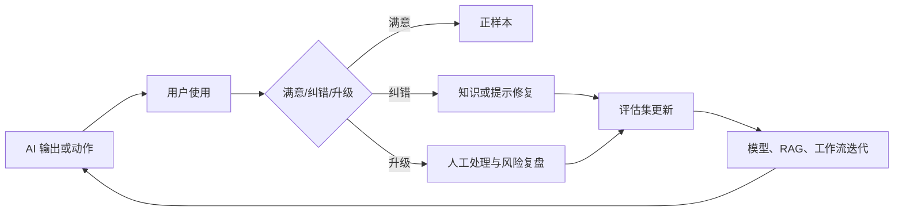

## 9.5 人机协同与操作边界

### 9.5.1 人类不应只做兜底按钮

人机协同的目标，不是把人放在流程末尾为模型错误背锅，而是让人类在最能创造价值的位置参与：定义目标、提供上下文、处理例外、确认高风险动作、反馈质量、承担组织责任。AI 擅长生成候选项、总结材料、发现相似模式、草拟文档和调用工具；人类擅长判断目标是否合理、风险是否可接受、例外是否需要破坏常规、责任是否可以承担。FDE 的设计任务，是把这些能力分工变成界面、权限、状态机和审计记录。

Microsoft 的 [Responsible AI](https://learn.microsoft.com/en-us/startups/build/enterprise-readiness/responsible-ai) 对透明、问责和监督的要求，Google [grounding 文档](https://docs.cloud.google.com/gemini-enterprise-agent-platform/models/grounding/overview)对可验证来源的要求，以及 [OWASP LLM Top 10](https://owasp.org/www-project-top-10-for-large-language-model-applications/)对错误信息、不可验证输出和过度代理的提醒，共同指向同一个结论：模型建议必须可解释，关键动作必须可确认，责任链必须可追溯。

| 决策类型 | 可自动化程度 | 人类角色 |
| --- | --- | --- |
| 低风险摘要 | 高 | 抽样校验、纠错反馈 |
| 标准流程分类 | 中高 | 处理低置信度和争议样本 |
| 对外发送内容 | 中 | 审阅语气、事实和合规要求 |
| 数据修改 | 中低 | 确认范围、回滚方案和影响 |
| 资金、权限、删除 | 低 | 明确批准、双人复核、事后审计 |

### 9.5.2 操作边界要写进系统，而不是写进培训

很多团队把 AI 风险控制写在用户培训里：不要输入敏感信息，不要完全相信答案，不要让模型执行危险动作。培训必要，但不足以构成控制。真正的边界应写进系统：输入端做数据分类和脱敏；检索端做权限过滤；模型端做工具白名单和结构化输出；执行端做审批、幂等和回滚；审计端记录上下文、证据和责任人。边界越靠近系统，越不依赖个人记忆。

FDE 应把操作划分为建议、草拟、待确认执行、自动执行四级。建议级只影响认知，例如“这些订单可能延期”；草拟级生成可编辑产物，例如邮件、SQL、变更单；待确认执行级允许模型填好参数，但必须由授权用户确认；自动执行级只允许低风险、可逆、规则明确的动作。每一级都要有默认拒绝策略：证据不足不回答，权限不足不检索，风险过高不执行，状态不一致不提交。

人工确认不是点一个“同意”按钮。确认界面必须展示确定性生成的 payload、目标对象、差异、权限主体、证据引用、风险标签、回滚或补偿方式、幂等键和过期时间；审批记录绑定 payload hash，而不是绑定模型摘要。这样才能证明人确认的是实际将执行的动作，而不是确认了一段可能遗漏关键信息的自然语言说明。

凡是用户反馈、工单、截图、日志和模型 trace 会进入改进闭环，都要先写数据契约：敏感级别、脱敏/最小化规则、访问范围、保留期、删除责任人、样本可否跨客户复用、以及退出训练或评测集的流程。否则“反馈闭环”会变成无人负责的影子数据资产。

### 9.5.3 反馈闭环决定长期质量

AI 系统上线后，质量会随业务变化而漂移。政策更新、产品变更、组织调整、数据源迁移、模型版本升级，都可能让原本正确的回答变错。人机协同必须包含反馈机制：用户能标记错误、补充正确答案、指出缺失来源、撤销或升级操作；运营团队能把反馈转化为知识修复、评估样本和流程改进。反馈不应只进入聊天记录，而应进入产品待办和模型评估。

最终边界应能够被一句话检验：当模型出错时，系统是否限制了损害、保留了证据、让合适的人接管，并把教训反馈到下一轮设计。如果答案是否定的，就还不是可生产的人机协同。
