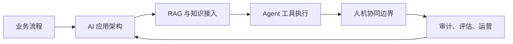

# 第九章：AI 原生 FDE

AI 原生不是把聊天框嵌入现有系统，也不是让模型替代所有业务判断。对 FDE 而言，AI 原生意味着把模型、知识、工具、权限、审计和人类决策重新组织成可交付、可运行、可治理的现场系统。企业客户通常不缺概念验证，真正稀缺的是能接入真实流程、经得住安全审查、在成本和延迟约束内稳定运行，并能在组织边界中被持续改进的 AI 应用。

本章讨论 FDE 在企业 AI 落地中的核心工作。首先识别真实瓶颈：数据可用性、流程嵌入、权限边界、评估体系和运营责任，往往比模型选择更决定成败。随后拆解 LLM 应用架构，说明提示词、模型网关、工具调用、上下文管理、评估和观测如何形成工程闭环。第三部分进入 RAG 与企业知识接入，强调检索质量、权限过滤、引用、更新和审计。第四部分讨论 Agent 工作流，区分确定性编排、半自主代理和多代理协作；多代理只在 peer agent 信任边界、每个代理的工具权限、handoff schema、仲裁规则和 trace 隔离都可审计时进入生产设计。最后回到人机协同：哪些动作必须保留人工确认，哪些判断可以自动化，哪些责任不能交给模型。

OpenAI 在 [agents 工具发布说明](https://openai.com/index/new-tools-for-building-agents/)中将 agents 描述为代表用户独立完成任务的系统，并在 Responses API、内置工具、Agents SDK 和 tracing 上强化了生产化能力；Anthropic 在 [building effective agents](https://www.anthropic.com/engineering/building-effective-agents) 中强调成功实现通常来自简单、可组合的模式，而不是过早采用复杂框架。安全边界方面，提示注入、敏感信息泄露、过度代理和供应链风险会改变传统应用安全边界，这类风险可参考 [OWASP LLM Top 10](https://owasp.org/www-project-top-10-for-large-language-model-applications/)。FDE 的价值，是把这些模型能力和风险控制翻译为现场可执行的工程设计。

读完本章，读者应能判断一个企业 AI 项目是否只是演示，还是已经具备生产条件：是否知道要解决哪类流程瓶颈，是否有可测试的架构，是否能把企业知识安全接入模型，是否能控制 Agent 的动作范围，是否能让人类在正确位置承担责任。
