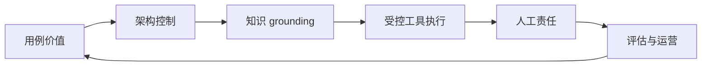

## 9.6 本章小结

AI 原生 FDE 的关键，不是追逐最新模型接口，而是把模型能力放入企业能够运行、审计和改进的工程体系。企业 AI 落地的真实瓶颈通常来自问题定义、知识接入、权限边界、评估闭环和责任划分。模型越强，越需要清楚地说明它在流程中承担什么角色、能看到什么数据、能调用什么工具、何时必须停下来交给人。

本章的核心结论有五点。第一，AI 用例要从业务动作反推，像售后工单 Agent 一样先界定流程、角色、数据源、指标和不可自动化动作。第二，LLM 应用架构必须包含上下文构造、工具调用、输出校验、评估观测和审计，而不是把提示词当作全部系统。第三，RAG 是企业知识接入模式，不是正确性的保证；检索、权限、引用、刷新和反馈共同决定质量。第四，Agent 工作流要先受控再自主，优先使用 routing、parallelization、orchestrator-workers 和 evaluator-optimizer 等可解释模式。第五，人机协同要把操作边界写进系统，用人工确认、回滚、审计和反馈闭环控制风险。

| 主题 | FDE 交付重点 | 可生产判断 |
| --- | --- | --- |
| AI 落地瓶颈 | 用例分级、指标、责任人、运营入口 | 是否有真实流程和可验证价值 |
| LLM 架构 | 网关、上下文、工具、校验、观测 | 是否能测试、降级和追踪 |
| RAG | 知识目录、索引、权限、引用、反馈 | 是否能说明答案来源和可见范围 |
| Agent | 工作流、工具白名单、状态、预算、trace | 是否能限制动作并复盘原因 |
| 人机协同 | 确认点、回滚、审批、反馈样本 | 是否能在人接管时保留证据 |

进入第 10-12 章前，本章应交付一组可传递产物：AI 用例 brief、权限矩阵、RAG 索引契约、工具注册表、基础 eval suite、trace schema、人机协同策略和回滚路径。第 10 章用这些产物形成评测与回归门禁，第 11 章把它们接入生产准入和上线切换，第 12 章再用同一套字段组织告警、运行手册和运营复盘。

进入后续 LLMOps、生产化和现场运维章节时，AI 原生能力不应作为某个项目的临时技巧存在。FDE 应把可复用的提示、评估、RAG 管线、工具接口、安全策略、审计字段和人机协同模式沉淀为平台能力，让不同团队能够在共同边界内快速交付，而不是每个场景重新承担一次模型风险。
