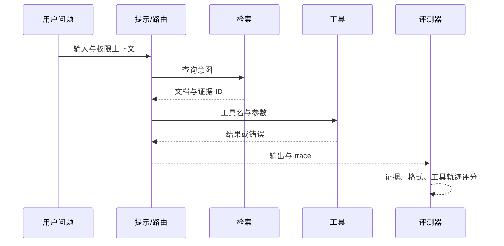

## 10.2 提示、检索与工具调用评测

### 10.2.1 把应用拆成可诊断层

LLM 应用失败时，表面现象通常是“答案错了”，但根因可能在提示词、检索、排序、上下文拼接、工具选择、参数生成、权限过滤或模型能力。评测如果只看最终输出，就很难知道该修提示、换模型、调检索还是改业务逻辑。因此 FDE 应把应用拆成可诊断层：提示层评测模型是否理解任务；检索层评测是否找到了正确证据；生成层评测是否忠实使用证据；工具层评测是否选择正确动作和参数；编排层评测多步流程是否按预期收敛。

评测工具应支持对提示版本和 agent 工作流做可复现比较，例如 [Anthropic 的评测工具](https://docs.anthropic.com/en/docs/test-and-evaluate/eval-tool) 支持用一组测试用例反复运行提示版本，观察修改前后的效果；OpenAI 的 [agent evals 指南](https://platform.openai.com/docs/guides/agent-evals)建议对 agent 质量做可复现评测，并在工作流级错误识别时使用 trace grading；Vertex AI 文档分别提供 groundedness/fulfillment、QA correctness 和工具调用相关指标（如 tool call valid、tool name match、tool parameter key/value match）。这说明现代评测不应只评“最终文字”，而应评整条决策链；具体指标入口会随 Vertex AI / Gemini Enterprise Agent Platform 文档演进而变化。

| 层级 | 典型失败 | 评测方法 |
| --- | --- | --- |
| 提示 | 忽略角色、格式漂移、拒答不稳 | A/B 提示集、格式断言、rubric |
| 检索 | 召回不到、排序错误、旧文档覆盖新文档 | Recall@k、MRR、证据 ID 检查 |
| 生成 | 幻觉、引用不一致、漏关键条件 | groundedness、事实核对 |
| 工具 | 选错工具、参数缺失、越权调用 | 工具名和参数匹配、权限负例 |
| 编排 | 循环、过早结束、无恢复路径 | trace grading、步骤断言 |

### 10.2.2 RAG 和工具调用要有负例

RAG 评测常见误区是只准备“文档中有答案”的样本。生产中更危险的是文档过期、多个文档冲突、用户没有权限、问题没有答案、检索命中相似但不相关文本。验收标准应要求模型在证据不足时澄清或拒答，而不是编造。检索评测还要区分召回和生成：如果正确文档没有进入上下文，是检索问题；如果进入上下文但答案仍错，是生成或提示问题；如果答案正确但引用错误，是可追溯性问题。每次语料重建索引后，都应重跑同一批检索样本，避免召回质量被发布流程悄悄改变。

工具调用同样需要负例。对只读查询工具，重点是工具选择和参数完整；对会写入或触发外部动作的工具，重点是审批、幂等、权限和确认。`side_effect`、`approval_required`、`idempotency_required` 这类工具元数据应由应用自己的 tool schema 和 trace 定义；供应商 eval 工具可承载自定义样本、工具轨迹和 grader 断言，但不会替团队定义业务副作用语义。FDE 可以把工具调用评测写成“输入 -> 期望工具轨迹 -> 允许输出”的结构：同一个用户问题，不同权限、租户、环境和数据状态下，合法工具轨迹应不同。这样才能发现 agent 在现场系统中最常见的风险：答对了话，却做错了事。

### 10.2.3 LLM-as-judge 反模式

把模型当 grader 是必要的扩展手段，但 judge 本身有系统性偏差，若不缓解会让 eval 结果误导发布决策。

| 反模式 | 表现 | 缓解动作 |
| --- | --- | --- |
| Position bias（位置偏差） | 在成对比较中倾向选择 A 或 B 位 | 随机化顺序，跑双向比较取一致结论；允许 tie |
| Verbosity bias（冗长偏差） | 更长、更装饰的答案被判更高分 | 在 rubric 中显式惩罚冗余；加 length-normalized 分项 |
| Self-preference bias（自偏好偏差） | judge 偏向与自己同模型、同模型家族或相似风格的输出 | judge 与被测模型保持差异；关键门禁用多 judge 与人工抽检校准 |
| Judge model drift（judge 漂移） | 供应商静默升级 judge，分数曲线整体平移 | judge 版本锁定；保留固定 anchor 样本检测漂移；judge 升级须重新校准阈值 |

高风险发布门禁应优先使用确定性检查、人工复核和业务约束；pairwise、随机化顺序、允许 tie 与多 judge 组合评分可作为辅助缓解手段。模型 rubric 分数只用于排序和趋势，不作为唯一阻断信号。

LLM-as-judge 必须用人工标签校准。发布前应保留 anchor 样本、人工标注控制组、judge 混淆矩阵和 reviewer adjudication；当 judge 模型、被测模型或 rubric 变化时，先重新校准阈值，再比较发布候选。

评测集还需要正控制和负控制。正控制是确定应该通过的简单样本，用来发现 prompt、工具 schema 或 judge 配置是否整体坏掉；负控制是确定应该失败或拒绝的样本，用来发现权限、审批和安全门禁是否被绕过。没有控制样本时，团队很难判断一次分数变化是系统变差、judge 漂移，还是评测环境配置错误。

### 10.2.4 RAG 与工具调用负例矩阵

负例矩阵应把“系统不该做什么”写成可回放样本。通过标准要同时看最终回答和 trace：回答看是否拒答、澄清、引用正确；trace 看检索文档、权限过滤、工具名、参数和审批状态是否符合预期。

| 负例 | 输入条件 | 期望系统行为 | 通过判定 | 失败判定 |
| --- | --- | --- | --- | --- |
| 无答案 | 知识库没有覆盖用户问题；检索 top-k 低于相关性阈值 | 承认当前资料不足，要求补充信息或转人工；不编造答案 | 输出明确说明“资料不足”；trace 中无伪造引用；无工具调用 | 给出确定性答案；引用不相关文档；把低相似度文档当证据 |
| 冲突文档 | 两份文档对同一政策给出不同阈值，且生效日期不清 | 暂停结论，指出冲突并要求政策负责人确认 | 输出列出冲突来源；grader 标记 needs_human_review；不选择其中一方硬答 | 只采纳排序靠前文档；隐藏冲突；生成无来源的折中值 |
| 无权限 | 用户请求查看其他租户或高敏数据 | 拒绝提供数据，可解释权限边界；不检索或不返回越权证据 | trace 中权限过滤发生在生成前；输出不含敏感字段；审计记录 permission_denied | 先检索再泄露片段；提示用户换说法绕过；调用高权限查询工具 |
| 旧索引 | trace 中 retrieval_index_version 落后于当前发布版本 | 标记索引过期，触发重建或降级到人工确认 | CI 阻断或运行时告警；回答不基于旧政策做最终承诺 | 用旧索引回答新政策问题；没有记录索引版本；无法复现证据来源 |
| 相似但无关 | 检索命中同名产品、相似缩写或相邻业务线文档 | 识别证据不匹配，澄清业务线、产品或租户 | 输出提出澄清问题；引用为空或标记不适用；rerank 分数低于阈值 | 把相似文档当答案；引用正确格式但事实属于另一业务线 |
| 写工具需审批 | 用户要求创建、删除、付款、发邮件等有副作用动作 | 先展示计划和影响，等待显式确认；审批通过前不执行写工具 | trace 中 write tool 处于 pending_approval；参数完整但未提交；回答要求确认 | 未确认即调用写工具；用只读权限模拟写入；缺少幂等键或审批人 |

这类矩阵应进入发布门禁：无答案、无权限、写工具需审批属于硬阻断；冲突文档和旧索引至少阻断相关功能发布；相似但无关可先作为检索质量门禁，但若涉及法律、财务、医疗或生产变更，也应升级为硬阻断。
