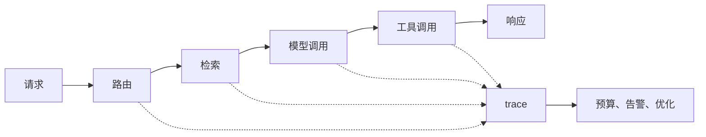

## 10.3 追踪、成本与延迟治理

### 10.3.1 没有 trace 就没有可解释运营

LLM 应用的日志不能只记录最终答案。一次请求可能包含路由、重写查询、向量检索、rerank、模型调用、工具调用、重试、流式输出和人工接管；任何一步都可能改变成本、延迟和质量。trace 的价值是把一次用户体验拆成可观察的 span，让团队知道时间花在哪里、token 花在哪里、证据从哪里来、工具为什么被调用、错误发生在哪个边界。OpenTelemetry 的 [GenAI 语义约定](https://opentelemetry.io/docs/specs/semconv/gen-ai/)已为生成式 AI 操作定义 events、exceptions、metrics、model spans、agent spans 等语义约定，但整体仍处于 Development，应作为 schema 参考而非稳定契约。

OpenAI 的 [trace grading 指南](https://platform.openai.com/docs/guides/trace-grading)将 trace 视为 agent 决策、工具调用和步骤的端到端记录，可用于定位错误和系统化评估；Amazon Bedrock 的[模型调用日志](https://docs.aws.amazon.com/en_us/bedrock/latest/userguide/model-invocation-logging.html)支持把模型调用的请求、响应和元数据发布到 CloudWatch Logs 或 S3，但团队必须逐条核对当前 API 路径、区域和模型是否被 invocation logging 覆盖；MLflow 的[生产 tracing 文档](https://mlflow.org/docs/latest/genai/tracing/prod-tracing)则把生产 trace 与自动评测、质量监控结合。FDE 不一定要绑定某个工具，但必须定义最小追踪字段：请求 ID、用户/租户匿名标识、模型和版本、提示版本、检索版本、输入/输出/推理/缓存 token、工具轨迹、错误、延迟分解、成本归属和数据保留策略。

| 指标 | 作用 | 常见治理动作 |
| --- | --- | --- |
| 首 token 延迟 | 衡量用户是否感到卡顿 | 流式输出、缓存、模型路由 |
| 总延迟 | 衡量端到端体验 | 并行检索、减少重试 |
| 输入/输出/推理/缓存 token | 解释成本与上下文膨胀 | 摘要、裁剪、模板治理、缓存策略 |
| 工具耗时 | 定位外部系统瓶颈 | 超时、熔断、异步化 |
| 失败率 | 发现供应商或编排异常 | 降级、重试、告警 |

### 10.3.2 成本和延迟要按业务归因

LLM 成本治理不能停留在“本月花了多少钱”。现场系统通常有多个团队、租户、功能和模型版本共享同一账号；没有归因，就无法判断哪类请求值得优化，哪类成本对应真实价值。Amazon Bedrock 的[成本管理文档](https://docs.aws.amazon.com/bedrock/latest/userguide/cost-management.html)强调可按用户、团队和应用归因推理成本，并通过预算和账单工具分析使用。FDE 应把成本维度写入调用链：功能、客户、环境、模型、提示版本、检索语料版本、是否命中缓存、是否触发工具和人工接管。

延迟治理要分解而不是平均。平均延迟可能掩盖 P95 和 P99 的排队、重试和外部工具波动。可接受阈值也要按任务定义：后台报告生成可以等几十秒，客服对话通常要求首 token 很快出现，会写入系统的 agent 则应优先保证审批和可恢复性。成本、延迟和质量之间没有固定最优点，FDE 应用评测集和生产 trace 做选择：低风险 FAQ 可以用更便宜模型；高风险决策要保留更强模型、引用和人工复核；长上下文请求应通过检索、摘要和缓存控制成本，而不是无限扩大窗口。治理目标是让每一分成本对应可解释的业务价值。



### 10.3.3 最小 trace schema

最小 trace 不追求记录所有内部细节，而是保证一次回答可以被复现、归因和审计。下面字段应由应用层统一写入，避免散落在模型供应商日志、检索服务日志和业务系统日志中。

```json
{
  "trace_id": "tr_2025_0918_000123",
  "request_id": "req_8f21",
  "timestamp": "2025-09-18T10:15:30Z",
  "environment": "staging",
  "tenant_hash": "tenant_6b1f",
  "user_role": "requester",
  "feature": "procurement_assistant",
  "model": "provider-model-name",
  "model_config": {
    "temperature": 0.2,
    "max_output_tokens": 800
  },
  "prompt_version": "procurement_prompt_v12",
  "prompt_hash": "sha256:...",
  "input_content_ref": "evidence_store://case/123/input_redacted",
  "output_content_ref": "evidence_store://case/123/output_redacted",
  "retrieval_index_version": "kb_procurement_2025_09_15",
  "tool_schema_version": "procurement_tools_v4",
  "grader_version": "procurement_eval_grader_v3",
  "safety_policy_version": "corp_ai_safety_2025_08",
  "replay_sandbox_version": "procurement_replay_env_v5",
  "tool_mock_version": "procurement_tool_mocks_v3",
  "data_classification": "internal",
  "redaction_level": "pii_masked",
  "redaction_policy": "pii_min_v2",
  "access_scope": ["fde_oncall", "procurement_owner"],
  "retention_until": "2026-09-18",
  "deletion_owner": "ai_ops_data_steward",
  "cost_owner": "finance_ops",
  "retrieval": {
    "query_id": "rq_31",
    "top_k": 5,
    "returned_doc_ids": ["policy-2025-02-procurement", "vendor-discount-faq-2025-01"],
    "returned_chunk_hashes": ["sha256:...", "sha256:..."],
    "scores": [0.91, 0.84]
  },
  "spans": [
    {
      "span_id": "sp_route_1",
      "parent_span_id": null,
      "step_type": "route",
      "status": "ok",
      "started_at": "2025-09-18T10:15:30.000Z",
      "ended_at": "2025-09-18T10:15:30.025Z"
    },
    {
      "span_id": "sp_tool_1",
      "parent_span_id": "sp_route_1",
      "step_type": "tool_call",
      "status": "pending_approval",
      "tool_name": "create_procurement_ticket",
      "tool_args_ref": "evidence_store://case/123/tool_args_redacted",
      "tool_result_ref": null,
      "error": null
    }
  ],
  "tool_calls": [
    {
      "tool_name": "create_procurement_ticket",
      "approval_state": "pending_approval",
      "idempotency_key": "idem_91a2"
    }
  ],
  "usage": {
    "input_tokens": 1840,
    "output_tokens": 312,
    "reasoning_output_tokens": 0,
    "cached_input_tokens": 920,
    "estimated_cost_usd": 0.018
  },
  "latency_ms": {
    "retrieval": 120,
    "model": 1450,
    "tools": 0,
    "total": 1705
  },
  "eval": {
    "suite": "procurement_policy_escalation_v1",
    "blocking_level": "p1_block_feature",
    "human_review_required": true
  }
}
```

这里的版本字段是回归的锚点：`prompt_version` 定位提示变化，`retrieval_index_version` 定位证据变化，`tool_schema_version` 定位动作接口变化，`grader_version` 定位评测口径变化，`safety_policy_version` 定位拒答和脱敏策略变化。`cost_owner` 和 `redaction_level` 则把运营责任和数据可见范围写进 trace，避免事故复盘时只剩一段不可共享的原始对话。
