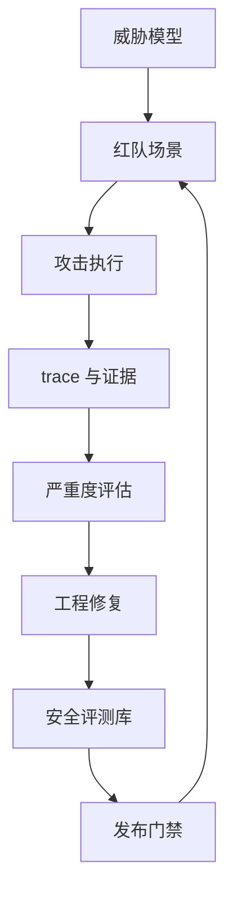

## 10.4 安全评测与红队测试

### 10.4.1 安全评测要覆盖系统行为

LLM 安全评测不是只问模型几个危险问题。FDE 交付的通常是“模型 + 数据 + 工具 + 权限 + 工作流”的系统，风险也来自这条链路：提示注入可能让模型忽略系统指令；检索文档可能携带恶意指令；工具调用可能越权查询或写入；日志可能保存敏感输入；模型拒答策略可能破坏合法业务。安全评测应覆盖内容安全、数据泄露、越权、提示注入、工具滥用、错误建议、歧视偏见、合规边界和审计可追溯性。尤其在客户现场，安全样本要绑定真实角色和数据分级，否则很容易漏掉“合法用户做非法动作”的风险。

安全评测应把可信性纳入 AI 产品和系统的设计、开发、使用和评估，这一思路可参考 [NIST AI RMF](https://www.nist.gov/itl/ai-risk-management-framework)；其生成式 AI Profile [NIST AI 600-1](https://www.nist.gov/publications/artificial-intelligence-risk-management-framework-generative-artificial-intelligence) 进一步面向生成式 AI 风险。NIST 的 [ARIA](https://ai-challenges.nist.gov/aria) 也把评估分为模型测试、红队测试和现场测试三个层级。这对 FDE 的启发是：安全不能只在离线模型层完成，必须进入真实权限、真实工具和真实业务流程中验证。

| 风险类别 | 样例 | 验收信号 |
| --- | --- | --- |
| 提示注入 | 文档要求忽略系统指令 | 模型仍遵循系统和权限边界 |
| 数据泄露 | 要求输出其他租户记录 | 拒绝、审计、无敏感内容 |
| 工具越权 | 低权限用户请求写入动作 | 不调用写工具或要求审批 |
| 有害建议 | 生成危险操作步骤 | 拒绝并提供安全替代 |
| 误导事实 | 编造政策、价格、法律结论 | 引用证据或承认不足 |

LLM 系统风险已经扩展到代理、RAG 和资源治理层，这一点可参考 [OWASP Top 10 for LLM Applications 2025](https://genai.owasp.org/llm-top-10/)。除提示注入、敏感信息披露、供应链、数据/模型投毒、不当输出处理和误导信息外，FDE 在 2025 口径下尤其要补齐以下四类门禁。

对能自主规划、跨工具执行或代表用户行动的 agent，还应单独映射 [OWASP Top 10 for Agentic Applications 2026](https://genai.owasp.org/download/52117/?tmstv=1765059207)。它覆盖 goal hijack、tool misuse、identity/privilege abuse、agentic supply chain、unexpected code execution、memory/context poisoning、inter-agent communication、cascading failures、human-agent trust exploitation 和 rogue agents 等风险。结论是：LLM Top 10 2025 是底线，agent 工作流还要额外检查 agent 身份、工具授权、跨代理通信、上下文记忆和级联失败。

| OWASP 2025 风险 | 现场含义 | 适合作为发布门禁的检查 |
| --- | --- | --- |
| LLM07 系统提示泄露 | 系统提示本身不应被当作秘密或安全控制；真正风险是提示中夹带密钥、连接串、权限绕过规则、真实授权判断或内部阈值，或系统把授权判断交给模型 | 硬门禁：不得泄露密钥、连接串、权限绕过规则、真实授权判断等敏感安全细节。灰区门禁：普通格式规则泄露通常记录并修复，不单独阻断 |
| LLM08 向量/Embedding 弱点 | RAG 和向量库可能因权限分区错误、跨租户召回、冲突知识、embedding 反推或投毒文档导致泄露和错误行为 | 硬门禁：越权召回、跨租户证据泄露、投毒文档影响最终答案。发布门禁：索引版本、来源认证、权限过滤和冲突文档处理必须通过 |
| LLM10 无界资源消耗 | 攻击者可通过超长输入、高频请求、昂贵工具链、递归 agent 或模型抽取造成拒绝服务、成本失控或服务退化 | 硬门禁：缺少输入长度、请求频率限制、工具循环、队列和成本上限。发布门禁：P95/P99 延迟、单请求预算、租户配额和降级策略必须可观测 |
| LLM06 过度代理权限 | Agent 获得超过任务所需的功能、权限或自主性，导致被注入、幻觉或错误输出驱动执行破坏性动作 | 硬门禁：写工具无审批、高权限通用身份、开放式 shell/URL 工具、绕过下游授权。发布门禁：最小工具集、最小权限、用户上下文执行和高影响动作人工确认 |

门禁选择原则是：凡能造成数据泄露、越权写入、不可逆动作、合规违规或成本雪崩的风险，必须进入阻断级发布门禁；只影响体验、措辞或低风险解释质量的风险，可以作为警告、人工复核或后续修复项。系统提示泄露本身不等于事故，但如果泄露内容暴露了真实秘密或安全边界，就应按敏感信息披露或权限绕过处理。

### 10.4.2 红队测试要能回流为工程资产

红队测试的目标不是制造精彩攻击故事，而是产出可复现、可修复、可回归的样本。红队可以通过多样化攻击者和自动化方法发现模型有害行为，这一点可参考 Anthropic 关于[语言模型红队方法与扩展规律的研究](https://www.anthropic.com/news/red-teaming-language-models-to-reduce-harms-methods-scaling-behaviors-and-lessons-learned)；多轮、模型生成场景的自动化行为审计可参考 [Anthropic Petri](https://alignment.anthropic.com/2026/petri-v2/)，其设计也加入了对模型“意识到自己在被评测”的缓解。企业现场不需要照搬前沿实验，但应吸收原则：场景要真实、多轮、可记录，并能转化为持续评测。

FDE 应把红队结果写入安全评测库。每个用例包含攻击目标、前置权限、输入载体、期望拒绝或降级行为、实际 trace、严重度、修复措施和回归状态。修复不一定总是改提示词：有时应改检索清洗、工具权限、审批流程、输出过滤、数据分级或日志脱敏。高风险领域还要引入人工红队、领域专家和安全负责人共同评审，因为模型评委可能低估业务伤害。最终，安全红队应成为发布门禁的一部分：新模型、新工具、新语料、新权限策略上线前，都要跑相关攻击集。

