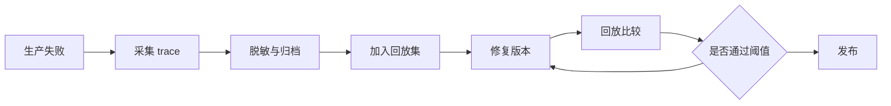

## 10.5 版本、回放与回归

### 10.5.1 版本化对象不止模型

LLM 系统的回归常常不是模型版本单独造成的。提示词改了一句，检索索引换了一批文档，工具 schema 新增字段，安全策略更严格，供应商后台模型静默升级，都会改变输出。FDE 应把可影响行为的对象都纳入版本管理：模型和参数、系统提示、模板、few-shot 示例、检索语料和索引、rerank 配置、工具 schema、权限规则、评测集、grader、业务阈值和运行环境。只有这样，线上一次失败才能被还原为“哪个版本组合在什么输入下产生了什么 trace”。版本记录还要能被自动化流水线读取。

MLflow 的 [GenAI 文档](https://mlflow.github.io/mlflow-website/docs/latest/genai/)将评测数据集、评测框架、trace 观测、质量监控、版本管理和 prompt registry 放在同一生命周期中；其[评测数据集文档](https://mlflow.org/docs/latest/genai/datasets/)明确指出数据集可用于防止回归、比较应用版本和把生产问题样本转成黄金集。OpenAI 的[评测最佳实践](https://platform.openai.com/docs/guides/evaluation-best-practices?api-mode=responses)也建议建立持续评测，在每次变更时运行，并随着生产中发现的新不确定性扩展评测集。版本化的目的不是归档，而是让回放和比较可执行。

| 对象 | 必须记录 | 回归用途 |
| --- | --- | --- |
| 模型 | 名称、供应商、参数、发布日期 | 比较能力、成本和延迟 |
| 提示 | 模板、变量、示例、发布人 | 定位行为漂移 |
| 检索 | 文档快照、索引、排序配置 | 复现证据变化 |
| 工具 | schema、权限、幂等策略 | 检查副作用风险 |
| 评测 | 样本、grader、阈值 | 保持门禁一致 |

### 10.5.2 回放让事故变成测试

回放是 LLMOps 的关键能力。一次线上失败发生后，团队应能取出输入、权限上下文、提示版本、检索结果、工具调用、模型配置和输出，在隔离环境中重跑，并比较修复前后的 trace。回放不要求完全重现模型随机性，但要求能解释差异：若供应商模型已变，至少要保留原始输出和 trace；若语料更新导致证据不同，要能定位文档版本；若工具状态不可逆，要使用 mock 或沙箱替代真实写入。对含敏感信息的 trace，还要先脱敏和分级，再进入可共享的回放库，并记录敏感级别、脱敏/最小化策略、访问范围、保留期、删除责任人和访问审批。

回归门禁应按风险分层运行。快速门禁在每次提示或代码变更时跑小型黄金集、格式检查和安全冒烟；发布门禁跑全量任务集、RAG/工具轨迹、安全负例和成本延迟预算；定期门禁用生产抽样、人工复核和模型评分发现长期漂移。OpenAI cookbook 的 [prompt regression 示例](https://cookbook.openai.com/examples/evaluation/use-cases/regression) 展示了用 eval 检测提示变更是否退化的思路；现场工程要把这个思路扩展到整个应用版本组合。最终，好的回归体系应让团队敢于升级模型和调整提示，因为每次变化都能被同一套业务样本、trace 和阈值审查。

### 10.5.3 CI/CD 门禁分层示例

LLMOps 门禁不应只在发布前跑一次大评测。更稳妥的做法是把不同成本、不同风险的检查放到流水线不同阶段，让低成本错误尽早失败，让高成本评测只在候选版本上运行。

| 阶段 | 触发条件 | 必跑检查 | 阻断规则 | 产物 |
| --- | --- | --- | --- | --- |
| 提交前本地检查 | 修改提示、工具 schema、检索配置或安全策略 | Markdown/JSON/YAML 格式、prompt 变量完整性、工具 schema 向后兼容、敏感词扫描 | schema 不合法、变量缺失、提示中含密钥或真实凭证 | 本地检查日志 |
| PR 快速门禁 | 每次 PR 或合并请求 | 小型黄金集、RAG 无答案样本、只读工具参数匹配、基础安全冒烟、成本预算静态检查 | P0/P1 eval 失败、越权样本失败、写工具未声明审批 | PR eval 摘要和失败样本链接 |
| 发布候选门禁 | 合并到发布分支或生成候选镜像 | 全量任务 eval、RAG/工具负例矩阵、trace schema 校验、OWASP 2025 高风险门禁、P95/P99 延迟和单请求成本 | 安全硬门禁任一失败；关键任务低于阈值；trace 缺版本字段；预算超上限 | 发布评测报告、trace 样本、审批记录 |
| 生产灰度门禁 | 小流量灰度或指定租户试点 | 生产抽样回放、人工复核灰区样本、告警阈值、成本和拒答率监控 | 错误率、越权请求拒绝失败率、成本、延迟或人工复核不通过率超过阈值 | 灰度看板和回滚决策 |
| 定期漂移门禁 | 每日、每周或语料重建后 | 固定回放集、最新事故集、索引召回稳定性、grader 漂移检查 | 关键样本回归、旧索引被使用、grader 版本未锁定 | 趋势报告和新增回归样本 |

分层门禁的核心是把阻断级别写清楚：提交前阻断明显配置错误，PR 阻断低成本可复现错误，发布候选阻断真实业务和安全风险，灰度阻断线上漂移，定期门禁把生产事故变成下一轮测试。这样 CI/CD 不是“跑一个分数”，而是维护模型、提示、检索、工具、安全和成本共同组成的发布契约。

### 10.5.4 开源与商业 LLMOps 示例工具

闭源平台之外，下列开源与商业工具可按层组合落地，覆盖评测、追踪、红队和质量监控。FDE 现场不必全套引入，也不应把此表当成完整市场清单；每一层至少应选一个并写入版本、部署方式和数据驻留边界。

| 工具 | 定位 |
| --- | --- |
| promptfoo | CLI/CI 友好的 prompt/模型对比评测，适合 PR 快速门禁 |
| Ragas | RAG 专项评测，提供 Faithfulness、Context Precision/Recall 等指标 |
| DeepEval | 单元测试风格的 LLM 评测框架，与 pytest 集成 |
| TruLens | LLM/RAG 评估与反馈函数，支持本地交互式调试 |
| garak | LLM 漏洞扫描器，覆盖越狱、提示注入、数据泄露等探针 |
| PyRIT | 微软开源的生成式 AI 红队工具集，适合系统化对抗测试 |
| LangSmith | LangChain 生态的 trace、评测与数据集管理（托管为主，自托管受限） |
| Phoenix（Arize） | 开源 LLM 可观测与评测；可接收 OTLP/OpenTelemetry trace，并可将 OpenTelemetry GenAI 语义转换到 OpenInference 口径 |
| Langfuse | 开源可自托管的 LLM trace/eval/prompt 管理平台 |
| Braintrust / W&B Weave / Humanloop / Giskard | 商业或混合形态的评测、追踪、人工反馈、红队与治理平台，需按数据驻留和采购边界评估 |
