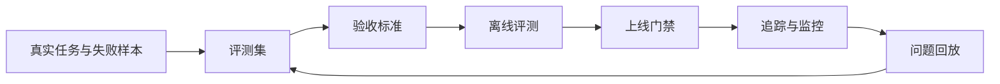

# 第十章：模型评测与 LLMOps

大模型应用进入现场后，最大的工程风险往往不是“模型不会回答”，而是团队无法说明它什么时候答得可靠、为什么变差、一次变更影响了哪些场景、线上失败能否复现。传统软件可以依赖单元测试、集成测试和监控指标建立信心；LLM 系统还要面对非确定性输出、提示词漂移、检索语料变化、工具调用副作用、供应商模型升级和安全策略更新。LLMOps 的目标不是把模型神秘化，而是把这些变化纳入可度量、可追踪、可回放、可治理的工程循环。

本章讨论 FDE 在客户现场如何建立模型评测与运行治理。评测集要来自真实任务、失败样本和业务验收标准，而不是只看通用榜单。OpenAI 的[评测最佳实践](https://platform.openai.com/docs/guides/evaluation-best-practices?api-mode=responses)强调持续评测应随每次变更运行，并把生产中新发现的不确定性纳入评测集；MLflow 的 [GenAI 数据集文档](https://mlflow.org/docs/latest/genai/datasets/)也把评测数据集视为防止回归、比较版本和隔离问题的测试套件。对 FDE 而言，这意味着评测不是一次性采购比较，而是交付过程中的质量控制面。

读完本章，读者应能为一个 LLM 应用定义评测集、验收阈值、提示与检索评测、工具调用检查、追踪字段、成本与延迟指标、安全红队用例，以及版本回放和回归门禁。最终目标是让模型应用像其他生产系统一样可交付、可审计、可复盘，而不是靠演示效果和个人经验维持。
