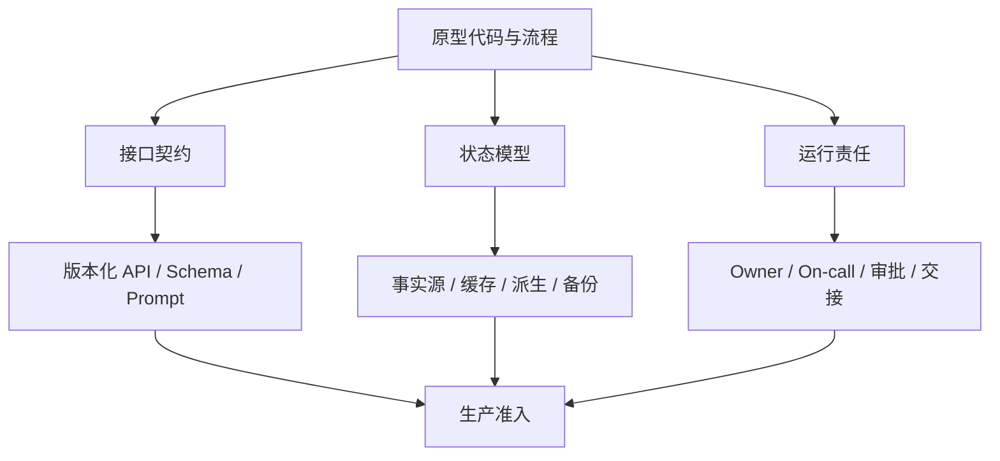

## 11.2 架构硬化与可维护性

### 11.2.1 硬化从接口、状态和责任开始

架构硬化不是把原型代码“加固一下”，而是把系统改造成可被多人维护、可被事故流程接管、可被客户审计的工程资产。第一步是拆清接口：外部系统调用什么 API，批处理读取哪些表，模型工具能访问哪些动作，人工操作在哪里进入链路。第二步是拆清状态：哪些数据是事实源，哪些是缓存，哪些是派生结果，哪些可以重算，哪些必须备份。第三步是拆清责任：谁拥有服务，谁拥有数据契约，谁拥有模型评测，谁批准高风险变更。

Microsoft Cloud Adoption Framework 在 [Ready your Azure cloud operations](https://learn.microsoft.com/en-us/azure/cloud-adoption-framework/manage/ready-cloud-operations) 中把运营准备拆为部署标准化、可靠性要求、监控、保护等能力，并要求按工作负载优先级定义 SLO、RPO、RTO。FDE 可以把这类框架转化为生产准入门禁：没有 SLO 不上线，没有恢复目标不接关键流程，没有审计字段不允许写回，没有回滚方案不开放全量用户。

### 11.2.2 可维护性要体现在变更成本

可维护性不是代码风格问题，而是每次变更需要多少人、多少上下文和多少风险。生产系统应把易变部分显式版本化：配置、提示词、特征定义、数据契约、权限策略、告警阈值和发布计划都应进入可追溯流程。Google SRE 的 [Service Level Objectives](https://sre.google/sre-book/service-level-objectives/) 强调用错误预算平衡可靠性和创新速度；同书的 [Production Services Best Practices](https://sre.google/sre-book/service-best-practices/) 则强调配置校验、退化设计和依赖控制等生产实践。对现场团队而言，这意味着维护性要通过机制体现：小批量变更、自动化检查、灰度发布、可观测性、清晰的回滚路径和事后复盘。

硬化时要避免两种极端。一种是把原型全盘重写，导致已验证的业务知识丢失；另一种是把临时实现原封不动搬进生产，导致隐性债务绑定客户流程。更稳妥的做法是保留经过验证的业务语义，重做不可运营的技术边界。判断标准很简单：新成员能否在不问原作者的情况下定位入口、理解数据流、运行测试、解释告警、回滚变更。如果不能，系统还没有真正硬化。

### 11.2.3 生产准入门禁

生产准入门禁的作用不是制造流程负担，而是在系统进入客户真实工作前阻止不可运营的风险。门禁应由 FDE、平台团队和客户 Owner 共同确认，并且每一项都能指向具体证据，而不是口头承诺。

每个门禁项都应有相同的证据格式：owner、通过阈值、验证证据、契约测试、回滚边界、风险接受人和复审触发。复审触发包括扩大用户范围、增加写动作、替换模型/数据源、权限策略变化、事故复盘行动项到期，以及任一关键回归样本失败。

原型到生产可以拆成五个连续门禁：Prototype Exit 确认可保留能力、丢弃物和未验证假设；Hardening Ready 确认接口、状态、Owner、测试和审计边界；Pilot Ready 确认 SLO、容量、回滚、人工兜底和观察窗口；Production Ready 确认真实用户、真实数据、真实写动作和客户 Owner 接管能力；Handover Ready 确认运行手册、告警处理、权限流程、复盘行动项和遗留债务都有明确 owner。任何阶段未通过时，只能停留在当前范围或降级到只读/内部使用。

允许带入生产的债务必须显式接受，而不是默认为“以后再修”。每一项债务至少记录：债务描述、用户影响、为什么不阻塞当前上线、补偿控制、风险接受人、到期日期、复审触发和清除条件。没有 owner、没有到期日、无法解释用户影响或缺少补偿控制的债务，不应进入生产范围。

| 门禁项 | 准入要求 | 未满足时的处理 |
| --- | --- | --- |
| Owner | 服务 Owner、数据 Owner、客户业务 Owner、升级路径明确 | 不允许进入无人值守生产 |
| SLO | 可用性、端到端延迟、数据新鲜度、关键动作成功率有目标和测量方式 | 只能继续试点或内部使用 |
| RPO/RTO | 明确可接受数据丢失窗口和恢复时间，备份与恢复步骤已验证 | 不接入关键业务写回 |
| 审计字段 | 写回、审批、模型建议、人工覆盖都记录操作者、时间、输入、输出和原因 | 禁止执行高风险动作 |
| 权限边界 | 用户、角色、模型工具、服务账号的读写范围最小化并可审计 | 不开放真实数据或写权限 |
| 回滚演练 | 发布回滚、配置回滚、模型版本回滚和数据修正路径至少演练一次 | 不扩大用户范围 |
| 数据契约 | 输入输出 schema、事实源、字段语义、兼容策略和质量检查已版本化 | 不允许下游依赖 |
| 模型评测集 | 覆盖常见、边界和失败样例；评测口径、人工判分和回归阈值明确 | 不允许模型建议影响生产写动作 |
| 告警手册 | 告警含义、用户影响、排查步骤、降级动作、沟通模板和恢复验证齐全 | 不进入非 FDE 值守时段 |

AI 系统在通用门禁之上还有额外准入项。任一项缺失都不应承担有副作用的自动化动作。

| AI 专属门禁项 | 准入要求 | 未满足时的处理 |
| --- | --- | --- |
| 评测集覆盖业务关键场景 | 黄金集、负例、安全样本对核心任务有显式覆盖，阈值经业务 Owner 认可 | 仅允许只读建议，不进入写动作 |
| Prompt/检索/工具版本化 | prompt、检索语料/索引、工具 schema 三者均有版本号并写入 trace | 不允许发布候选 |
| 模型供应商账户隔离 | 生产、预发、研发使用不同 API key/项目；密钥可独立轮换与撤销 | 不接入真实客户数据 |
| PII 脱敏策略 | 输入、上下文、日志、trace 的 PII 字段级脱敏规则与保留周期已写入设计 | 不允许跨租户或对外共享 trace |
| 模型服务 SLO / 供应商 SLA 与回退路径 | 内部模型服务有 SLO，供应商 SLA 与限流边界已确认，主模型故障时有备选模型或规则降级路径，并演练过一次 | 关键流程不上线 |
| Token 预算上限 | 单请求/单租户/单功能均有 token 与费用上限，超限熔断或降级 | 不开放对外流量 |
| 人工干预率上限 | 设定人工改写、退回、转人工队列等告警阈值，超过即触发评估和扩面暂停 | 不扩大用户范围 |
| 高风险工具/写动作审批 | 写库、发邮件、付款、改权限等动作有审批、幂等键、补偿动作和审计字段 | 写动作降级为草稿或只读建议 |
| 提示注入/越权负例 | 覆盖提示注入、跨租户、越权工具、政策冲突和敏感数据泄露样本 | 阻断发布或限制到内部租户 |
| 红队回归 | OWASP LLM Top 10、OWASP Agentic Applications 2026、MITRE ATLAS 等高风险样本进入回归集，模型、提示、工具变更后必跑；该组合是本书建议的生产门禁口径 | 不允许扩大流量 |

门禁不是一次性文档。每次扩大用户、增加写回动作、替换模型、改变数据源或调整权限，都应重新检查受影响项。若团队无法说明某次变更触碰了哪些门禁，说明系统的生产边界还没有被真正建模。
