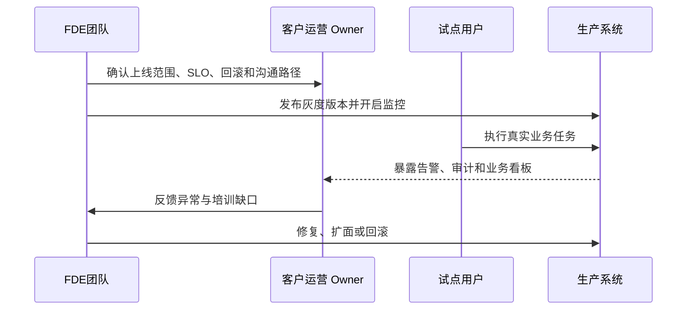

## 11.4 用户上线与运营切换

### 11.4.1 上线是行为迁移，不只是流量切换

用户上线的难点通常不在发布按钮，而在工作方式迁移。原型阶段，用户会容忍人工解释、临时入口和 FDE 现场陪跑；生产阶段，系统必须进入客户的日常节奏：谁每天打开它，谁处理异常，谁批准动作，谁接收告警，谁在系统不可用时执行替代流程。上线计划应按用户群、业务时段、数据范围和动作风险分批推进，而不是用“全量开放”证明信心。

Google SRE 的[发布协调清单](https://sre.google/sre-book/launch-checklist/)强调发布前协调、依赖确认、监控和分阶段发布；回退优先、配置校验和依赖控制等生产实践还可参考 Google SRE 的 [Production Services Best Practices](https://sre.google/sre-book/service-best-practices/)。DORA 的[软件交付性能指标](https://dora.dev/guides/dora-metrics/)也提醒团队同时观察吞吐和不稳定性：部署频率、变更前置时间、失败部署恢复时间、变更失败率和部署返工率。FDE 上线时应把这些工程指标与业务指标并排看：用户是否真的完成任务，人工兜底是否减少，异常是否更早暴露，客户运营团队是否能独立处理常见问题。

### 11.4.2 运营切换要有接管标准

生产交接不能只交代码仓库和部署文档，还要交“如何运行”。Microsoft CAF 的运营准备要求覆盖监控、保护、部署和可靠性能力；Palantir AI FDE 关于[安全与治理](https://www.palantir.com/docs/foundry/ai-fde/security-and-governance)的文档也强调敏感操作需要用户批准，所有活动应受权限、治理和审计约束。对 FDE 项目而言，接管包至少包括运行手册、告警看板、升级联系人、权限申请流程、回滚权限、演练记录、开放风险和客户 Owner 签收。接管标准应确认：客户 Owner 已明确，值班或支持路径已确认，关键告警有处理手册，权限申请有流程，数据异常有归属，发布与回滚由客户或平台团队可执行。

上线后应设置观察窗口，至少覆盖一个完整业务周期；“低风险场景一到两周”是本书建议的案例假设，高风险场景应按结算、排产、审计或监管周期确定。窗口内不要急于扩功能，而要验证运营事实：哪些告警噪声过高，哪些用户绕回旧流程，哪些异常需要 FDE 解释，哪些指标无法被客户理解。只有当系统能被客户组织独立运行，FDE 才算完成运营切换；否则只是把一个成功演示搬到了生产环境。

运营切换还需要明确沟通节奏。本书建议上线当天关注是否可用，第一周关注异常和采用，第一月关注价值指标和维护负担；实际节奏应由客户业务周期和风险等级决定。每个阶段都应有固定复盘：保留什么、修正什么、停止什么、何时扩大范围。若没有这种节奏，客户容易把所有问题继续抛给 FDE，团队也难以判断系统是已经稳定，还是只是靠现场陪跑维持运行。

责任转移应在上线计划中写成 RACI。FDE 负责发布候选证据、灰度观察和知识转移；平台/SRE 负责部署、监控、回滚执行和运行权限；客户 Owner 负责业务验收、扩面批准、人工兜底和日常运营；业务或合规批准人负责风险接受。回滚矩阵还要写清触发条件、决策 owner、执行人、最长决策时间、补偿/重放动作、沟通口径和恢复验证。

### 11.4.3 灰度上线示例：让异常订单重排逐步上线

AI 异常订单重排系统的灰度不应从“所有订单、所有调度员、自动写回”开始。更稳妥的灰度范围是：一个区域、两到三条产线、少量高频异常类型、固定调度班组、只读建议加人工审批写回。灰度用户必须是真实承担业务结果的人，而不是只参加演示的管理者；否则上线验证的是观感，不是运营能力。

观察窗口至少覆盖一个完整业务节奏，例如一个排产周期或一个结算周期。窗口内应同时看四类指标：工程指标包括可用性、P95/P99 延迟、错误率、限流次数和写回成功率；AI 指标包括建议可执行率、人工改写率、低置信触发率和评测回归结果；业务指标包括异常处理时长、延期风险变化、人工协调次数和客户承诺影响；运营指标包括告警噪声、手册命中率、客户 Owner 独立处理比例和培训缺口。

扩面、暂停和回滚条件要在灰度前写清楚。若 SLO 连续达标、关键告警可被客户 Owner 处理、人工改写率下降、没有未解释的权限或审计缺口，可以扩大到更多产线或异常类型。若长尾延迟恶化、模型不可执行建议集中出现、成本超过预算、用户绕回旧流程、告警需要 FDE 才能解释，应暂停扩面并修复。若写回错误、权限越界、审计缺失、数据契约破坏或客户承诺受到实质影响，应立即回滚到只读建议或关闭写回。

### 11.4.4 影子运行与 champion-challenger

模型或提示词切换时，灰度之外还应叠加影子运行（shadow mode）或 champion-challenger 评估。影子运行让新模型/新 prompt 与真实流量并行执行，但输出仅写入 trace 和影子评测看板，不进入用户结果；champion-challenger 则在小流量上让 challenger 替代 champion 的部分响应，与 champion 的关键业务指标按相同口径对比。影子 trace 也必须带数据契约：敏感级别、脱敏/最小化、访问角色、保留期、删除责任人，以及是否允许进入回放/评测集。

最小流程：覆盖一个完整业务周期或预设观察窗口的影子运行 → 对齐影子评测指标（可审核通过率、证据忠实度（Faithfulness）、人工改写率、成本、延迟）→ 与 champion 基线对比并达到预先写入发布门禁的阈值 → 在受控灰度范围切换 challenger 为 champion，保留旧 champion 至少一个回滚周期。任何关键指标低于基线、出现新失败模式或客户 Owner 反馈异常，应停止切换并将样本回流到回归集。

### 11.4.5 客户 Owner 接管验收

客户 Owner 接管验收是灰度结束的必要条件。验收不只是签字，而是客户 Owner 能独立完成一次发布检查、解释关键看板、处理一条告警、执行一次回滚演练、批准或拒绝一条 AI 建议，并说明失败时的沟通路径。只有这组动作通过，系统才从 FDE 陪跑进入客户团队独立运营。
