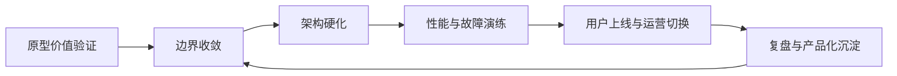

# 第十一章：从原型到生产系统

原型证明的是“这件事可能有价值”，生产系统证明的是“这件事可以被组织持续依赖”。FDE 在客户现场推进项目时，最危险的误判不是原型失败，而是原型成功后没有及时收紧边界：临时账号继续存在，手工脚本进入关键路径，模型提示词没有版本，数据回填没有审计，性能指标只在演示样本上成立，值班、回滚和客户运营切换无人负责。

本章讨论从原型到生产的工程化迁移。Google SRE 在 [Service Level Objectives](https://sre.google/sre-book/service-level-objectives/) 中强调，必须先理解用户真正关心的服务行为，再定义 SLI、SLO 和错误预算；DORA 的 [软件交付性能指标](https://dora.dev/guides/dora-metrics/) 则把变更吞吐与不稳定性放在同一张仪表盘上。对 FDE 而言，这两类思想必须合并：既要让系统能快，又要让系统在真实组织中可恢复、可解释、可交接。

本章不把“上线”视为终点，而把它视为责任转移的开始。读者应能识别原型的可丢弃部分与可产品化部分，建立生产准入清单，设计架构硬化路径，定义性能、伸缩和故障模式，完成用户上线与运营切换，并把项目经验沉淀为下一次交付可复用的平台资产。
