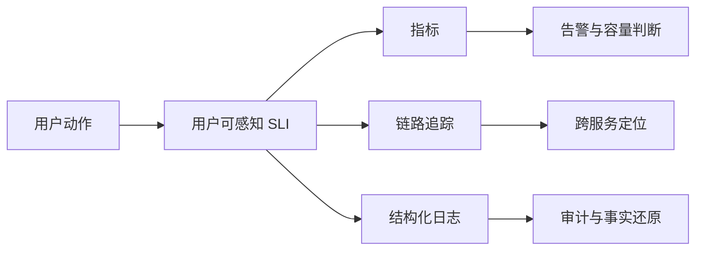

## 12.1 指标、日志与链路追踪

本章的起点不是工具，而是业务承诺和 SLI/SLO。遥测设计承接这些承诺：每一个需要被证明、告警或复盘的目标，都必须提前设计可采集、可关联、可解释的证据。

### 12.1.1 先从问题设计遥测

可观测性不是把所有数据都收上来，而是让团队能够回答生产现场最关键的问题：用户是否成功完成业务动作，失败影响了谁，瓶颈在哪一层，最近一次变更是否相关，是否需要回滚或降级。遥测信号可参考 [OpenTelemetry Signals](https://opentelemetry.io/docs/concepts/signals/) 中对 traces、metrics、logs 和 baggage 的组合式定义；其[可观测性入门](https://opentelemetry.io/docs/concepts/observability-primer/)也强调，可靠性要回答“服务是否按用户期望工作”。因此 FDE 项目应从用户旅程和关键业务动作反推遥测，而不是从 CPU、内存、日志量开始堆仪表盘。

### 12.1.2 三类信号各司其职

指标适合聚合判断，用于可用性、延迟、吞吐、错误率、队列积压、饱和度和业务转化率；日志适合记录离散事实，用于审计、异常上下文、人工操作和不可聚合的诊断细节；链路追踪适合解释一次请求如何穿过网关、服务、数据库、消息队列和外部接口。Grafana 文档把 metrics、logs、traces 和 profiles 称为 observability pillars，并强调信号关联可以从指标点跳转到相关 trace 或日志；日志与追踪关联也可利用 [OpenTelemetry 日志规范](https://opentelemetry.io/docs/specs/otel/logs/)中 LogRecord 携带的 TraceId 和 SpanId。

| 信号 | 回答的问题 | FDE 现场用法 | 常见误用 |
| --- | --- | --- | --- |
| 指标 | 现在是否异常，趋势如何 | SLO、告警、容量、发布观察 | 只看主机指标，不看用户动作 |
| 日志 | 发生了什么，谁做了什么 | 审计、异常上下文、合规证据 | 打印敏感数据，缺少 request_id |
| 追踪 | 请求慢在哪里，跨服务如何传播 | API、数据流、Agent 工具链定位 | 全量采样导致成本失控 |

### 12.1.3 控制基数、语义和成本

遥测系统最常见的失败，是上线初期看似丰富，几周后因高基数字段、噪声日志和无边界采样而不可维护。指标标签应限制在服务、环境、租户级别、接口、状态码等稳定维度，避免把用户 ID、订单号、完整 URL query 放入标签。日志必须结构化，字段命名要与追踪语义一致，并在源头完成脱敏。追踪要按服务重要性、错误、慢请求和关键交易设置采样策略，保留能支撑排障的证据。现场交付时，应把遥测 schema、保留周期、访问权限和费用上限写入运维设计；否则可观测性会从工程能力变成新的生产风险。

### 12.1.4 Agent/GenAI 要观测行为证据

Agent 和 GenAI 系统的现场风险不只来自接口可用性，还来自输出质量、工具调用路径、上下文漂移和人工接管边界。OpenTelemetry [GenAI 语义约定](https://opentelemetry.io/docs/specs/semconv/gen-ai/)已覆盖模型调用、token usage、工具执行 span 等信号，其中 `gen_ai.usage.input_tokens`、`gen_ai.usage.output_tokens`、`gen_ai.usage.reasoning.output_tokens`、`gen_ai.usage.cache_read.input_tokens`、`gen_ai.usage.cache_creation.input_tokens` 可用于记录输入、输出、推理和缓存相关 token；语义约定也明确输入输出内容应按配置选择性采集。因此 FDE 项目不要只记录“模型调用成功”，还要让一次自动化建议可以被审计、复现和解释。

| 观测字段 | 用途 | 采集边界 |
| --- | --- | --- |
| 模型版本、提示词版本 | 判断行为变化是否由模型或提示词切换引起 | 记录版本 ID 和哈希，不记录完整敏感提示词 |
| 工具调用链 | 还原 Agent 调用了哪些系统、顺序和结果 | 记录工具名、trace_id、状态码和耗时 |
| 输入 token、输出 token | 分析成本、延迟和上下文长度风险 | 使用供应商返回用量或离线计数 |
| 缓存命中 | 判断性能和成本优化是否生效 | 记录命中状态和缓存 token，不暴露原文 |
| 人工接管 | 衡量自动化边界和风险控制 | 记录接管原因、角色和时间，不记录个人敏感信息 |
| 可审核通过率 | 衡量输出是否能进入业务流程 | 区分“生成成功”和“审核可用” |
| 脱敏边界 | 证明日志、追踪和样本未泄露受保护数据 | 标注敏感级别、字段级脱敏/最小化策略、访问范围、保留周期和删除责任 |

这些字段应进入统一遥测 schema，并与业务 SLI、告警规则和运行手册保持同一套命名。否则事故发生时，团队只能看到模型 API 正常，却无法说明建议为什么变差、影响了哪些审批、该回滚模型还是回滚提示词。
