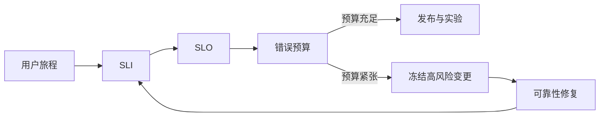

## 12.2 服务等级目标

业务承诺只有转化为 SLI/SLO，才能进入工程控制系统。SLO 定义完成后，下一步才是为这些目标设计遥测、告警和事故响应，而不是反过来从已有仪表盘拼指标。

### 12.2.1 SLO 是可靠性的产品语言

FDE 项目常被要求“稳定”“快”“不要出问题”，但这些描述无法指导工程取舍。Google SRE 在[服务等级目标](https://sre.google/sre-book/service-level-objectives/)一章中，将 SLI 定义为对服务水平某方面的定量测量，将 SLO 定义为 SLI 的目标值或目标范围。关键不是追求 100%，而是把用户真正关心的行为写成可计算承诺：请求成功率、端到端延迟、批处理准时完成率、数据新鲜度、自动化动作成功率、人工接管率等。一个好的 SLO 应明确测量窗口、统计口径、数据来源、排除条件和责任边界。人工接管率不是越低越好；高风险流程中，合理接管代表系统守住了自动化边界。

| 服务类型 | 推荐 SLI | 示例 SLO | 不宜作为核心 SLO 的指标 |
| --- | --- | --- | --- |
| 用户接口 | 成功率、P95/P99 延迟 | 30 天内 99.9% 请求成功且 P95 < 300ms | 平均 CPU |
| 数据管道 | 准时率、完整率、新鲜度 | 每日 08:00 前 99% 分区可用 | 单次任务耗时 |
| Agent 工作流 | 任务完成率、人工接管率 | 关键流程 99% 产出可审核通过或可接受结果 | Token 总量 |
| 集成接口 | 依赖可用性、重试成功率 | 第三方失败时 5 分钟内降级 | 单节点存活 |

SLO 定义卡应成为上线交付物，至少包含：用户旅程、SLI 公式、测量窗口、数据来源、排除条件、服务 owner、业务 owner、错误预算策略、burn-rate 告警、关联运行手册和复审节奏。没有这些字段，SLO 只是一个目标数字，无法驱动告警、发布冻结或客户沟通。

一张 SLO 卡还应记录 `slo_id`、关联功能、客户承诺边界、例外审批人、冻结规则、恢复判据和报告对象。对 AI/Agent 流程，必须把“生成成功”和“可审核通过/可接受结果”拆成不同 SLI；否则模型 API 正常会掩盖业务动作质量下降。

### 12.2.2 错误预算连接速度与风险

SLO 的工程价值来自错误预算。若目标是 30 天 99.9% 可用，则理论错误预算约为 43.2 分钟不可用时间；当预算充足，团队可以加快发布和实验；当预算快速消耗，应暂停高风险变更，优先修复可靠性问题。Google SRE Workbook 的[基于 SLO 告警](https://sre.google/workbook/alerting-on-slos/)进一步用 burn rate 描述错误预算消耗速度，使告警从“指标越线”转向“可靠性目标正在被消耗”。这比单纯盯 5xx 阈值更贴近用户影响，也更适合向客户解释为什么某些发布要延后。

### 12.2.3 现场 SLO 要避免伪精确

初次进入客户现场时，很多系统没有稳定历史数据，也没有端到端用户视角。此时不要编造精确目标，应先建立基线：过去 30 天成功率是多少，慢请求集中在哪些业务路径，哪些失败来自外部依赖，哪些失败可被降级吸收。SLO 可以先宽后严，但不能含糊。每个 SLO 都应附带仪表盘、告警规则、例外说明和复盘机制。对 FDE 团队尤其重要的是区分服务承诺与业务承诺：系统可用不等于业务结果达成，模型回复成功也不等于任务正确完成。最终 SLO 应服务取舍：是否值得为一个低频后台页面投入高可用架构，是否需要为关键审批链路增加同步降级路径，是否应该把客户依赖方纳入联合演练。
